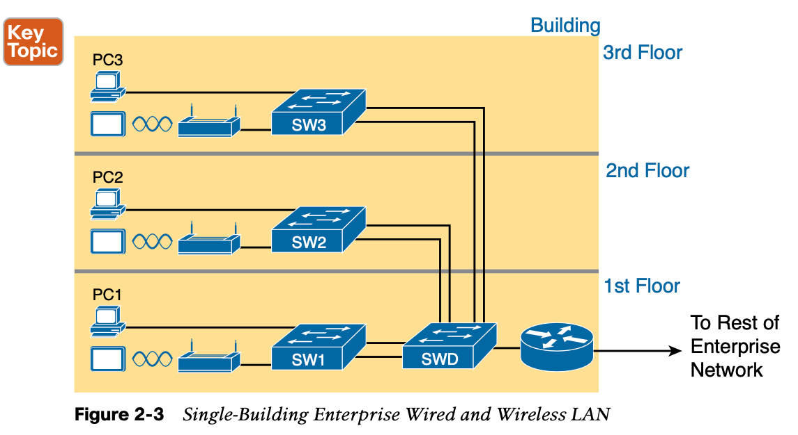
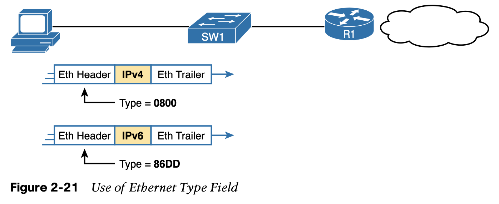

# **Fundamentals of Ethernet LANs**

- Unshielded Twisted Pair (UTP) cabling.
-  this section looks at the details of sending data in both directions over a UTP cable.
- small form-factor pluggable (SFP+) transceiver, which runs at 10 Gbps

An electrical circuit requires a complete loop, so the two nodes, using circuitry on their Ethernet ports, connect the wires in one pair to complete a loop, allowing electricity to flow.

Note that in an actual UTP cable, the wires will be twisted together, instead of being paral- lel as shown in Figure 2-5. The twisting helps solve some important physical transmission issues. When electrical current passes over any wire, it creates electromagnetic interference (EMI) that interferes with the electrical signals in nearby wires, including the wires in the same cable. (EMI between wire pairs in the same cable is called crosstalk.) Twisting the wire pairs together helps cancel out most of the EMI, so most networking physical links that use copper wires use twisted pairs.

**Gigabit Ethernet Interface Converter (GBIC):** The original form factor for a removable transceiver for Gigabit interfaces; larger than SFPs

**Small Form Pluggable (SFP):** The replacement for GBICs, used on Gigabit interfaces, with a smaller size, taking less space on the side of the networking card or switch.

**Small Form Pluggable Plus (SFP+):** Same size as the SFP, but used on 10-Gbps interfaces. (The Plus refers to the increase in speed compared to SFPs.)

## Straight-Through Cable Pinout

**10BASE-T and 100BASE-T use two pairs of wires in a UTP cable**, one for each direction, as shown in Figure 2-9. The figure shows four wires, all of which sit inside a single UTP cable that connects a PC and a LAN switch. In this example, the PC on the left transmits using the top pair, and the switch on the right transmits using the bottom pair.

 As a rule, Ethernet NIC transmitters use the pair connected to pins 1 and 2; the NIC receivers use a pair of wires at pin positions 3 and 6. LAN switches, knowing those facts about what Ethernet NICs do, do the opposite: Their receivers use the wire pair at pins 1 and 2, and their transmitters use the wire pair at pins 3 and 6.

## **Crossover Ethernet Cable**

## Choosing the Right Cable Pinouts

**Crossover cable:** If the endpoints transmit on the same pin pair

**Straight-through cable:** If the endpoints transmit on different pin pairs

Table 2-3 lists the devices and the pin pairs they use, assuming that they use 10BASE-T and 100BASE-T.

**NOTE** If you have some experience with installing LANs, you might be thinking that you have used the wrong cable before (straight-through or crossover), but the cable worked. Cisco switches have a feature called auto-mdix that notices when the wrong cable is used and automatically changes its logic to make the link work. However, for the exams, be ready to identify whether the correct cable is shown in the figures.

## **UTP Cabling Pinouts for 1000BASE-T**

1000BASE-T (Gigabit Ethernet) differs from 10BASE-T and 100BASE-T as far as the cabling and pinouts. First, 1000BASE-T requires four wire pairs. Second, it uses more advanced electronics that allow both ends to transmit and receive simultaneously on each wire pair. However, the wiring pinouts for 1000BASE-T work almost identically to the earlier stan- dards, adding details for the additional two pairs.

**Four-Pair Straight-Through Cable to 1000BASE-T**

The straight-through cable for 1000BASE-T uses the four wire pairs to create four circuits, but the pins need to match. It uses the same pinouts for two pairs as do the 10BASE-T and 100BASE-T standards, and it adds a pair at pins 4 and 5 and the final pair at pins 7 and 8, as shown in Figure 2-14.

**The Gigabit Ethernet crossover cable** crosses the same two-wire pairs as the crossover cable for the other types of Ethernet (the pairs at pins 1,2 and 3,6). It also crosses the two new pairs as well (the pair at pins 4,5 with the pair at pins 7,8).

## **Building Physical Ethernet LANs with Fiber**

A light source, called the **optical transmitter**, shines a light into the core. Light can pass through the core; however, light reflects off the cladding back into the core. Figure 2-16 shows an example with a light emitting diode (LED) transmitter. You can see how the cladding reflects the light back into the core as it travels through the core.

### Multimode Fiber vs. Single-Mode Fiber

Both multimode and single-mode cabling have important roles in Ethernet and meet different needs. Multimode improves the maximum distances over UTP, and it uses less expensive transmitters as compared with single-mode. Standards do vary; for instance, the standards for 10 Gigabit Ethernet over Fiber allow for distances up to 400m, which would often allow for connection of devices in different buildings in the same office park. Single-mode allows dis- tances into the tens of kilometers, but with slightly more expensive SFP/SFP+ hardware.

## **Sending Data in Ethernet Networks**

Ethernet addresses, also called Media Access Control (MAC) addresses, are 6-byte-long (48-bit-long) binary numbers. For convenience, most computers list MAC addresses as 12-digit hexadecimal numbers. Cisco devices typically add some periods to the number for easier readability as well; for example, a Cisco switch might list a MAC address as 0000.0C12.3456.

##### If two PCs on the same Ethernet tried to use the same MAC address, to which PC should frames sent to that MAC address be delivered?

Ethernet solves this problem using an administrative process so that, at the time of manufacture, all Ethernet devices are assigned a universally unique MAC address. Before a manufacturer can build Ethernet products, it must ask the IEEE to assign the manufacturer a universally **unique 3-byte code**, called the **organizationally unique identifier (OUI)**. The manufacturer agrees to give all NICs (and other Ethernet products) a MAC address that begins with its assigned 3-byte OUI. **The manufacturer also assigns a unique value for the last 3 bytes, a number that manufacturer has never used with that OUI.** As a result, the MAC address of every device in the universe is unique.

**Broadcast address:** Frames sent to this address should be delivered to all devices on the Ethernet LAN. It has a value of FFFF.FFFF.FFFF.

**Multicast addresses:** Frames sent to a multicast Ethernet address will be copied and for- warded to a subset of the devices on the LAN that volunteers to receive frames sent to a specific multicast address.

The Ethernet **Frame Check Sequence (FCS)** field in the Ethernet trailer—the only field in
 the Ethernet trailer—gives the receiving node a way to compare results with the sender, to discover whether errors occurred in the frame. 

Nodes that use half-duplex logic actually use a relatively well-known algorithm called car- rier sense multiple access with collision detection (CSMA/CD). 

