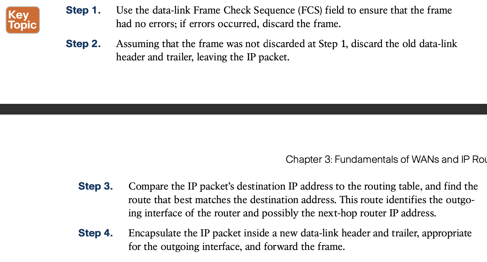
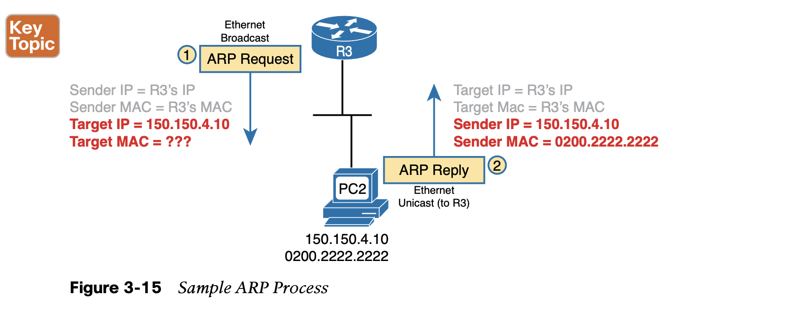

# **Fundamentals of WANs and IP Routing**

## **1. Leased-Line WANs**

Because leased lines define only the Layer 1 transmission service, many companies and standards organizations have created data-link protocols to control and use leased lines. Today, the two most popular data-link layer protocols used for leased lines between two routers are **High-Level Data Link Control (HDLC)** and **Point-to-Point Protocol (PPP)**.

All data-link protocols perform a similar role: to control the correct delivery of data over a physical link of a particular type. For example, the **Ethernet** data-link protocol uses a destination address field to identify the correct device that should receive the data and an FCS field that allows the receiving device to determine whether the data arrived correctly. **HDLC provides similar functions.**

Leased lines have many benefits that have led to their relatively long life in the WAN market- place. However, New faster WAN technology has been replacing leased lines for a long time, including **the second WAN technology discussed in this book: Ethernet.**

## **2. Ethernet as a WAN Technology**

This book refers to this particular Ethernet WAN service with a couple of the common names: 

**Ethernet WAN:** A generic name to differentiate it from an Ethernet LAN.

**Ethernet Line Service (E-Line):** A term from the Metro Ethernet Forum (MEF) for the kind of point-to-point Ethernet WAN service shown throughout this book.

**Ethernet emulation:** A term emphasizing that the link is not a literal Ethernet link from end to end.

**Ethernet over MPLS (EoMPLS):** A term that refers to Multiprotocol Label Switching (MPLS), a technology that can be used to create the Ethernet service for the customer.

In this case, all three routing steps use the same Ethernet (802.3) protocol. However, note that each frame’s data-link header and trailer are different. Each router discards the old data-link header/trailer and adds a new set, as described in these steps.

**1.** To send the IP packet to Router R1 next, PC1 encapsulates the IP packet in an Ethernet frame that has the destination MAC address of R1.

**2.** Router R1 de-encapsulates (removes) the IP packet from the Ethernet frame and encap- sulates the packet into a new Ethernet frame, with a new Ethernet header and trailer. The destination MAC address is R2’s G0/0 MAC address, and the source MAC address is R1’s G0/1 MAC address. R1 forwards this frame over the EoMPLS service to R2 next.

**3.** Router R2 de-encapsulates (removes) the IP packet from the Ethernet frame, encapsu- lates the packet into an Ethernet frame that has the destination MAC address of PC2, and forwards the Ethernet frame to PC2.

**Throughout this book, the WAN links (serial and Ethernet) will connect routers as shown here, with the focus being on the LANs and IP routing.** The rest of the chapter turns our attention to a closer look at IP routing.

## **3. IP Routing**

#### Host Forwarding Logic: Send the Packet to the Default Router

In this example, PC1 does some basic analysis and then chooses to send the IP packet to the router so that the router will forward the packet. PC1 analyzes the destination address and realizes that PC2’s address (150.150.4.10) is not on the same LAN as PC1. So PC1’s logic tells it to send the packet to a device whose job it is to know where to route data: a nearby router, on the same LAN, called PC1’s default router.

To send the IP packet to the default router, the sender sends a data-link frame across the medium to the nearby router; this frame includes the packet in the data portion of the frame. That frame uses data-link layer (Layer 2) addressing in the data-link header to ensure that the nearby router receives the frame.

#### R1 and R2’s Logic: Routing Data Across the Network

In Figure 3-10, R1 would have matched the destination address (150.150.4.10) to a routing table entry, which in turn told R1 to send the packet to R2 next. Similarly, R2 would have matched a routing table entry that told R2 to send the packet, over an Ethernet WAN link, to R3 next.

#### R3’s Logic: Delivering Data to the End Destination

## **4. How Network Layer Routing Uses LANs and WANs**

The following list summarizes the major steps in a router’s internal network layer routing for each packet beginning with the a frame arriving in a router interface:

The following list explains the forwarding logic at each router, focusing on how the routing integrates with the data link.

**Step A.**

**PC1 sends the packet to its default router.** PC1’s network layer logic builds the IP packet, with a destination address of PC2’s IP address (150.150.4.10). The network layer also performs the analysis to decide that 150.150.4.10 is not in the local IP subnet, so PC1 needs to send the packet to R1 (PC1’s default router). PC1 places the IP packet into an Ethernet data-link frame, with a desti- nation Ethernet address of R1’s Ethernet address. PC1 sends the frame on to the Ethernet.

**Step B.**

**R1 processes the incoming frame and forwards the packet to R2.** Because the incoming Ethernet frame has a destination MAC of R1’s Ethernet MAC, R1 decides to process the frame. R1 checks the frame’s FCS for errors, and if none, R1 discards the Ethernet header and trailer. Next, R1 compares the packet’s destination address (150.150.4.10) to its routing table and finds the entry for subnet 150.150.4.0. Because the destination address of 150.150.4.10 is in that subnet, R1 forwards the packet out the interface listed in that matching route (Serial0) to next-hop Router R2 (150.150.2.7). R1 must first encapsulate the IP packet into an HDLC frame.

**Step C.**

**R2 processes the incoming frame and forwards the packet to R3.** R2 repeats the same general process as R1 when R2 receives the HDLC frame. R2 checks the FCS field and finds that no errors occurred and then discards the HDLC header and trailer. Next, R2 compares the packet’s destination address (150.150.4.10) to its routing table and finds the entry for subnet 150.150.4.0, a route that directs R2 to send the packet out interface Fast Ethernet 0/0 to next-hop router 150.150.3.1 (R3). But first, R2 must encapsulate the packet
 in an Ethernet header. That header uses R2’s MAC address and R3’s MAC address on the Ethernet WAN link as the source and destination MAC address, respectively.

**Step D.**

**R3 processes the incoming frame and forwards the packet to PC2.** Like R1 and R2, R3 checks the FCS, discards the old data-link header and trailer, and matches its own route for subnet 150.150.4.0. R3’s routing table entry for 150.150.4.0 shows that the outgoing interface is R3’s Ethernet interface, but there is no next-hop router because R3 is connected directly to subnet 150.150.4.0. All R3 has to do is encapsulate the packet inside a new Ethernet header and trailer, but with a destination Ethernet address of PC2’s MAC address.

### Rules for Groups of IP Addresses (Networks and Subnets)

However, the brief version of two of the foundational rules of subnetting can be summarized as follows:

IP supports a small number of different IP routing protocols. However, many routing protocols use the same general steps for learning routes:

Figure 3-13 shows an example of how a routing protocol works, using the same diagram as in Figures 3-10 and 3-11. In this case, IP subnet 150.150.4.0, which consists of all addresses that begin with 150.150.4.0, sits on the Ethernet at the bottom of the figure. The figure shows the advertisement of routes for subnet 150.150.4.0 from bottom to top, as described in detail fol- lowing the figure.

## **5. Other Network Layer Features**

#### Domain Name System (DNS)

#### Address Resolution Protocol (ARP)

