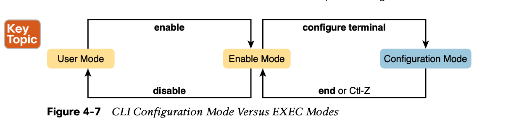

# **Using the Command-Line Interface**

The switch CLI can be accessed through three popular methods—**the console, Telnet, and Secure Shell (SSH).** Two of these methods (Telnet and SSH) use the IP network in which the switch resides to reach the switch. The console is a physical port built specifically to allow access to the CLI. Figure 4-2 depicts the options.


## 1. Cabling the Console Connection


## 2. Accessing the CLI with Telnet and SSH


## 3. User and Enable (Privileged) Modes

All three CLI access methods covered so far (console, Telnet, and SSH) place the user in an area of the CLI called user EXEC mode. User EXEC mode, sometimes also called **user mode**, **allows the user to look around but not break anything.**

Cisco IOS supports a more powerful EXEC mode called **enable mode** (also known as privi- leged mode or privileged EXEC mode). Enable mode gets its name from the **enable** com- mand, which moves the user from user mode to enable mode, as shown in Figure 4-6. The other name for this mode, privileged mode, refers to the fact that powerful (or privileged) commands can be executed there. 

**NOTE** If the command prompt lists the hostname followed by a >, the user is in user mode; if it is the hostname followed by the #, the user is in enable mode.




**Configuration mode** is another mode for the Cisco CLI, similar to user mode and privileged mode. User mode lets you issue nondisruptive commands and displays some information. Privileged mode supports a superset of commands compared to user mode, including com- mands that might disrupt switch operations. However, not one of the commands in user or privileged mode changes the switch’s configuration. Configuration mode accepts configura- tion commands—commands that tell the switch the details of what to do and how to do it.

Configuration mode itself contains a multitude of commands. To help organize the configu- ration, IOS groups some kinds of configuration commands together. To do that, when using configuration mode, you move from the initial mode—global configuration mode—into subcommand modes.


- Movement from enable mode to global configuration mode by using the **configure terminal** EXEC command

- Using a **hostname Fred** global configuration command to configure the switch’s name

- Movement from global configuration mode to console line configuration mode (using the

  **line console 0** command)

- Setting the console’s simple password to **hope** (using the **password hope** line

  subcommand)

- Movement from console configuration mode to interface configuration mode (using the **interface** type number command)


## **4. Storing Switch Configuration Files**

Cisco switches contain random- access memory **(RAM)** to store data while Cisco IOS is using it, but RAM loses its contents when the switch loses power or is reloaded. To store information that must be retained when the switch loses power or is reloaded, Cisco switches use several types of more permanent memory, none of which has any moving parts. By avoiding components with moving parts (such as traditional disk drives), switches can maintain better uptime and availability.

The following list details the four main types of memory found in Cisco switches, as well as the most common use of each type:


Essentially, when you use configuration mode, you change only the running-config file. This means that the configuration example earlier in this chapter (Example 4-4) updates only the running-config file. However, if the switch lost power right after that example, all that configuration would be lost. If you want to keep that configuration, you have to copy the running-config file into NVRAM, overwriting the old startup-config file.

## **5. Copying and Erasing Configuration Files**

```shell
# In short, the following command backs up the running- config to the startup-config file. This command overwrites the current startup-config file with what is currently in the running-configuration file.
copy running-config startup-config 
```

```shell
# In addition, in the lab, you may want to just get rid of all existing configuration and start over with a clean configuration. To do that, you can erase the startup-config file using three different commands:

write erase
erase startup-config 
erase nvram:
```

**Note** that Cisco IOS does not have a command that erases the contents of the running- config file. To clear out the running-config file, simply erase the startup-config file, and then **reload** the switch, and the running-config will be empty at the end of the process.

## 6. Command List

```shell
# enable
# reload
# show running-config
Note that the lines with a ! in them are comment lines, both in the text of this book and in the real switch CLI.
# show mac address-table dynamic
# debug 
```

```
Switch# configure terminal
Switch(config)# hostname Fred
Fred(config)# line console 0 
Fred(config-line)# password hope 
Fred(config-line)# interface FastEthernet 0/1 
Fred(config-if)# speed 100
Fred(config-if)# exit 
Fred(config)#
```


