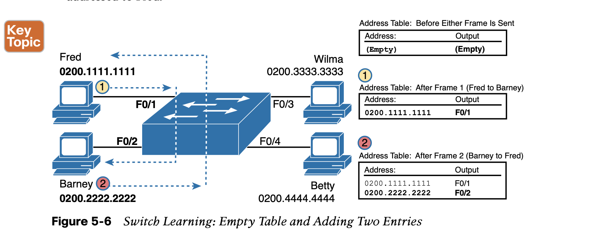
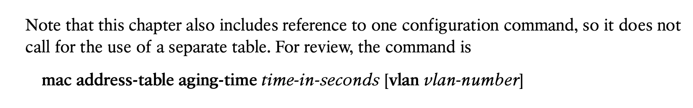

# **Analyzing Ethernet LAN Switching**

## **1. Overview of Switching Logic**

The LAN switch has one primary job: to forward frames to the correct destination (MAC) address. 

LAN switches receive Ethernet frames and then make a switching decision: either forward the frame out some other ports or ignore the frame. To accomplish this primary mission, switches perform three actions:


## **2. Forwarding Known Unicast Frames**

To decide whether to forward a frame, a switch uses a dynamically built table that lists MAC addresses and outgoing interfaces. Switches compare the frame’s destination MAC address to this table to decide whether the switch should forward a frame or simply ignore it. 

**NOTE** **A switch’s MAC address table** is also called the switching table, or bridging table, or even the Content-Addressable Memory (CAM) table, in reference to the type of physical memory used to store the table.


## **3. Learning MAC Addresses**

each switch does its second main function: to learn the MAC addresses and interfaces to put into its address table. 

**Switches build the address table by listening to incoming frames and examining the source MAC address in the frame.** If a frame enters the switch and the source MAC address is not in the MAC address table, the switch creates an entry in the table. That table entry lists the interface from which the frame arrived. 



## **4. Flooding Unknown Unicast and Broadcast Frames**

What do you suppose the switch does with Fred’s first frame, the one that occurred when there were no entries in the MAC address table?

As it turns out, **when there is no matching entry in the table, switches forward the frame out all interfaces (except the incoming inter- face) using a process called flooding.** And the frame whose destination address is unknown to the switch is called an unknown unicast frame, or simply an unknown unicast.


Flooding means that the switch forwards copies of the frame out all ports, except the port on which the frame was received. 

Switches also flood LAN broadcast frames (frames destined to the Ethernet broadcast address of FFFF.FFFF.FFFF) because this process helps deliver a copy of the frame to all devices in the LAN.

## **5. Avoiding Loops Using Spanning Tree Protocol**

The third primary feature of LAN switches is loop prevention, as implemented by Spanning Tree Protocol (STP). **Without STP, any flooded frames would loop for an indefinite period of time in Ethernet networks with physically redundant links.** To prevent looping frames, STP blocks some ports from forwarding frames so that only one active path exists between any pair of LAN segments.

The result of STP is good: frames do not loop infinitely, which makes the LAN usable. However, STP has negative features as well, including the fact that it takes some work to balance traffic across the redundant alternate links.


The flooding of this frame would result in the frame repeatedly rotating around the three switches, because none of the switches list Bob’s MAC address in their address tables—so each switch floods the frame. And while the flooding process is a good mechanism for forwarding unknown unicasts and broadcasts, the continual flooding of traffic frames as in the figure can completely congest the LAN to the point of making it unusable.

To avoid Layer 2 loops, all switches need to use STP. **STP causes each interface on a switch to settle into either a blocking state or a forwarding state.**

**Blocking** means that the interface cannot forward or receive data frames, while **forwarding** means that the interface can send and receive data frames. If a correct subset of the interfaces is blocked, only a single currently active logical path exists between each pair of LANs.

**NOTE** STP behaves identically for a transparent bridge and a switch. Therefore, the terms bridge, switch, and bridging device all are used interchangeably when discussing STP.

## **6. Verifying and Analyzing Ethernet Switching**


```shell
show mac address-table 
show mac address-table dynamic
```


## **7. Switch Interfaces**

````shell
show interfaces status
show interfaces FastEthernet 0/1 status
show interfaces GigabitEthernet 0/1 status
````

## **8. Managing the MAC Address Table (Aging, Clearing)**

```shell
show mac address-table aging-time
```


## **9. MAC Address Tables with Multiple Switches**


## **Command References**



