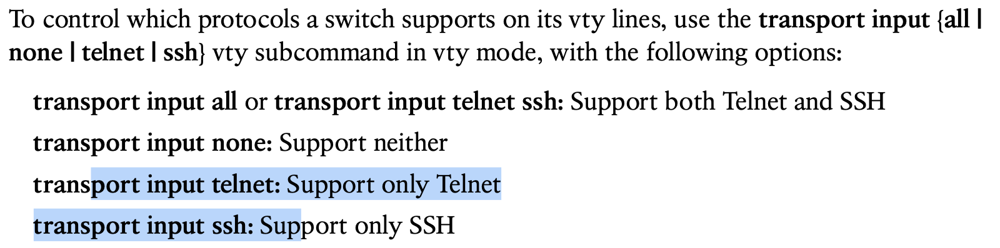
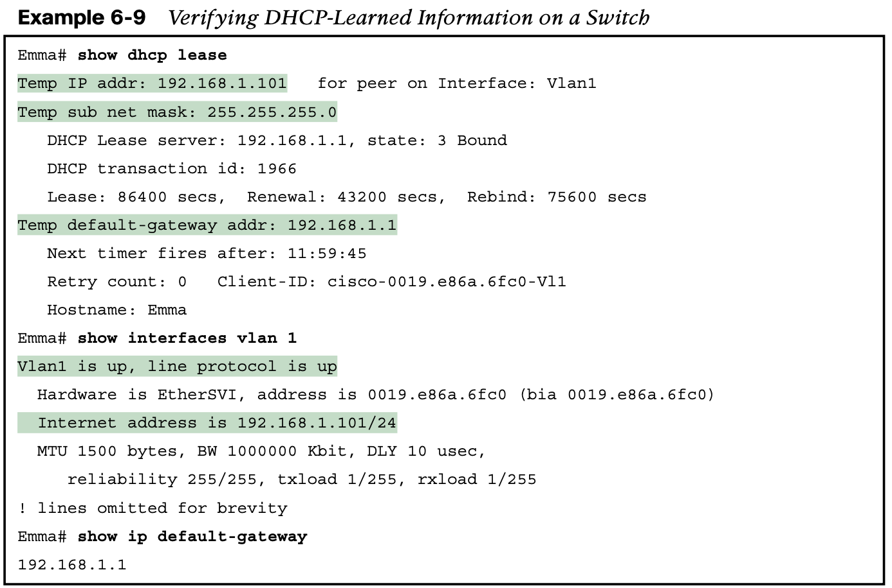

# **Configuring Basic Switch Management**

A switch’s IPv4 configuration has nothing to do with how a Layer 2 switch forwards Ethernet frames (as discussed in Chapter 5, “Analyzing Ethernet LAN Switching”). Instead, to support Telnet and Secure Shell (SSH) into a switch, the switch needs to be configured with an IP address. This chapter also shows how to configure a switch’s IPv4 settings in the upcoming section “Enabling IPv4 for Remote Access.”

## 1. Securing user mode and privileged mode with simple passwords

By default, Cisco Catalyst switches allow full access from the console but no access via Telnet or SSH. Using default settings, a console user can move into user mode and then privileged mode with no passwords required; however, default settings prevent remote users from accessing even user mode.

In addition, Cisco switches protect **enable mode (also called privileged mode)** with yet another shared password called the enable password.

The configuration for these three passwords does not require a lot of work. First, the console and vty password configuration sets the password based on the context: console mode for the console (**line con 0**), and vty line configuration mode for the Telnet password (**line vty 0 15**). Then inside console mode and vty mode, respectively, the two commands in each mode are as follows:

**password** password-value**:** Defines the actual password used on the console or vty **login:** Tells IOS to enable the use of a simple shared password (with no username) on this line (console or vty), so that the switch asks the user for a password

**NOTE** Older IOS versions used the command **enable password** password-value to set the enable password, and that command still exists in IOS. However, the **enable secret** command is much more secure. In real networks, use **enable secret**.

**NOTE** For historical reasons, the output of the **show running-config** command, in the last six lines of Example 6-3, separates the first five vty lines (0 through 4) from the rest (5 through 15).

## 2. **Securing User Mode Access with Local Usernames and Passwords**

Cisco switches support two other login security methods that both use per-user username/ password pairs instead of a shared password with no username.

## 3. Securing user mode access with external authentication servers

## 4. Securing remote access with Secure Shell (SSH)

## **5. Enabling IPv4 for Remote Access**

To allow Telnet or SSH access to the switch, and to allow other IP-based management proto- cols (for example, Simple Network Management Protocol, or SNMP) to function as intended, the switch needs an IP address, as well as a few other related settings. The IP address has nothing to do with how switches forward Ethernet frames; it simply exists to support over- head management traffic.

### **5.1 Host and Switch IP Settings**

The switch obviously has lots of Ethernet ports, but instead of assigning its management IP address to any of those ports, the switch then uses a NIC-like concept called a switched virtual interface (SVI), or more commonly, a VLAN interface, that acts like the switch’s own NIC. Then the settings on the switch look something like a host, with the switch configuration assigning IP settings, like an IP address, to this VLAN interface, as shown in Figure 6-6.

**By using interface VLAN 1 for the IP configuration, the switch can then send and receive frames on any of the ports in VLAN 1. In a Cisco switch, by default, all ports are assigned to VLAN 1.**

### 5.2 **Configuring IPv4 on a Switch**

On a side note, this example shows a particularly important and common command: the [**no**] **shutdown** command. To administratively enable an interface on a switch, use the **no shutdown** interface subcommand; to disable an interface, use the **shutdown** interface subcommand. 

## **5.3 Configuring a Switch to Learn Its IP Address with DHCP**

## **6. Miscellaneous Settings Useful in the Lab**

### 6.1 **The logging synchronous, exec-timeout, and no ip domain-lookup Commands**

## **7. Command References**

