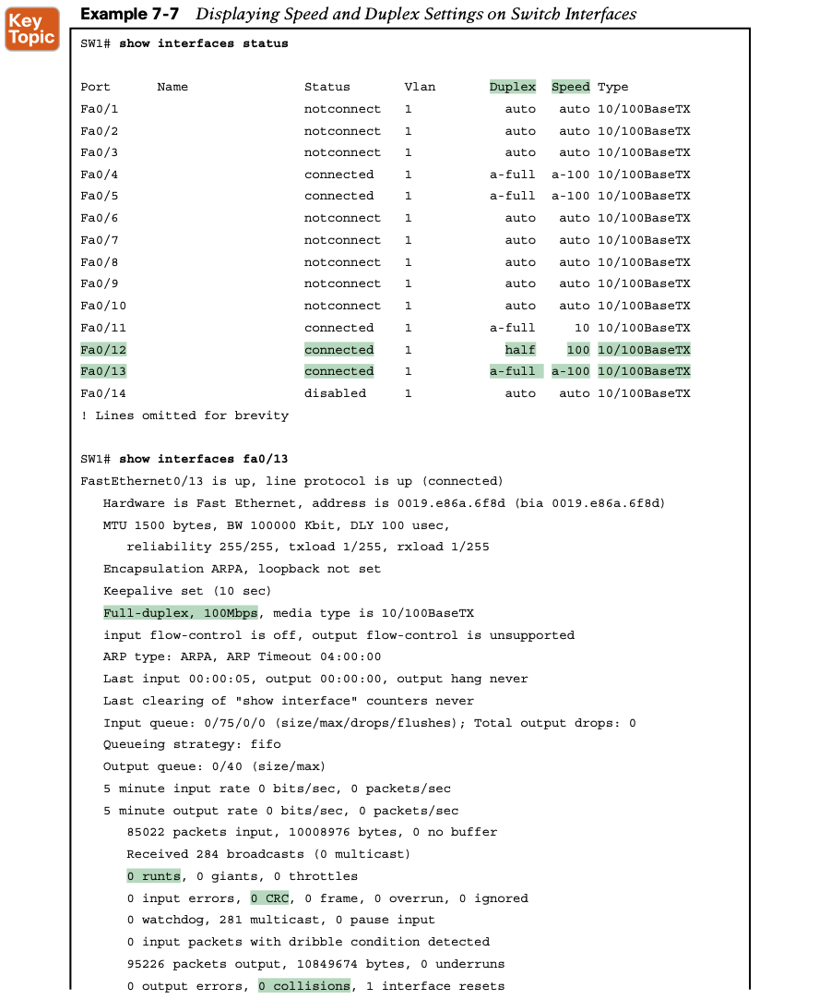

# **Configuring and Verifying Switch Interfaces**

This chapter focuses on switch interfaces in two major sections. The first section shows how you can configure and change the operation of switch interfaces: how to change the speed, duplex, or even disable the interface. The second half then focuses on how to use show com- mands on a switch to verify switch interface status and how to interpret the output to find some of the more common issues with switch interfaces.


**FastEthernet 0/4 (Fa0/4):** Like Fa0/2, this port has all default configuration but was cabled to another working device to give yet another contrasting example. This device completed the autonegotiation process, so instead of “auto” under the speed and duplex headings, the output lists the negotiated speed and duplex (**a-full** and **a-100**). Note that the text includes the **a-** to mean that the listed speed and duplex values were autonegotiated.

### **1. Configuring Multiple Interfaces with the interface range Command**

```
interface range FastEthernet 0/11 - 20
```


### **2. Administratively Controlling Interface State with shutdown**

Cisco uses two interface subcommands to configure the idea of administratively enabling and disabling an interface: the **shutdown** command (to disable) and the **no shutdown** command (to enable).


### 3. **Removing Configuration with the no Command**


### 4. **Autonegotiation**

IEEE autonegotiation (IEEE standard 802.3u) defines a protocol that lets the two UTP-based Ethernet nodes on a link negotiate so that they each choose to use the same speed and duplex settings. 

Basically, each node states what it can do, and then each node picks the best options that both nodes support: the fastest speed and the best duplex setting, with full duplex being better than half duplex.


#### **Autonegotiation Results When Only One Node Uses Autonegotiation**

Disabling autonegotiation is not always a bad idea. For instance, many network engineers disable autonegotiation on links between switches and simply configure the desired speed and duplex on both switches. **However, mistakes can happen when one device on an Ethernet predefines speed and duplex (and disables autonegotiation), while the device on the other end attempts autonegotiation.** In that case, the link might not work at all, or it might just work poorly.


PC1 shows a classic and unfortunately common end result: a duplex mismatch. The two nodes (PC1 and SW1’s port G0/1) both use 100 Mbps, so they can send data. However, PC1, using full duplex, does not attempt to use carrier sense multiple access with collision detec- tion (CSMA/CD) logic and sends frames at any time. Switch port F0/1, with half duplex, does use CSMA/CD. As a result, switch port F0/1 will believe collisions occur on the link, even if none physically occur. The switch port will stop transmitting, back off, resend frames, and so on. As a result, the link is up, but it performs poorly. 

## 5. **Analyzing Switch Interface Status and Statistics**

the rest of the chapter takes a closer look at how to verify the interfaces work correctly.

```shell
show interfaces status 
show interfaces
show interfaces description
```


For the other interface states listed in Table 7-2, only the up/up (connected) state needs more discussion. An interface can be in a working state, and it might really be working—or it might be working in a degraded state. The next few topics discuss how to examine an up/up (connected) interface to find out whether it is working well or having problems.

#### **Interface Speed and Duplex Issues**




For example, consider ports Fa0/12 and Fa0/13 in the output of the **show interfaces status** command. For Fa0/13, **a-full** means full duplex as autonegotiated, whereas **half** on Fa0/12 means half duplex but as manually configured. The example shades the command output that implies that the switch’s Fa0/12 interface’s speed and duplex were not found through autonegotiation, but Fa0/13 did use autonegotiation.


#### **Common Layer 1 Problems on Working Interfaces**


**However, one problem, called late collisions, points to the classic duplex mismatch problem.**

So, just keep repeating the **show interfaces** command, and if you see the late collisions counter incrementing on a half- duplex interface, you might have a duplex mismatch problem.

## **Command References**


