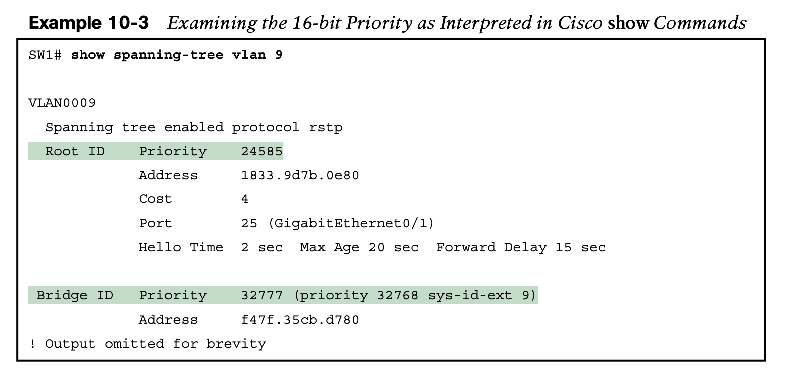

# **RSTP and EtherChannel Configuration**

## **1. Understanding RSTP Through Configuration**

### 1.1. **The Need for Multiple Spanning Trees**

The emergence of VLANs posed a challenge for STP—the only type of STP available at the time— because STP defined a single common spanning tree (CST) topology for the entire LAN. The IEEE needed an option to create multiple spanning trees so that traffic could be balanced across the available links, as shown in Figure 10-2. 

Today, Cisco Catalyst switches give us three options to configure on the **spanning-tree mode** command, which tells the switch which type of STP to use. 

### 1.2. **The Bridge ID and System ID Extension**

Cisco switches let you configure the BID, but only the priority part. The switch fills in its universal (burned-in) MAC address as the system ID. It also plugs in the VLAN ID of a VLAN in the 12-bit system ID extension field; you cannot change that behavior either. The only part configurable by the network engineer is the 4-bit priority field.

the configuration command (**spanning-tree vlan** vlan-id **priority** x) requires a decimal number between 0 and 65,535. But not just any number in that range will suffice; it must be a multiple of 4096, as emphasized in the help text shown in Example 10-2.

### 1.3. **How Switches Use the Priority and System ID Extension**

### 1.4. **RSTP Methods to Support Multiple Spanning Trees**

In other words, standard RSTP behaves as if VLANs do not exist, while Cisco’s RPVST+ inte- grates VLAN information into the entire process.

### 1.5 **Other RSTP Configuration Options**

## 2. **Configuring Layer 2 EtherChannel**

As introduced in Chapter 9, two neighboring switches can treat multiple parallel links between each other as a single logical link called an EtherChannel. 

- Without EtherChannel, a switch treats each physical port as an independent port, applying MAC learning, forwarding, and STP logic per physical port. 
- With EtherChannel, the switch applies all those same processes to a group of physical ports as one entity: the EtherChannel.

- Without EtherChannel, with parallel links between two switches, STP/RSTP would block all links except one,
-  but with EtherChannel, the switch can use all the links, load balancing the traffic over the links.

EtherChannel may be one of the most challenging switch features to make work.

**This section shows how to configure a Layer 2 EtherChannel, first through manual (static) configuration, and then by allowing dynamic protocols to create the channel.**

### 2.1 **Configuring a Manual Layer 2 EtherChannel**

### 2.2 **Configuring Dynamic EtherChannels**

In addition to manual configuration, Cisco switches also support two different configuration options that then use a dynamic protocol to negotiate whether a particular link becomes part of an EtherChannel or not. 

Most Cisco Catalyst switches support the Cisco-proprietary Port Aggregation Protocol (PAgP) and the IEEE standard Link Aggregation Control Protocol (LACP), based on IEEE standard 802.3ad. Although differences exist between the two, to the depth discussed here, they both accomplish the same task: negotiate so that only links that pass the configuration checks are actually used in an EtherChannel.

One difference of note is that LACP does support more links in a channel—16—as com- pared to PaGP’s maximum of 8. With LACP, only 8 can be active at one time, with the oth- ers waiting to be used should any of the other links fail.

### 2.3 **Physical Interface Configuration and EtherChannels**

### 2.4 **EtherChannel Load Distribution**

EtherChannel load distribution makes the choice for each frame based on various numeric values found in the Layer 2, 3, and 4 headers. The process uses one configurable setting as input: the load distribution method as defined with the **port-channel load-balance** method global command. The process then performs some match against the fields identified by the configured method.

Table 10-4 lists the most common methods.

**The Effects of the EtherChannel Load Distribution Algorithm**

- All three tests list the same outgoing physical interface because (1) the method uses only the source MAC address, and (2) all three tests use the same MAC addresses.

## Command Referance

