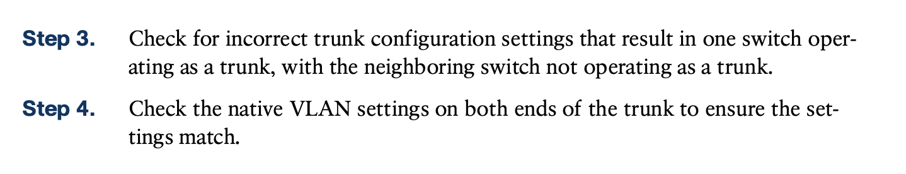
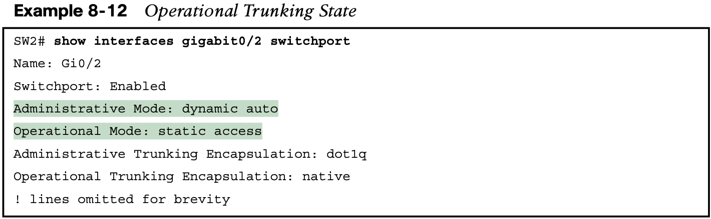

# **Implementing Ethernet Virtual LANs**

From one perspective, you can think of a LAN and a broadcast domain as being basically the same thing.

The rest of this chapter looks closely at the mechanics of how VLANs work across multiple Cisco switches, including the required configuration. To that end, the next section examines VLAN trunking, a feature required when installing a VLAN that exists on more than one LAN switch.

#### **Creating Multiswitch VLANs Using Trunking**

Configuring VLANs on a single switch requires only a little effort: you simply configure each port to tell it the VLAN number to which the port belongs. When you are using VLANs in networks that have multiple interconnected switches, the switches need to use VLAN trunking on the links between the switches.

Each switch has two ports assigned to each VLAN, so each VLAN exists in both switches. To forward traffic in VLAN 10 between the two switches, the design includes a link between switches, with that link fully inside VLAN 10. Likewise, to support VLAN 20 traffic between switches, the design uses a second link between switches, with that link inside VLAN 20.

The design shown in Figure 8-3 works, but it simply does not scale very well. It requires one physical link between switches to support every VLAN. If a design needed 10 or 20 VLANs, you would need 10 or 20 links between switches, and you would use 10 or 20 switch ports (on each switch) for those links.

**The use of trunking allows switches to forward frames from multiple VLANs over a single physical connection by adding a small header to the Ethernet frame.** 

#### The 802.1Q and ISL VLAN Trunking Protocols

Cisco has supported two different trunking protocols over the years: Inter-Switch Link (ISL) and IEEE 802.1Q.

While both ISL and 802.1Q tag each frame with the VLAN ID, the details differ. 802.1Q inserts an extra 4-byte 802.1Q VLAN header into the original frame’s Ethernet header, as shown at the top of Figure 8-6. 

As for the fields in the 802.1Q header, only the 12-bit VLAN ID field inside the 802.1Q header matters for topics discussed in this book. This 12-bit field supports a theoretical maximum of $2^{12}$ (4096) VLANs, but in practice it supports a maxi- mum of 4094. (Both 802.1Q and ISL use 12 bits to tag the VLAN ID, with two reserved values [0 and 4095].)

Cisco switches break the range of VLAN IDs (1–4094) into **two ranges: the normal range and the extended range**. All switches can use normal-range VLANs with values from 1 to 1005. Only some switches can use extended-range VLANs with VLAN IDs from 1006 to 4094.

The rules for which switches can use extended-range VLANs depend on the configuration of the **VLAN Trunking Protocol (VTP)**

802.1Q also defines one special VLAN ID on each trunk as the native VLAN (defaulting to use VLAN 1). By definition, 802.1Q simply does not add an 802.1Q header to frames in the native VLAN.

### **Forwarding Data Between VLANs**

If you create a campus LAN that contains many VLANs, you typically still need all devices to be able to send data to all other devices. This next topic discusses some concepts about how to route data between those VLANs.

Layer 2 switches will not forward data between two VLANs.

### Routing Packets Between VLANs with a Router

When including VLANs in a campus LAN design, the devices in a VLAN need to be in the same subnet. **Following the same design logic, devices in different VLANs need to be in different subnets.**

To forward packets between VLANs, the network must use a device that acts as a router.

With an interface connected to each subnet, the Layer 2 switch can keep doing its job—forwarding frames inside a VLAN, while the router can do its job— routing IP packets between the subnets.

**From a Layer 3 perspective, Fred sends the IP packet to its default router (R1), and R1 routes the packet out another interface (F0/1) into another subnet where Betty resides.**

## **2. VLAN and VLAN Trunking Configuration and Verification**

#### **2.1 Creating VLANs and Assigning Access VLANs to an Interface**

For ports that should always act as access ports, add the optional interface subcommand **switchport mode access**. This command tells the switch to always be an access interface and disables the protocol that negotiates trunking (Dynamic Trunking Protocol [DTP]) with the device on the other end of the link. 

### 2.2 **VLAN Trunking Protocol**

### 2.3**VLAN Trunking Configuration**

Both SW1 and SW2 currently have all default settings on the interfaces that connect the two switches. With the default setting of **switchport mode dynamic auto**, the two switches do not trunk.

First, focus on the highlighted items from the output of the **show interfaces switchport** command at the beginning of Example 8-3. The output lists the default administrative mode setting of dynamic auto. Because SW2 also defaults to dynamic auto, the command lists SW1’s operational status as “access,” meaning that it is not trunking. **(“Dynamic auto” tells both switches to sit there and wait on the other switch to start the negotiations.)** 

The end of the example shows the output of the **show interfaces trunk** command, but with no output. This command lists information about all interfaces that currently operationally trunk; that is, it lists interfaces that currently use VLAN trunking. With no interfaces listed, this command also confirms that the link between switches is not trunking.

Next, consider Example 8-6, which shows the new configuration that enables trunking. In this case, SW1 is configured with the **switchport mode dynamic desirable** command, which **asks the switch to both negotiate as well as to begin the negotiation process, rather than waiting on the other device.** The example shows that as soon as the command is issued, log messages appear showing that the interface goes down and then back up again, which hap- pens when the interface transitions from access mode to trunk mode.

Finally, before leaving the discussion of configuring trunks, Cisco recommends disabling trunk negotiation on most ports for better security. The majority of switch ports on most switches will be used to connect to users and configured with the command **switchport mode access**—which also disables DTP. For ports without the **switchport mode access** command—for instance, ports statically configured to trunk with the **switchport mode trunk** command—DTP still operates, but you can disable DTP negotiations altogether using the **switchport nonegotiate** interface subcommand.

### 2.4 **Implementing Interfaces Connected to Phones**

 In the world of IP telephony, telephones use Ethernet ports to connect to an Ethernet network so they can use IP to send and receive voice traffic sent via IP packets. To make that work, the switch’s Ethernet port acts like an access port, but at the same time, the port acts like a trunk in some ways. This last topic of the chapter works through those main concepts.

## 2.5 **Troubleshooting VLANs and VLAN Trunks**

Switch IOS gives you two similar configuration methods with which to disable (**shutdown**) and enable (**no shutdown**) a VLAN. Example 8-11 shows how, first by using the global command [**no] shutdown vlan** number and then using the VLAN mode subcommand [**no**] **shutdown**. The example shows the global commands enabling and disabling VLANs 10 and 20, respectively, and using VLAN subcommands to enable and disable VLANs 30 and 40, respectively.

**NOTE** The output of the **show vlan brief** command also lists a state of “act/unsup” for the reserved VLAN IDs 1002–1005, with “unsup” meaning “unsupported.”

#### **2.5.1 Mismatched Trunking Operational States**

The most common incorrect configuration—which results in both switches not trunking—is a configuration that uses the **switchport mode dynamic auto** command on both switches on the link. The word auto just makes us all want to think that the link would trunk automati- cally, but this command is both automatic and passive. As a result, both switches passively wait on the other device on the link to begin negotiations. Example 8-12 highlights those parts of the output from the **show interfaces switchport** command that confirm both the configured and operational states. Note that the output lists the operational mode as “static access” rather than “trunking.”

A different incorrect trunking configuration has an even worse result: one switch trunks, sending tagged frames, while the neighboring switch does not trunk, so the neighboring switch discards any frames it receives that have a VLAN tag in the header. When this combi- nation of events happens, the interface works in that the status on each end will be up/up or connected. Traffic in the native VLAN will actually cross the link successfully because those frames have no VLAN tags (headers). However, traffic in all the rest of the VLANs will not cross the link.

Figure 8-14 shows the incorrect configuration along with which side trunks and which does not. The side that trunks (SW1 in this case) enables trunking using the command **switchport mode trunk** but also disables Dynamic Trunking Protocol (DTP) negotiations using the **switchport nonegotiate** command. SW2’s configuration also helps create the problem, by using one of the two trunking options that relies on DTP. Because SW1 has disabled DTP, SW2’s DTP negotiations fail, and SW2 chooses to not trunk.

The figure shows what happens when using this incorrect configuration. At Step 1, SW1 **8** could (for example) forward a frame in VLAN 10. However, SW2 would view any frame that arrives with an 802.1Q header as illegal because the frame has an 802.1Q header, and SW2 treats its G0/2 port as an access port. So, SW2 discards any 802.1Q frames received on that port.

The trunking issues shown here can be easily avoided by checking the configuration and by checking the trunk’s operational state (mode) on both sides of the trunk. The best commands to check trunking-related facts are **show interfaces trunk** and **show interfaces switchport**. Just be aware that the switches do not prevent you from making these configuration mistakes.

#### **The Supported VLAN List on Trunks**

The first category in this step can be easily done using the **show interfaces** interface-id **trunk** command, which only lists information about currently operational trunks. The best place to begin with this command is the last section of output, which lists the VLANs whose traffic will be forwarded over the trunk. Any VLANs that make it to this final list of VLANs in the command output meet the following criteria:

The **switchport trunk allowed vlan** interface subcommand gives the network engineer a method to administratively limit the VLANs whose traffic uses a trunk. If the engineer wants all defined VLANs to be supported on a trunk, the engineer simply does not configure this command. If the engineer would like to limit the trunk to support a subset of the VLANs known to the switch, however, the engineer can add one or more **switchport trunk allowed vlan** interface subcommands.

For instance, in a switch that has configured VLANs 1 through 100, but no others, by default the switch would allow traffic in all 100 VLANs. However, the trunk interface com- mand **switchport trunk allowed vlan 1-60** would limit the trunk to forward traffic for VLANs 1 through 60, but not the rest of the VLANs. Example 8-13 shows a sample of the command output from the **show interfaces trunk** command, which confirms the first list of VLAN IDs now lists VLANs 1–60. Without the **switchport trunk allowed vlan** command, the first list would have included VLANs 1–4094.

The output of the **show interfaces trunk** command creates three separate lists of VLANs, each under a separate heading. These three lists show a progression of reasons why a VLAN is not forwarded over a trunk. Table 8-4 summarizes the headings that precede each list and the reasons why a switch chooses to include or not include a VLAN in each list. For instance, in Example 8-13, VLAN 60 has been shut down, and VLAN 59 happens to be in an STP blocking state. (Chapter 9, “Spanning Tree Protocol Concepts,” has more information about STP.)

#### **Mismatched Native VLAN on a Trunk**

Unfortunately, it is possible to set the native VLAN ID to different VLANs on either end of the trunk, using the **switchport trunk native vlan** vlan-id command. If the native VLANs differ according to the two neighboring switches, the switches will cause frames sent in the native VLAN to jump from one VLAN to the other.

For example, if switch SW1 sends a frame using native VLAN 1 on an 802.1Q trunk, SW1 does not add a VLAN header, as is normal for the native VLAN. When switch SW2 receives the frame, noticing that no 802.1Q header exists, SW2 assumes that the frame is part of SW2’s configured native VLAN. If SW2 has been configured to think VLAN 2 is the native VLAN on that trunk, SW2 will try to forward the received frame into VLAN 2. (This effect of a frame being sent in one VLAN but then being believed to be in a different VLAN is called VLAN hopping.)

## **Command References**

