# **Spanning Tree Protocol Concepts**

Without some mechanism like **Spanning Tree Protocol (STP) or Rapid STP (RSTP)**, a LAN with redundant links would cause Ethernet frames to loop for an indefinite period of time. With STP or RSTP enabled, some switches block ports so that these ports do not forward frames. 

STP and RSTP strike a balance, allowing frames to be delivered to each device, without causing the problems that occur when frames loop through the network over and over again.

STP/RSTP prevents looping frames by adding an additional check on each interface before a switch uses it to send or receive user traffic. That check: **If the port is in STP/RSTP forwarding state in that VLAN, use it as normal; if it is in STP/RSTP blocking state, however, block all user traffic and do not send or receive user traffic on that interface in that VLAN.**

STP/RSTP prevents **three common problems** in Ethernet LANs. 

- Just one looping frame causes what is called a broadcast storm.
- The storm also causes a much more subtle problem called MAC table instability. 
- The looping frames in a broadcast storm also cause a third problem: multiple copies of the frame arrive at the destination. 

## **2. What Spanning Tree Does**

STP/RSTP prevents loops by placing each switch port in either **a forwarding state or a blocking state.** 

Interfaces that block do not forward user frames, do not learn MAC addresses of received frames, and do not process received user frames.

How does STP/RSTP manage to make switches block or forward on each interface? 

And how does it converge to change state from blocking to forwarding to take advantage of redundant links in response to network outages? 

The following pages answer these questions.

## 3. **How Spanning Tree Works**

The process used by STP, sometimes called the spanning-tree algorithm (STA)

All other interfaces are placed in blocking state.

### 3.1 The STP Bridge ID and Hello BPDU

The STA begins with an election of one switch to be the root switch. To better understand this election process, you need to understand the STP/RSTP messages sent between switches as well as the concept and format of the identifier used to uniquely identify each switch.

**The STP/RSTP bridge ID (BID) is an 8-byte value unique to each switch.** **The bridge ID consists of a 2-byte priority field and a 6-byte system ID, with the system ID being based on a universal (burned-in) MAC address in each switch.** Using a burned-in MAC address ensures that each switch’s bridge ID will be unique.

STP/RSTP defines messages called bridge protocol data units (BPDU), also called configuration BPDUs, which switches use to exchange information with each other. The most common BPDU, called a Hello BPDU, lists many details, including the sending switch’s BID. By listing its own unique BID, switches can tell which switch sent which Hello BPDU. Table 9-4 lists some of the key information in the Hello BPDU.

### Electing the Root Switch

**Switches elect a root switch based on the BIDs in the BPDUs.** **The root switch is the switch with the lowest numeric value for the BID.** Because the two-part BID starts with the priority value, essentially the switch with the lowest priority becomes the root.

STP/RSTP elects a root switch in a manner not unlike a political election. The process begins with all switches claiming to be the root by sending Hello BPDUs listing their own BID as the root BID. If a switch hears a Hello that lists a better (lower) BID, that switch stops advertising itself as root and starts forwarding the superior Hello. The Hello sent by the better switch lists the better switch’s BID as the root. It works like a political race in which a less-popular candidate gives up and leaves the race, throwing his support behind the more popular candidate. Eventually, everyone agrees which switch has the best (lowest) BID, and everyone supports the elected switch—which is where the political race analogy falls apart.

### Choosing Each Switch’s Root Port

As a result of the process depicted in Figure 9-6, SW3 chooses Gi0/1 as its RP because the cost to reach the root switch through that port (5) is lower than the other alternative (Gi0/2, cost 8). Similarly, SW2 chooses Gi0/2 as its RP, with a cost of 4 (SW1’s advertised cost of 0 plus SW2’s Gi0/2 interface cost of 4). Each switch places its root port into a forwarding state.

### Choosing the Designated Port on Each LAN Segment

STP/RSTP’s final step to choose the STP/RSTP topology is to choose the designated port on each LAN segment. 

The designated port (DP) on each LAN segment is the switch port that advertises the lowest-cost Hello onto a LAN segment. When a nonroot switch forwards a Hello, the nonroot switch sets the root cost field in the Hello to that switch’s cost to reach the root. In effect, the switch with the lower cost to reach the root, among all switches con- nected to a segment, becomes the DP on that segment.

For example, earlier Figure 9-4 shows in bold text the parts of the Hello messages from both SW2 and SW3 that determine the choice of DP on that segment. **Note that both SW2 and SW3 list their respective cost to reach the root switch (cost 4 on SW2 and cost 5 on SW3). SW2 lists the lower cost, so SW2’s Gi0/1 port is the designated port on that LAN segment.**

All DPs are placed into a forwarding state; so in this case, SW2’s Gi0/1 interface will be in a forwarding state.

### **Configuring to Influence the STP Topology**

STP/RSTP works by default on Cisco switches, so all the settings needed by a switch have a useful default.

Network engineers often want to change the STP/RSTP settings to then change the choices STP/RSTP makes in a given LAN. **Two main tools available to the engineer are to configure the bridge ID and to change STP/RSTP port costs.**

Of course, it helps to know the default cost values so you can then choose alternative values as needed. Table 9-6 lists the default port costs suggested by IEEE. 

## 4. **Details Specific to STP (and Not RSTP)**

STP performed well for the era and circumstances in which it was created. The “rapid” in RSTP refers to the improvements to how fast RSTP could react when changes occur—so understanding how STP reacts will be useful to understand why RSTP reacts faster. 

### **STP Activity When the Network Remains Stable**

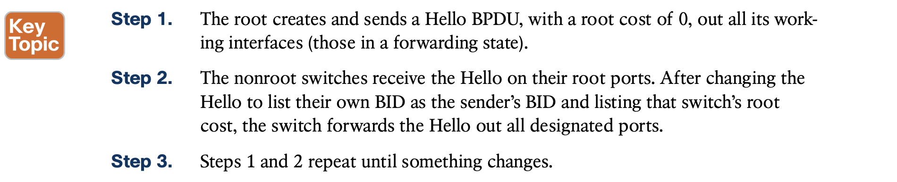

**When a switch fails to receive a Hello, it knows a problem might be occurring in the network.** Each switch relies on these periodically received Hellos from the root as a way to know that its path to the root is still working. When a switch ceases to receive the Hellos, or receives a Hello that lists different details, something has failed, so the switch reacts and starts the process of changing the spanning-tree topology.

### **STP Timers That Manage STP Convergence**

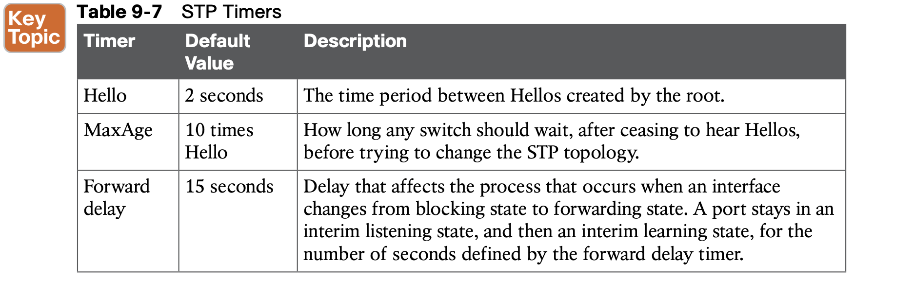

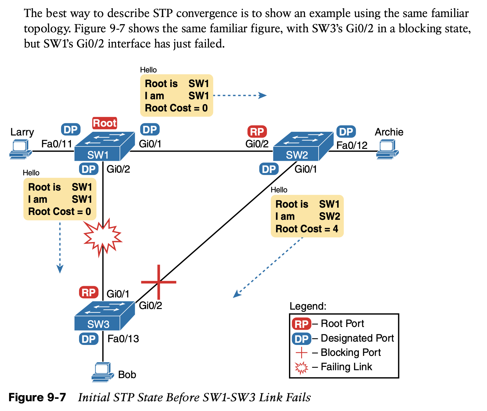

Now that SW3 can act, it begins by reevaluating the choice of root switch. SW3 still receives the Hellos from SW2, as forwarded from the root (SW1). SW1 still has a lower BID than SW3; otherwise, SW1 would not have already been the root. So, SW3 decides that SW1 wins the root election and that SW3 is not the root.

Next, SW3 reevaluates its choice of RP. At this point, SW3 is receiving Hellos on only one interface: Gi0/2. Whatever the calculated root cost, Gi0/2 becomes SW3’s new RP. (The cost would be 8, assuming the STP costs had no changes since Figures 9-5 and 9-6.)

SW3 then reevaluates its role as DP on any other interfaces. In this example, no real work needs to be done. SW3 was already DP on interface Fa0/13, and it continues to be the DP because no other switches connect to that port.

### **Changing Interface States with STP**

Switches using STP can simply move immediately from forwarding to blocking state, but they must take extra time to transition from blocking state to forwarding state. For instance, when switch SW3 in Figure 9-7 formerly used port G0/1 as its RP (a role), that port was in a forwarding state. After convergence, G0/1 might be neither an RP nor DP; the switch can immediately move that port to a blocking state.

However, when a port that formerly blocked needs to transition to forwarding, the switch first puts the port through two intermediate interface states. These temporary STP states help prevent temporary loops:

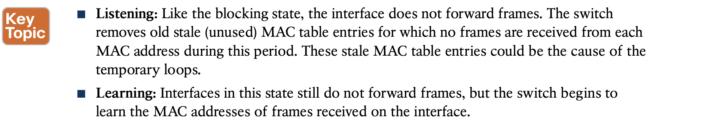

STP moves an interface from blocking to listening, then to learning, and then to forwarding state. STP leaves the interface in each interim state for a time equal to the forward delay timer, which defaults to 15 seconds. As a result, a convergence event that causes an interface to change from blocking to forwarding requires 30 seconds to transition from blocking to forwarding.

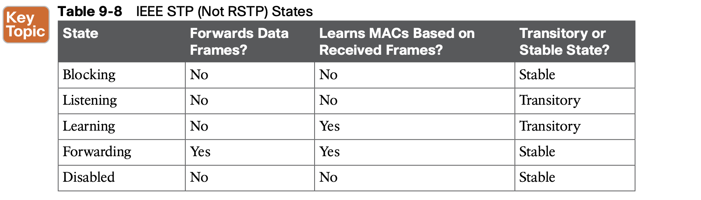

## 5. **Rapid STP Concepts**

### 5.1 **Comparing STP and RSTP**

**Similarities**

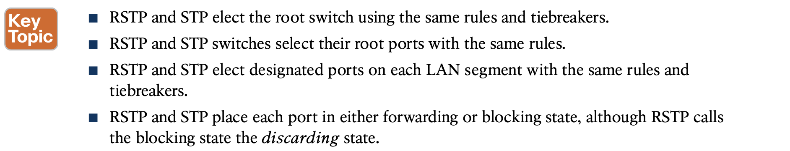

**Differences**

STP takes a relatively long time to converge (50 seconds with the default settings when all the wait times must be followed). RSTP improves network convergence when topology changes occur, usually converging within a few seconds (or in slow conditions, in about 10 seconds).

**RSTP changes and adds to STP in ways that avoid waiting on STP timers, resulting in quick transitions from forwarding to discarding (blocking) state and vice versa.** 

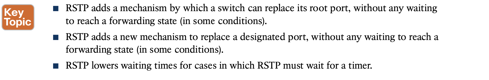

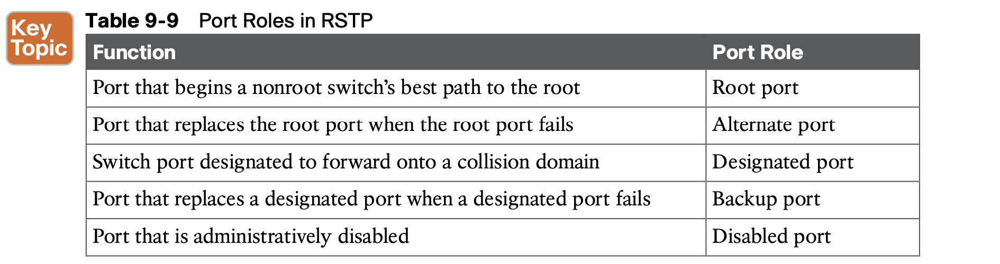

### 5.2 **RSTP and the Alternate (Root) Port Role**

To be an alternate port, both the RP and the alternate port must receive Hellos that identify the same root switch. For instance, in Figure 9-8, SW1 is the root. SW3 will receive Hello BPDUs on two ports: G0/1 and G0/2.

**SW3 picks G0/1 as its root port in this case and then makes G0/2 an alternate port.**

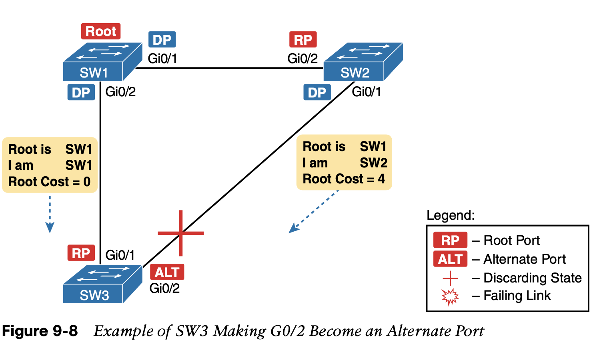

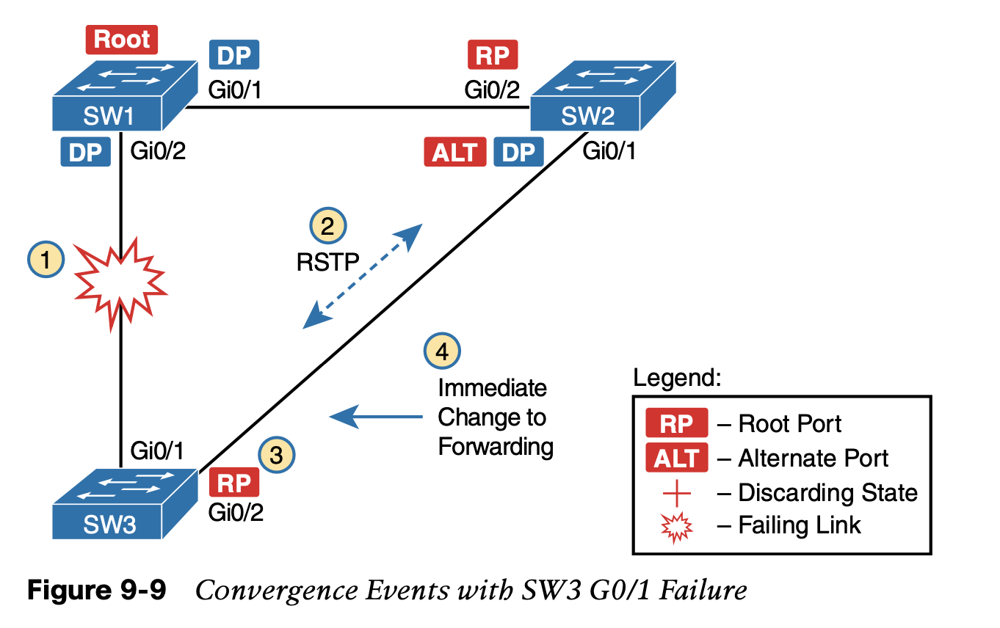

### 5.3 **RSTP States and Processes**

Both STP and RSTP use port states, but with some differences.

1. First, RSTP keeps both the learning and forwarding states as compared with STP, for the same purposes. However, RSTP does not even define a listening state, finding it unnecessary. Finally, RSTP renames the blocking state to the discarding state and redefines its use slightly.
2. RSTP uses the discarding state for what STP defines as two states: disabled state and blocking state. Blocking should be somewhat obvious by now: the interface can work physically, but STP/RSTP chooses to not forward traffic to avoid loops. STP’s disabled state simply meant that the interface was administratively disabled. RSTP just combines those into a single discarding state.

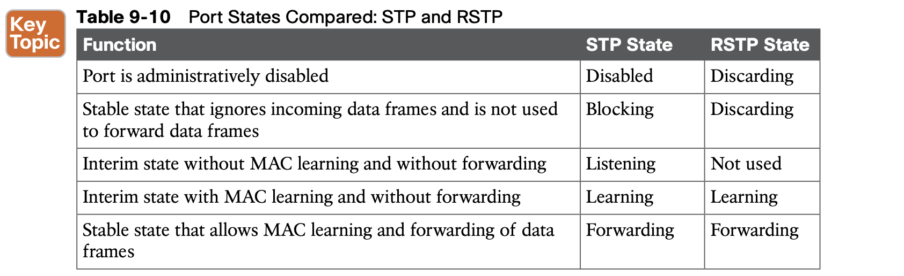

### 5.4 **RSTP and the Backup (Designated) Port Role**

As a reminder, the RSTP alternate port role creates a way for RSTP to quickly replace a switch’s root port. Similarly, the RSTP backup port role creates a way for RSTP to quickly replace a switch’s designated port on some LAN.

### 5.5 **RSTP Port Types**

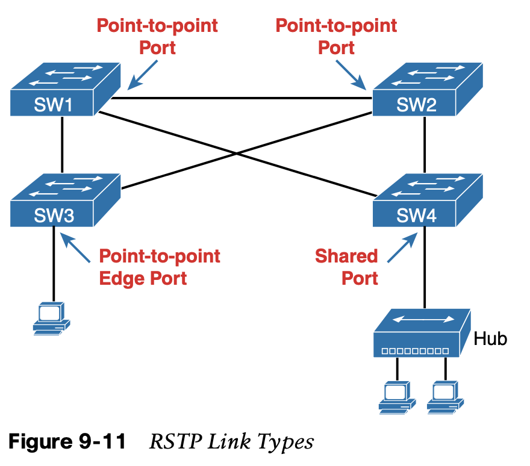

### 5.6 **Optional STP Features**

 the last few topics introduce a few optional features that make STP work even better or be more secure: 

- **EtherChannel:** EtherChannel provides a way to prevent STP convergence from being needed when only a single port or cable failure occurs.
- **PortFast**: PortFast allows a switch to immediately transition from blocking to forwarding, bypass-
   ing listening and learning states.
- **BPDU Guard**: Security
