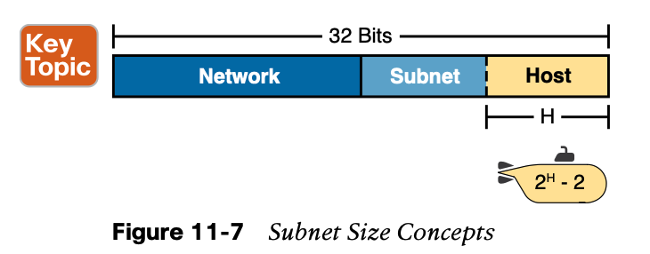

# **Perspectives on IPv4 Subnetting**

### 1. **Rules About Which Hosts Are in Which Subnet**

### 2. **Determining the Number of Subnets**

### 3. **Determining the Number of Hosts per Subnet**

However, the subnet’s size is not 2H. It’s 2H – 2 because two numbers in each subnet are reserved for other purposes. Each subnet reserves the numerically lowest value for the **subnet number** and the numerically highest value as the **subnet broadcast address**. As a result, the number of usable IP addresses per subnet is 2H – 2.

### 4. **Choose a Classful Network**

**Growth Exhausts the Public IP Address Space**

### 5. **Choose the Mask**

#### 5.1 Borrowing Host Bits to Create Subnet Bits

#### 5.2 Choosing Enough Subnet and Host Bits

