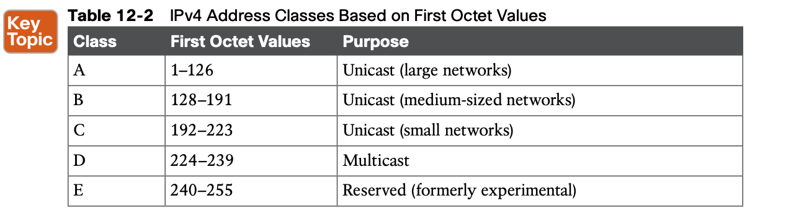
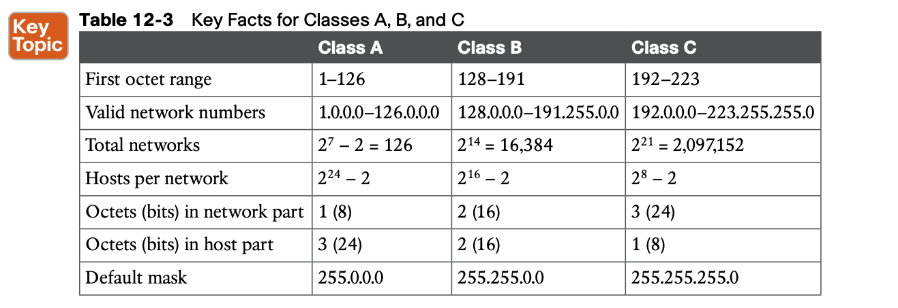
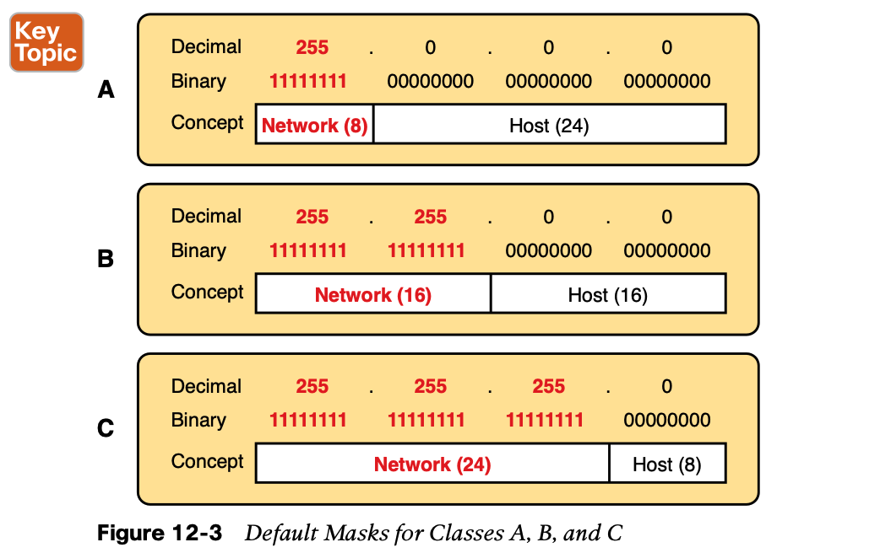

# **Analyzing Classful IPv4 Networks**

## 1. **IPv4 Network Classes and Related Facts**

**Address Formats**

**Default Masks**

**Number of Hosts per Network**

##  2. **Practice with Classful Networks**