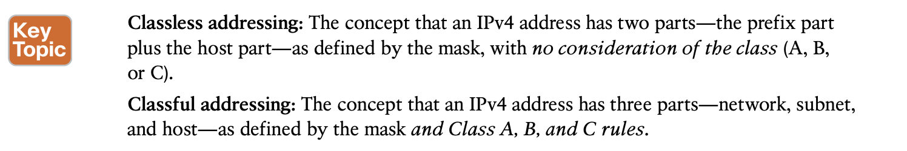

# **Analyzing Subnet Masks**

## 1. **Subnet Mask Conversion**

**Three Mask Formats**

**Converting Between Binary and Prefix Masks**

**Masks Divide the Subnet’s Addresses into Two Parts**

**Masks and Class Divide Addresses into Three Parts**

**Classless and Classful Addressing**

Classful addressing means that you think about Class A, B, and C rules, so the prefix is separated into the network and sub- net parts, as shown in Figures 13-6 and 13-7. Classless addressing means that you ignore the Class A, B, and C rules and treat the prefix part as one part, as shown in Figures 13-4 and 13-5. 