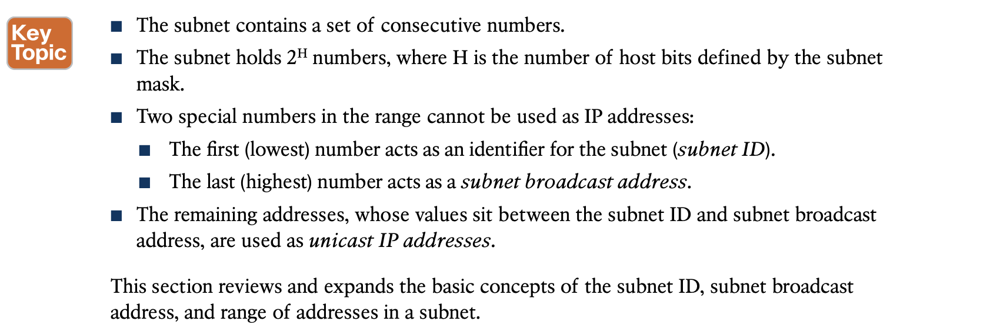
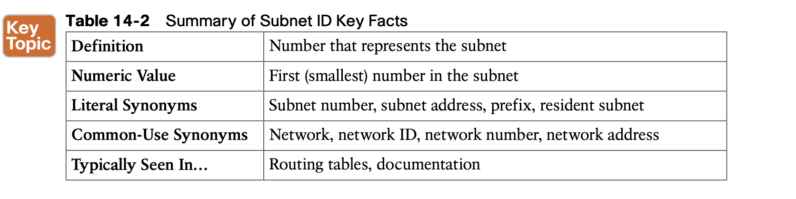
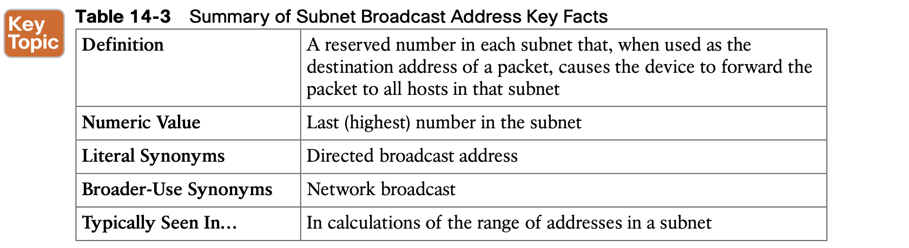
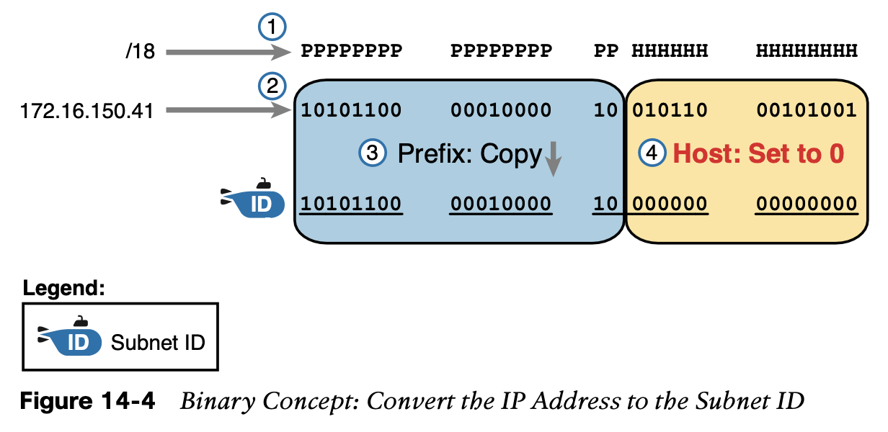
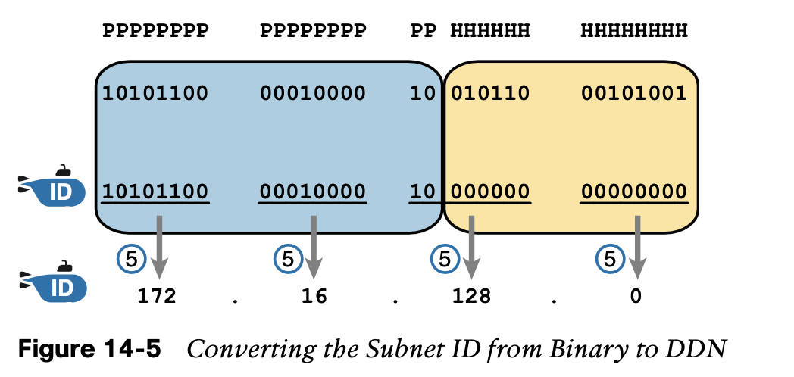
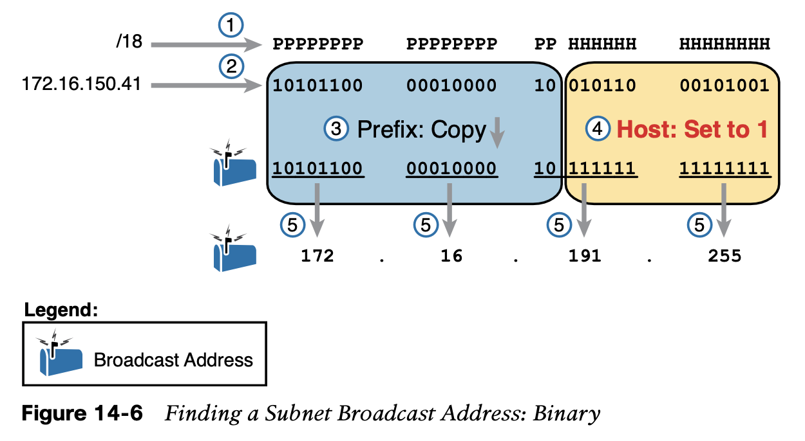
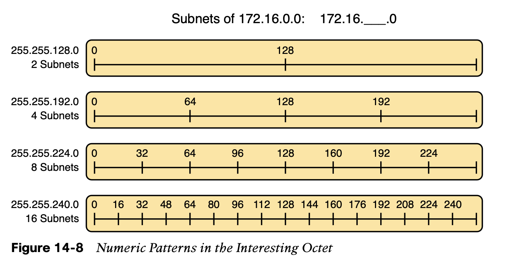
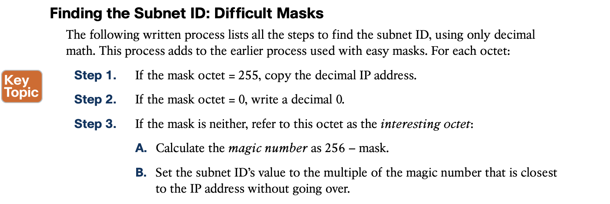

# **Analyzing Existing Subnets**

### 1. Defining a Subnet

**Subnet ID Concepts**

**Subnet Broadcast Address**

### 2. **Analyzing Existing Subnets: Binary**

**Finding the Subnet Broadcast Address: Binary**

### 3. **Analyzing Existing Subnets: Decimal**

