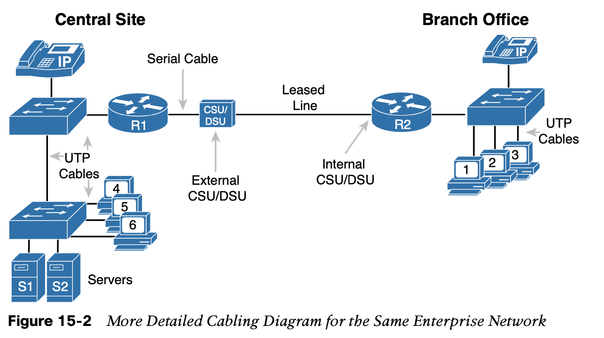

# Operating Cisco Routers

### 1. **Installing Cisco Routers**

**Network Interface Modules (NIMs)**

Gi0/1 refers to interface GigabitEthernet0/1 and is an RJ-45 port that supports UTP cabling only. However, interface Gi0/0 (short for GigabitEthernet0/0) has some interesting features:

- The router has two ports for one interface (Gi0/0).
- You can use one or the other at any point in time, but not both.
- One physical port is an RJ-45 port that supports copper cabling (implying that it is used to connect to a LAN).
- The other Gi0/0 physical port is a Small Form Pluggable (SFP) port that would support vari- ous fiber Ethernet standards, allowing the port to be used for Ethernet WAN purposes.

**Note that Cisco enterprise routers typically have an on/off switch, while switches do not.**

The terms **enterprise router** and **small office/home office (SOHO)** router act as a pair of contrasting categories for routers,

### 2. **Enabling IPv4 Support on Cisco Router Interfaces**

A couple of topics do work differently with the router CLI as compared to the switch CLI, as follows:

#### 2.1 **Router Interfaces**

Routers support a variety of other types of interfaces, including serial interfaces, cable TV, DSL, 3G/4G wireless, and others not mentioned in this book.

Two of the most common commands to display the interfaces, and their status, are the
 **show ip interface brief** and **show interfaces** commands. 

