# Configuring IPv4 Addressing and Static Routes

## 1. **IP Routing**

**IPv4 Routing Process Reference**

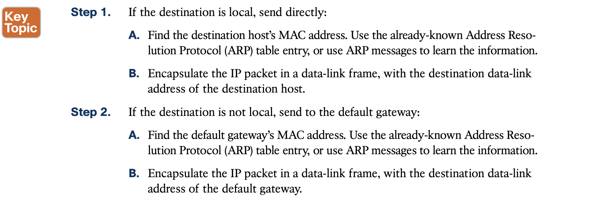

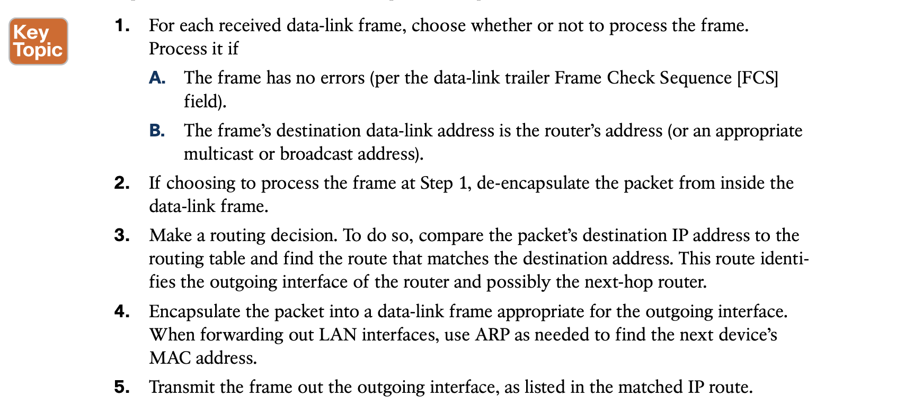

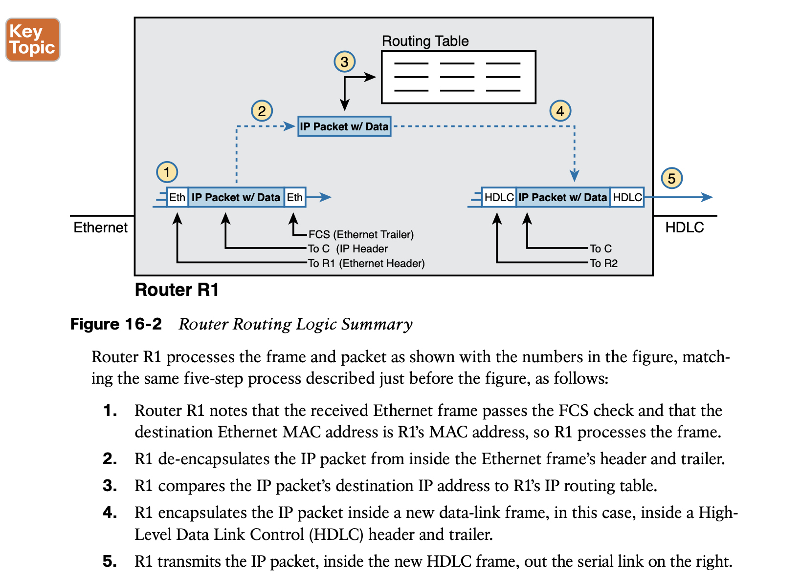

**Routing Step 1:** Decide Whether to Process the Incoming Frame

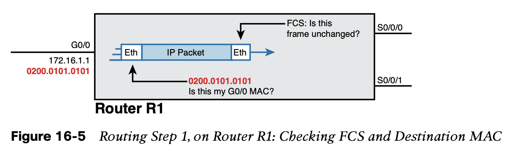

**Routing Step 2**: De-encapsulation of the IP Packet

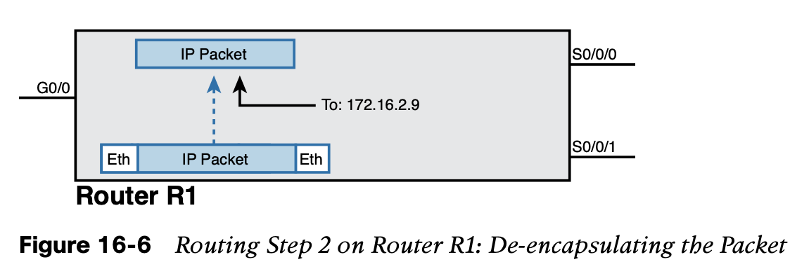

**Routing Step 3:** Choosing Where to Forward the Packet

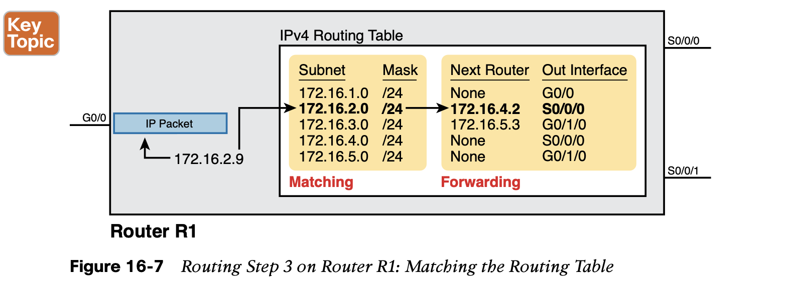

**Routing Step 4:** Encapsulating the Packet in a New Frame

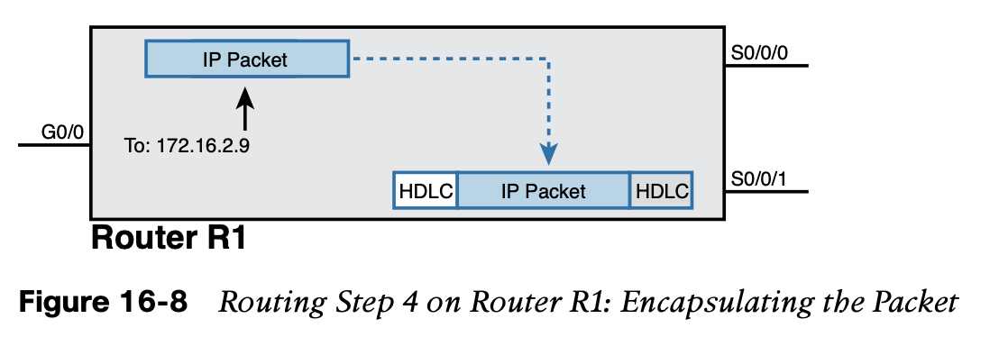

**Routing Step 5:** Transmitting the Frame

## 2. **Configuring IP Addresses and Connected Routes**

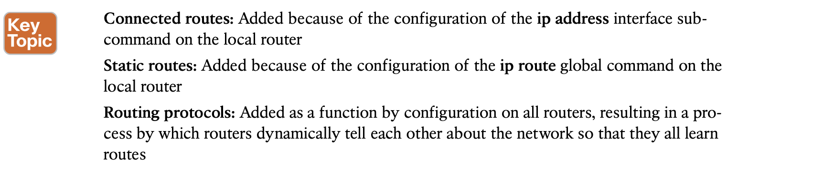

**Connected Routes and the ip address Command**

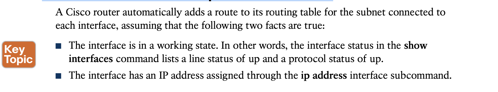

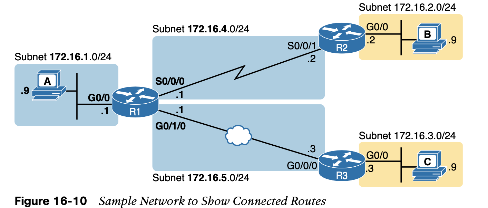

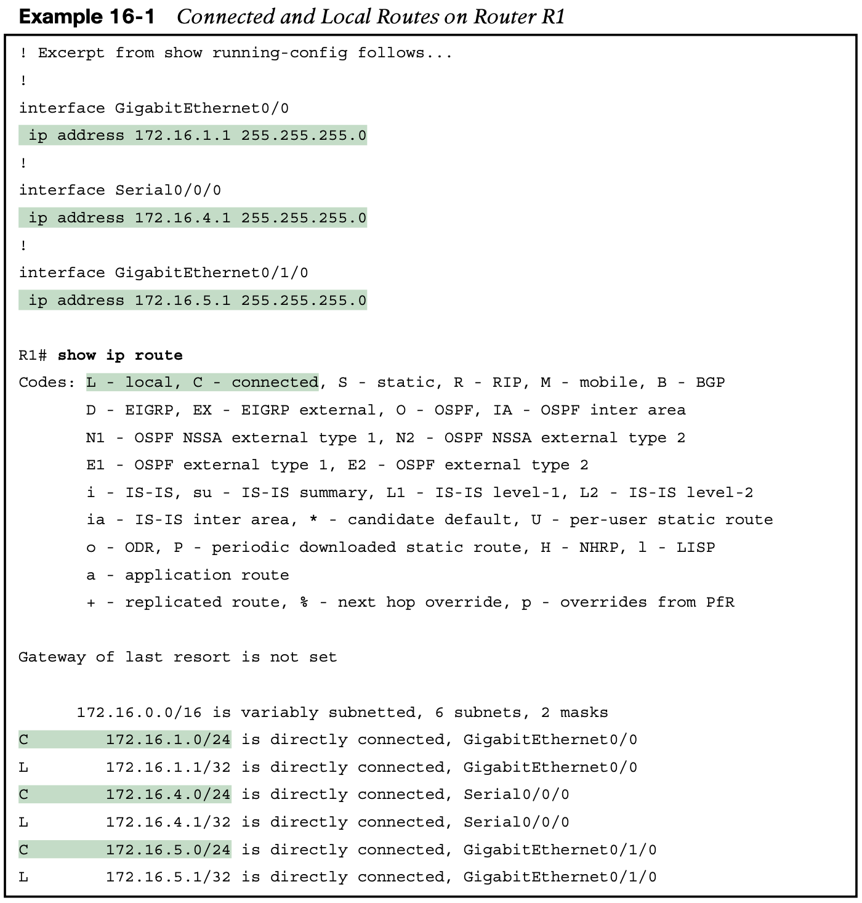

**The ARP Table on a Cisco Router**

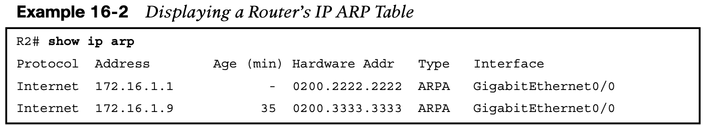

Note that to experiment in the lab, you might want to empty all dynamic entries (or a single entry for one IP address) using the **clear ip arp** [ip-address] EXEC command.

## 3. **Configuring Static Routes**

**Static Network Routes**

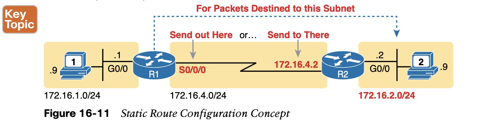

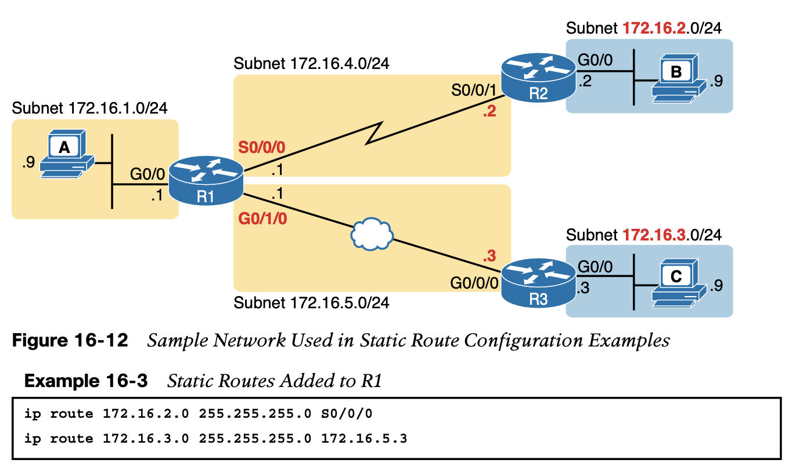

```
show ip route
show ip route static
```

**Floating Static Routes**

Next, consider the case in which a static route competes with other **static routes or routes learned by a routing protocol.** That is, the **ip route** command defines a route to a subnet, but the router also knows of other static or dynamically learned routes to reach that same subnet. In these cases, the router must first decide which routing source has the better administrative distance, with lower being better, and then use the route learned from the better source.

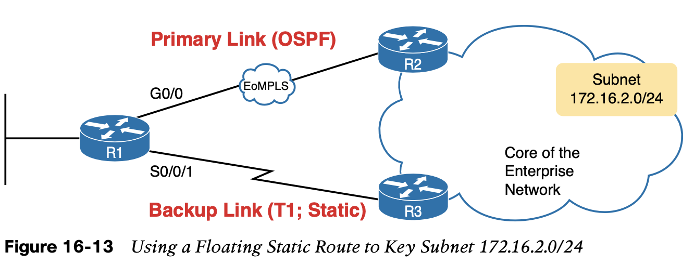

**By default, IOS considers static routes better than OSPF-learned routes. By default, IOS gives static routes an administrative distance of 1 and OSPF routes an administrative distance of 110.**

in this case, which is not the intended design. Instead, the engineer prefers to use the OSPF- learned routes over the much-faster primary link and use the static route over the backup link only as needed when the primary link fails.

To instead prefer the OSPF routes, the configuration would need to change the administra- tive distance settings and use what many networkers call a floating static route. 

For example, the **ip route 172.16.2.0 255.255.255.0 172.16.5.3 130** command on R1 would do exactly that—setting the static route’s administrative distance to 130. As long as the primary link stays up, and OSPF on R1 learns a route for 172.16.2.0/24, with a default administrative distance of 110, R1 ignores the static route.

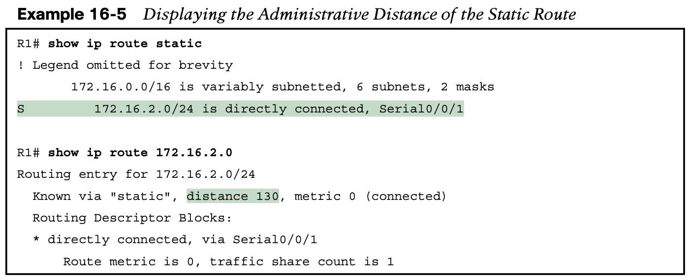

**Static Default Routes**

When a router tries to route a packet, the router might not match the packet’s destination IP address with any route. When that happens, the router normally just discards the packet.

Routers can be configured so that they use either a statically configured or dynamically learned default route. The default route matches all packets, so that if a packet does not match any other more specific route in the routing table, the router can at least forward the packet based on the default route.

```shell
ip route 0.0.0.0 0.0.0.0 S0/0/1 
# creates a static default route on Router B1—a route that matches all IP packets—and sends those packets out interface S0/0/1.
```


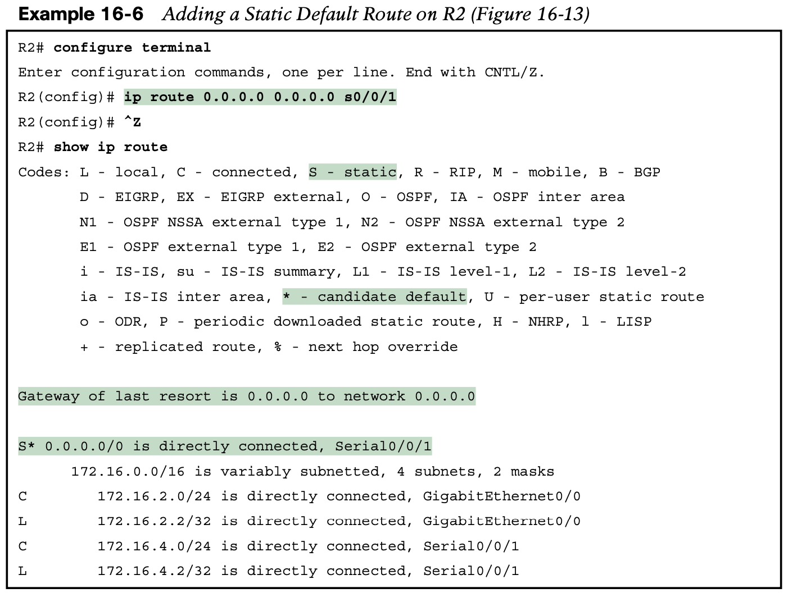

**Troubleshooting Static Routes**

1. **Troubleshooting Incorrect Static Routes That Appear in the IP Routing Table**

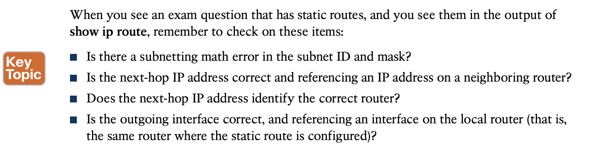

2. **The Static Route Does Not Appear in the IP Routing Table**

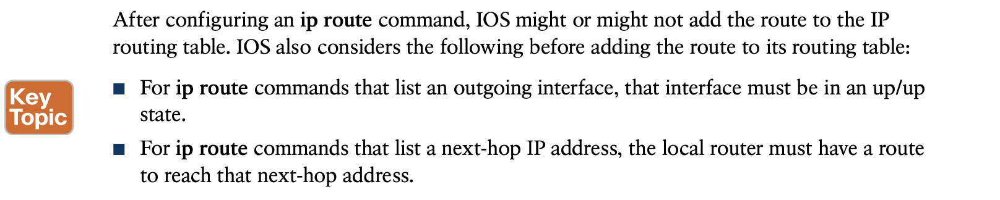

You can configure a static route so that IOS ignores these basic checks, always putting the IP route in the routing table. To do so, just use the **permanent** keyword on the **ip route** com- mand.

## 4. **IP Forwarding with the Longest Prefix Match**

**Interpreting the IP Routing Table**

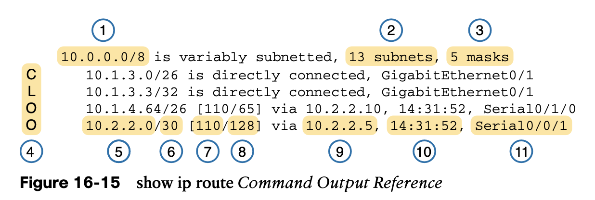

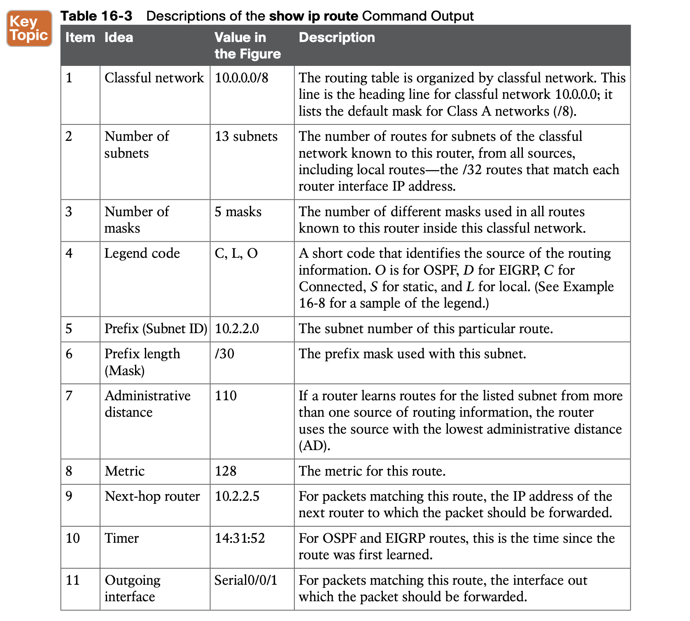

## **Command References**

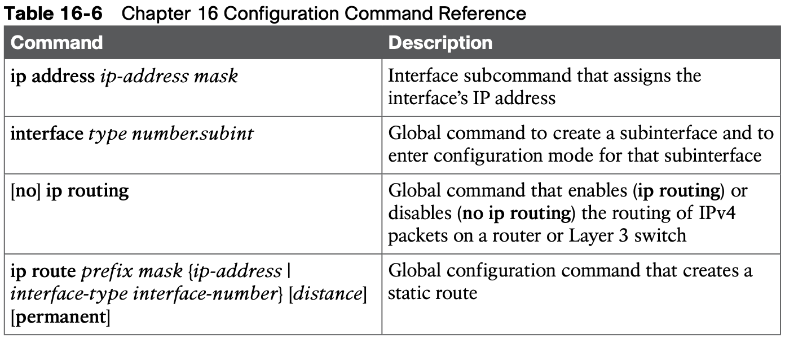

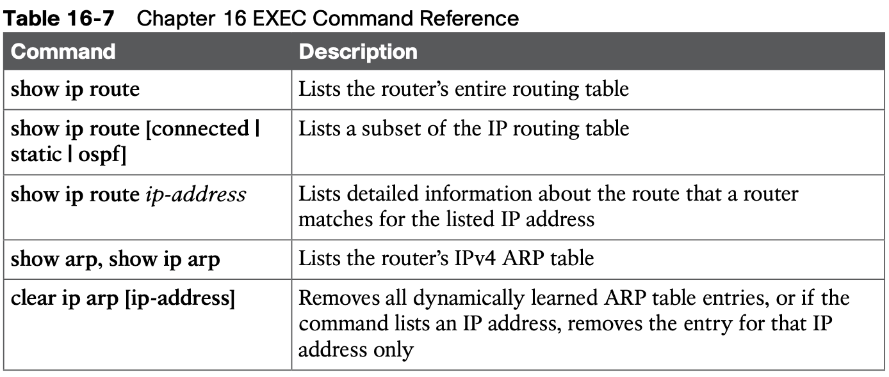
