# **Troubleshooting IPv4 Routing**

## 1  **Problem Isolation Using the ping Command**

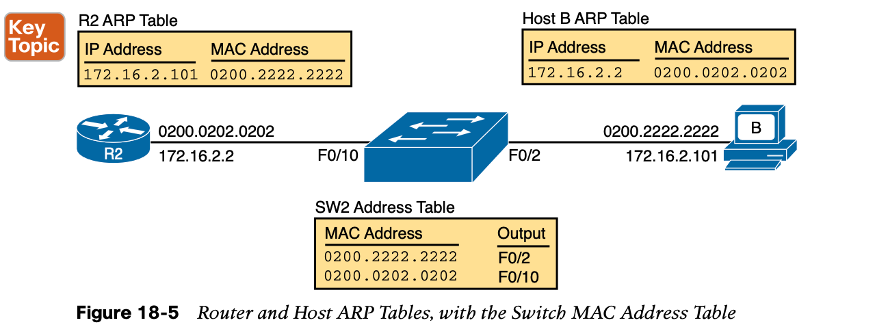

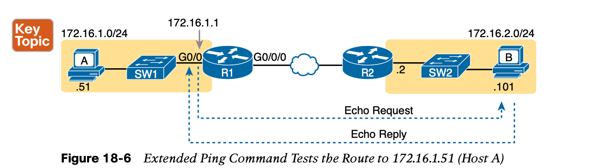

The extended **ping** command does allow the user to type all the parameters on a potentially long command, but it also allows users to simply issue the **ping** command, press **Enter**, with IOS then asking the user to answer questions to complete the command, as shown in Example 18-3. The example shows the **ping** command on R1 that matches the logic in Figure 18-6. This same command could have been issued from the command line as **ping 172.16.2.101 source 172.16.1.1.**

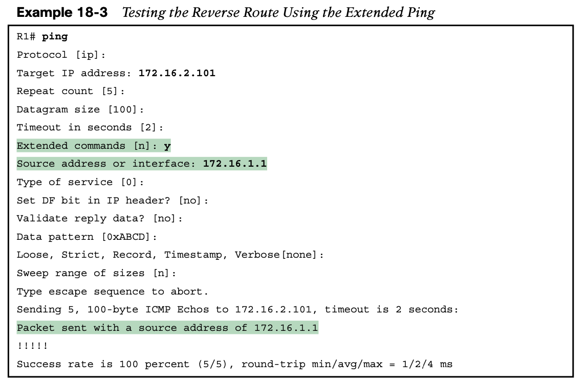

**Testing LAN Neighbors with Standard Ping**

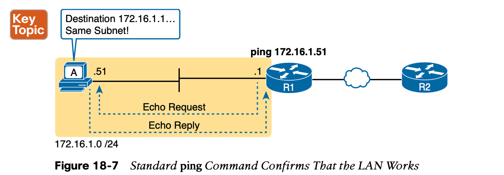

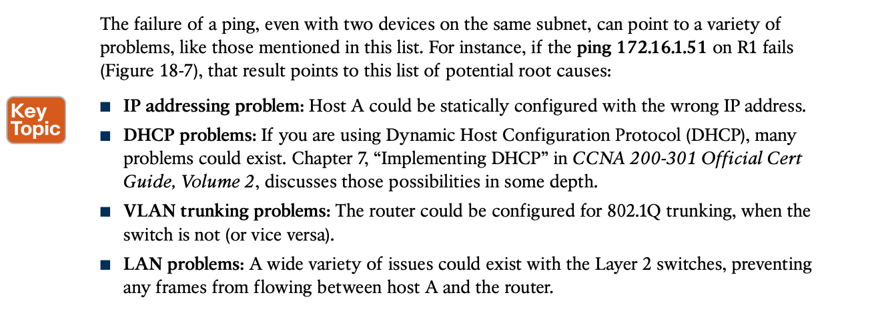

**Testing LAN Neighbors with Extended Ping**

## 2. **Problem Isolation Using the traceroute Command**

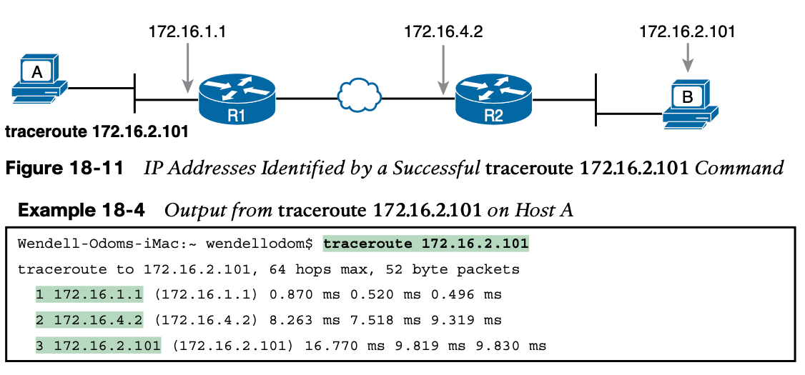

**How the traceroute Command Works**

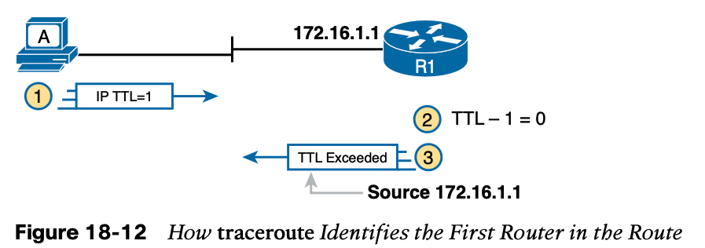

  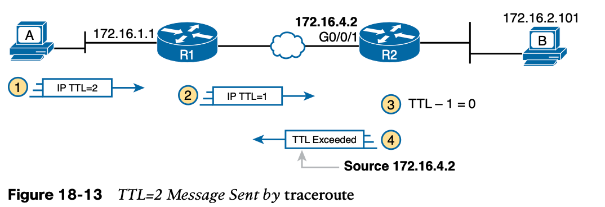

**Standard and Extended traceroute**

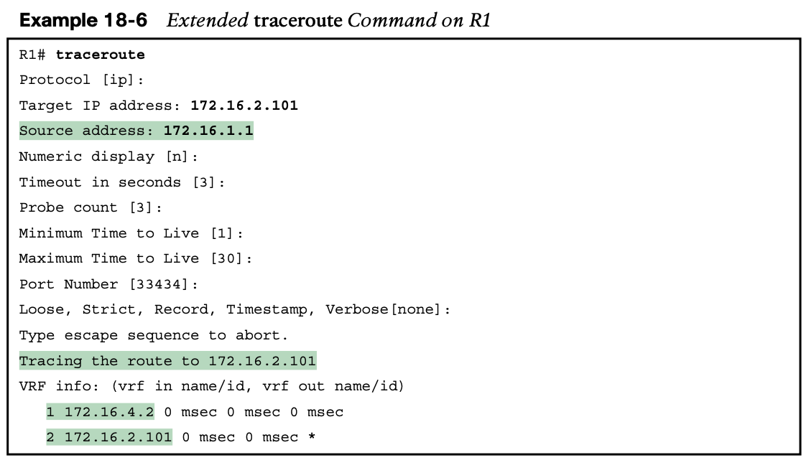

## 3. **Telnet and SSH**

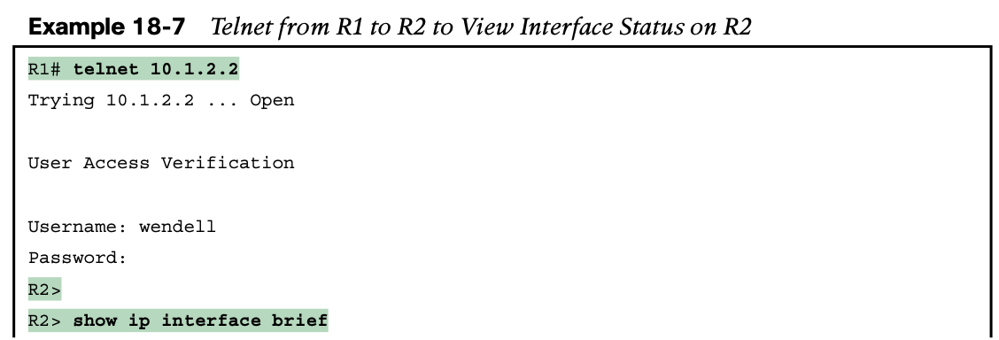

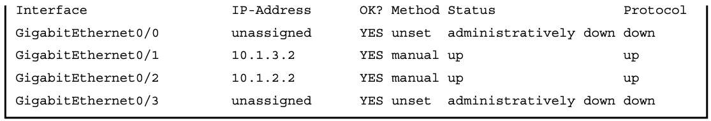

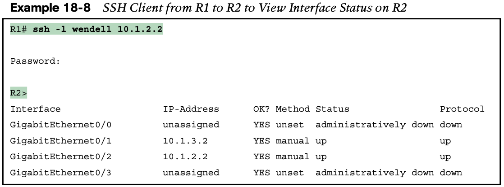