# **Understanding OSPF Concepts**

## 1. **Comparing Dynamic Routing Protocol Features**

Routers add IP routes to their routing tables using three methods: connected routes, static routes, and routes learned by using dynamic routing protocols.

**Routing Protocol Functions**

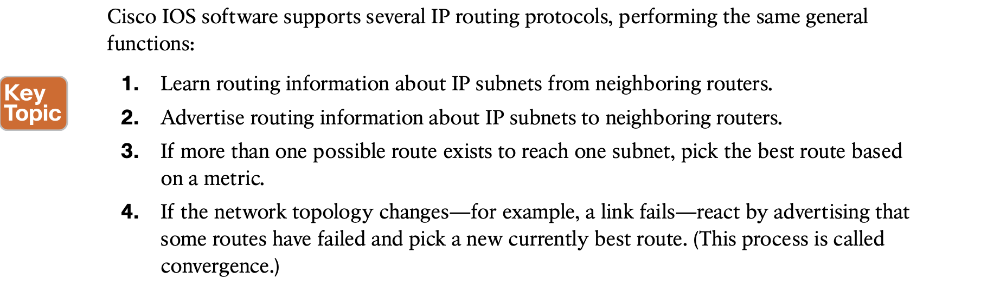

**Interior and Exterior Routing Protocols**

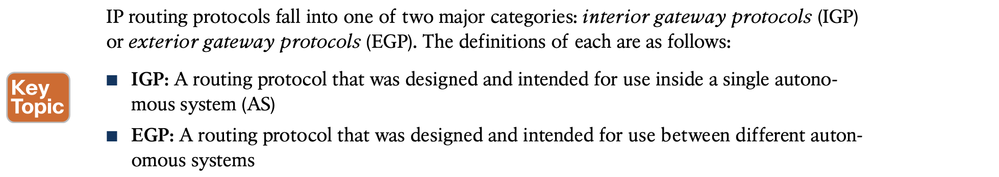

These definitions use another new term: **autonomous system (AS).** An AS is a network under the administrative control of a single organization. For example, a network created and paid for by a single company is probably a single AS, and a network created by a single school system is probably a single AS.

**Today, Border Gateway Protocol (BGP) is the only EGP used.**

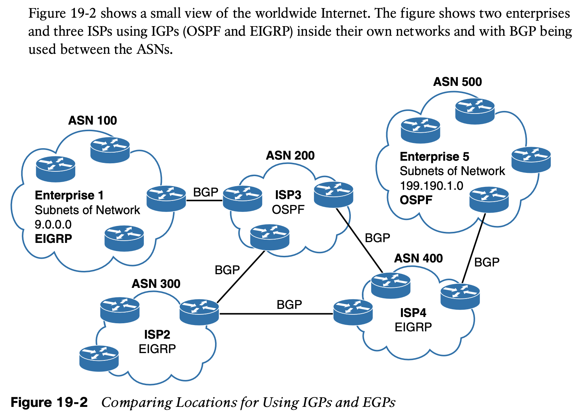

**Comparing IGPs**

Organizations have several options when choosing an IGP for their enterprise network, but **most companies today use either OSPF or EIGRP.**

**IGP Routing Protocol Algorithms**

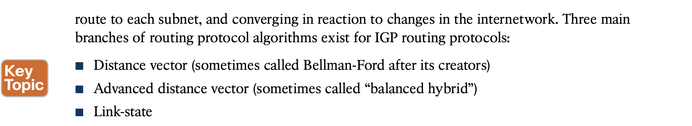

1. **Routing Information Protocol (RIP)** was the first popularly used IP distance vector protocol, with the Cisco-proprietary Interior Gateway Routing Protocol (IGRP) being intro- duced a little later.
2. distance vector protocols’ somewhat slow convergence and potential for routing loops, Link-state protocols—in particular, **Open Shortest Path First (OSPF)** and **Integrated Intermediate System to Intermediate System (IS-IS)**—solved the main issues. They also came with a price: they required extra CPU and memory on routers, with more planning required from the network engineers.

3. Cisco created a proprietary routing proto- col called **Enhanced Interior Gateway Routing Protocol (EIGRP)**, which used some features of the earlier IGRP protocol. EIGRP solved the same problems as did link-state routing protocols, but EIGRP required less planning when implementing the network.

**Metrics**

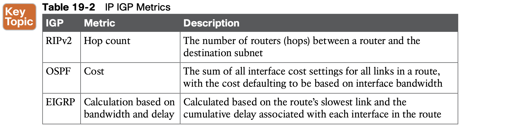

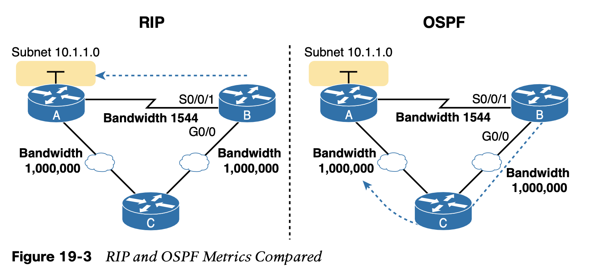

**Other IGP Comparisons**

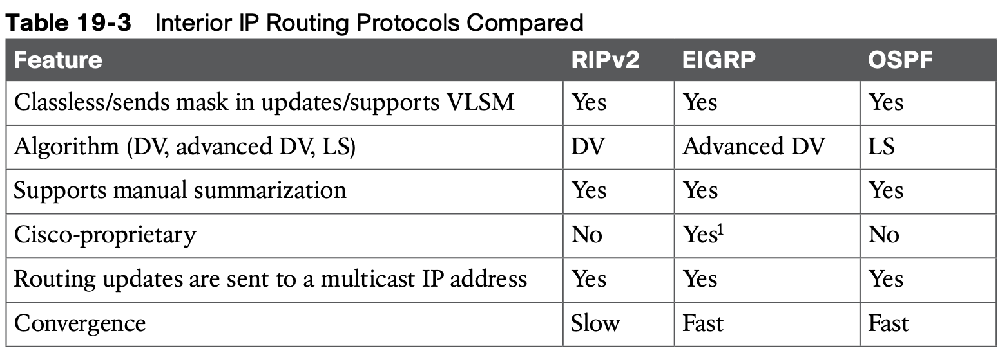

**variable-length subnet masks (VLSM)**

**Administrative Distance**

When IOS must choose between routes learned using different routing protocols, IOS uses a concept called administrative distance. Administrative distance is a number that denotes how believable an entire routing protocol is on a single router. The lower the number, the better, or more believable, the routing protocol.

For example, RIP has a default administra- tive distance of 120, OSPF uses a default of 110, and EIGRP defaults to 90. When using OSPF and EIGRP, the router will believe the EIGRP route instead of the OSPF route (at least by default).

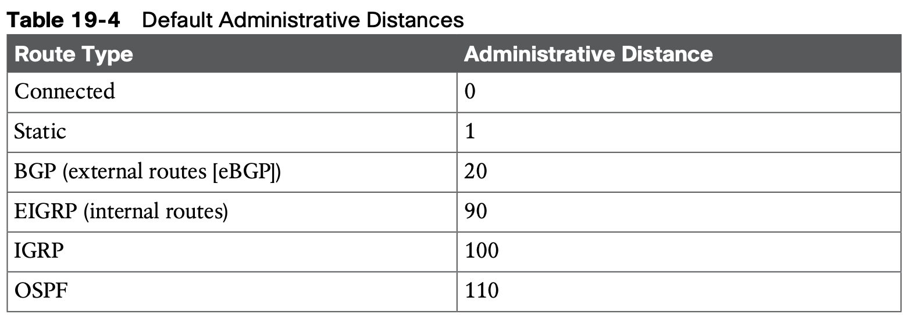

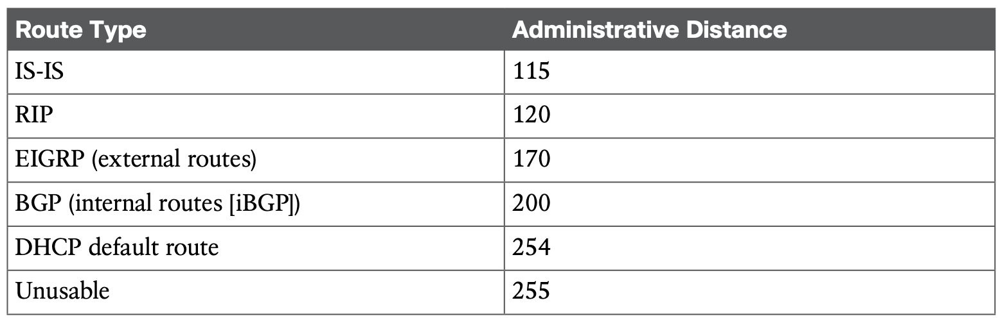

## 2. **OSPF Concepts and Operation**

This section begins with an overview of what OSPF does by exchanging data about the network in data structures called **link-state advertisements (LSA).** 

### 2.1 **OSPF Overview**

Link-state protocols build IP routes with a couple of major steps. 

1. First, the routers together build a lot of information about the network: routers, links, IP addresses, status information, and so on. 
2. Then the routers flood the information, so all routers know the same information.
3. At that point, each router can calculate routes to all subnets, but from each router’s own perspective.

**Topology Information and LSAs**

Open Shortest Path First (OSPF), the most popular link-state IP routing protocol, organizes topology information using **LSAs** and the **link-state database (LSDB).**

Each LSA is a data structure with some specific information about the network topology; the LSDB is simply the collection of all the LSAs known to a router.

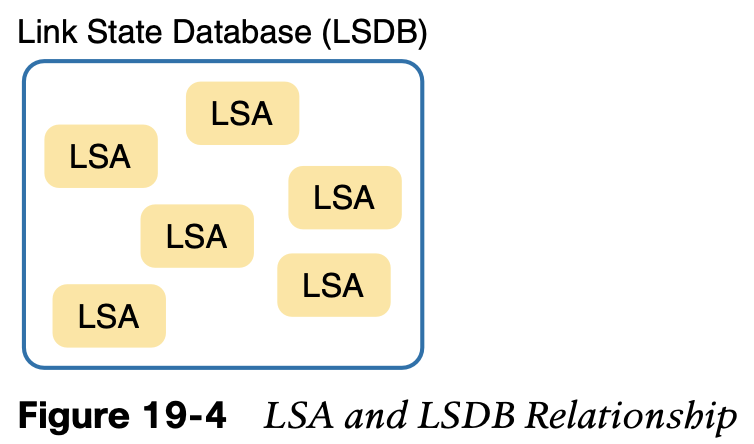

Figure 19-5 shows the general idea of the flooding process, with R8 creating and flooding its router LSA. The router LSA for Router R8 describes the router itself, including the existence of subnet 172.16.3.0/24, as seen on the right side of the figure.

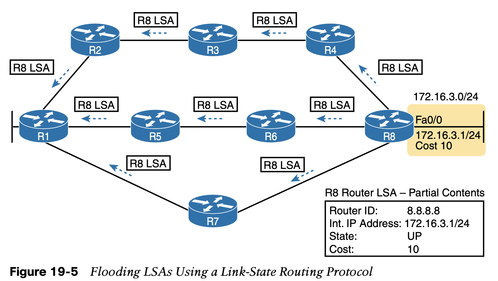

Figure 19-5 shows the rather basic flooding process, with R8 sending the original LSA for itself, and the other routers flooding the LSA by forwarding it until every router has a copy. The flooding process causes every router to learn the contents of the LSA while preventing the LSA from being flooded around in circles.

Once flooded, routers do occasionally reflood each LSA. Routers reflood an LSA when some information changes (for example, when a link goes up or comes down). They also reflood each LSA based on each LSA’s separate aging timer (default 30 minutes).

**Applying Dijkstra SPF Math to Find the Best Routes**

All link-state protocols use a type of math algorithm, called the Dijkstra Shortest Path First (SPF) algorithm, to process the LSDB.

### 2.2 **Becoming OSPF Neighbors**

**The Basics of OSPF Neighbors**

OSPF neighbors are routers that both use OSPF and both sit on the same data link. **Two routers can become OSPF neighbors if connected to the same VLAN, or same serial link, or same Ethernet WAN link.**

The OSPF neighbor model allows new routers to be dynamically discovered. That means new routers can be added to a network without requiring every router to be reconfig- ured. Instead, OSPF routers listen for OSPF Hello messages from new routers and react to those messages, attempting to become neighbors and exchange LSDBs.

**Meeting Neighbors and Learning Their Router ID**

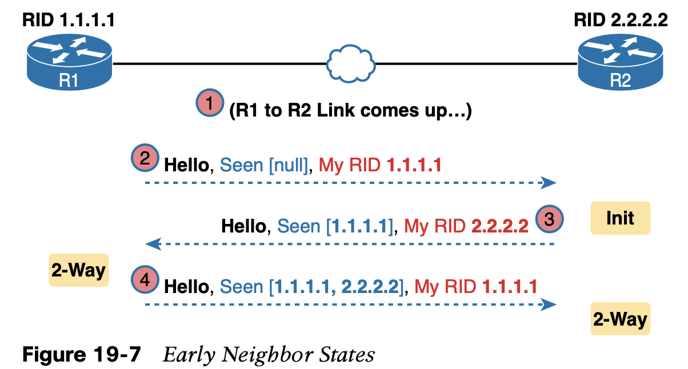

Following the steps in the figure, the scenario begins with the link down, so the routers have no knowledge of each other as OSPF neighbors. As a result, they have no state (status) infor- mation about each other as neighbors, and they would not list each other in the output of the **show ip ospf neighbor** command. At Step 2, R1 sends the first Hello, so R2 learns of the existence of R1 as an OSPF router. At that point, R2 lists R1 as a neighbor, with an interim beginning state of init.

The process continues at Step 3, with R2 sending back a Hello. This message tells R1 that R2 exists, and it allows R1 to move through the init state and quickly to a 2-way state. At Step 4, R2 receives the next Hello from R1, and R2 can also move to a 2-way state.

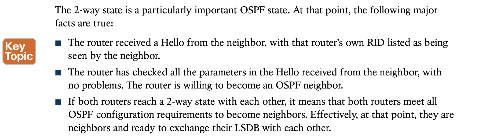

### 2.3 **Exchanging the LSDB Between Neighbors**

**Fully Exchanging LSAs with Neighbors**

After two routers decide to exchange databases, they do not simply send the contents of the entire database. First, they tell each other a list of LSAs in their respective databases—not all the details of the LSAs, just a list. (Think of these lists as checklists.) Then each router can check which LSAs it already has and then ask the other router for only the LSAs that are not known yet.

the OSPF messages that actually send the LSAs between neighbors are called **Link-State Update (LSU)** packets. That is, the LSU packet holds data structures called link- state advertisements (LSA). The LSAs are not packets, but rather data structures that sit inside the LSDB and describe the topology.

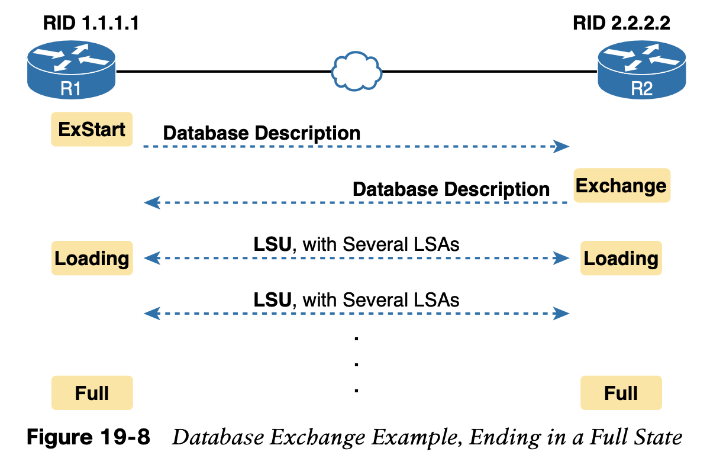

**Maintaining Neighbors and the LSDB**

For example, imagine a LAN switch loses power, so a router’s G0/0 interface fails from up/up to down/down. That router updates an LSA that shows the router’s G0/0 as being down. That router then sends the LSA to its neighbors, and that neighbor in turn sends it to its neigh- bors, until all routers again have an identical copy of the LSDB. Each router’s LSDB now reflects the fact that the original router’s G0/0 interface failed, so each router will then use SPF to recalculate any routes affected by the failed interface.

By default, each router that creates an LSA also has the responsibility to reflood the LSA every 30 minutes (the default), even if no changes occur.

**Using Designated Routers on Ethernet Links**

OSPF behaves differently on some types of interfaces based on a per-interface setting called the OSPF network type. On Ethernet links, OSPF defaults to use a network type of broad- cast, which causes OSPF to elect one of the routers on the same subnet to act as the desig- nated router (DR). The DR plays a key role in how the database exchange process works, with different rules than with point-to-point links.

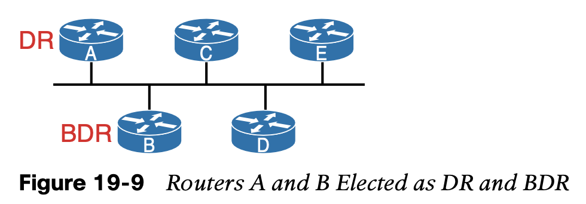

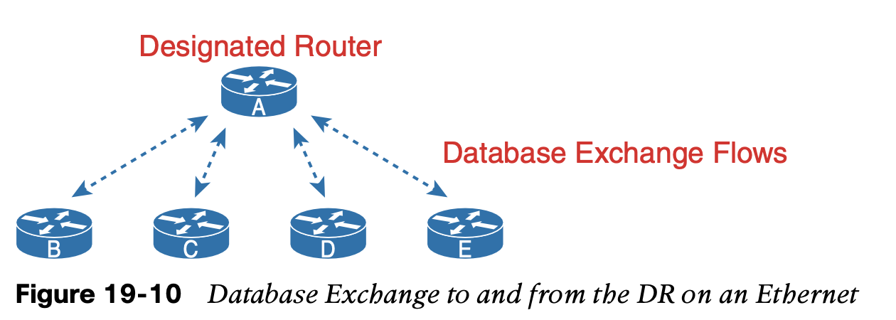

OSPF uses the **BDR** concept because the DR is so important to the database exchange pro- cess. The BDR watches the status of the DR and takes over for the DR if it fails. (When the DR fails, the BDR takes over, and then a new BDR is elected.)

Because the DR and BDR both do full database exchange with all the other OSPF routers in the LAN, they reach a full state with all neighbors. However, routers that are neither a DR nor a BDR— called DROthers by OSPF—never reach a full state because they do not exchange LSDBs directly with each other. As a result, the **show ip ospf neighbor** command on these DROther routers lists some neighbors in a 2-way state, remaining in that state under normal operation.

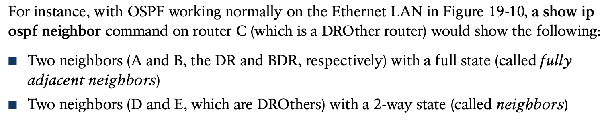

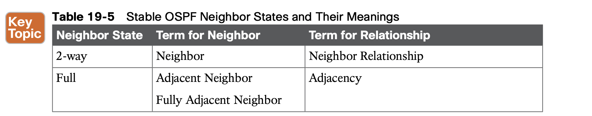

### 2.4 **Calculating the Best Routes with SPF**

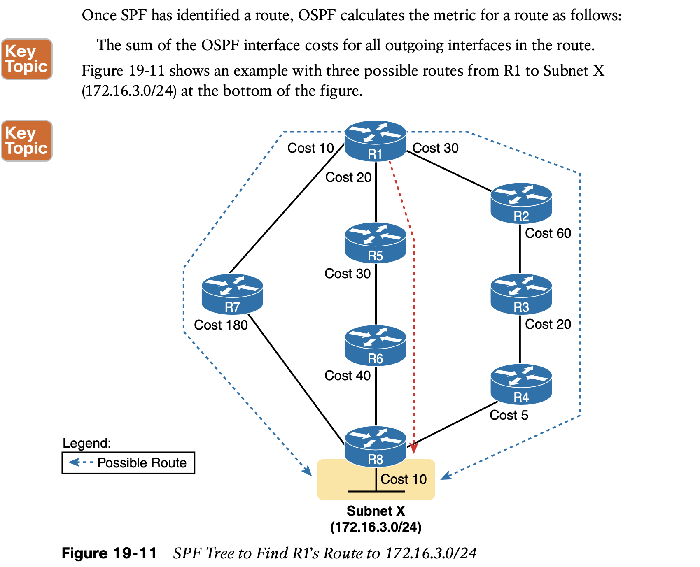

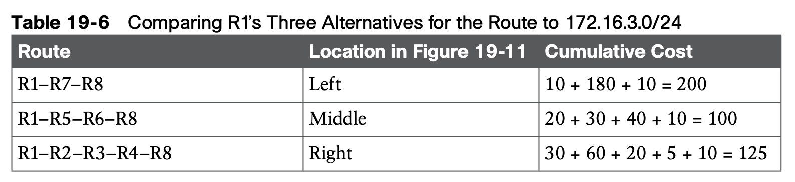

As a result of the SPF algorithm’s analysis of the LSDB, R1 adds a route to subnet 172.16.3.0/24 to its routing table, with the next-hop router of R5.

## 3. **OSPF Areas and LSAs**

OSPF can be used in some networks with very little thought about design issues. You just turn on OSPF in all the routers, put all interfaces into the same area (usually area 0), and it works! Figure 19-12 shows one such network example, with 11 routers and all interfaces in area 0.

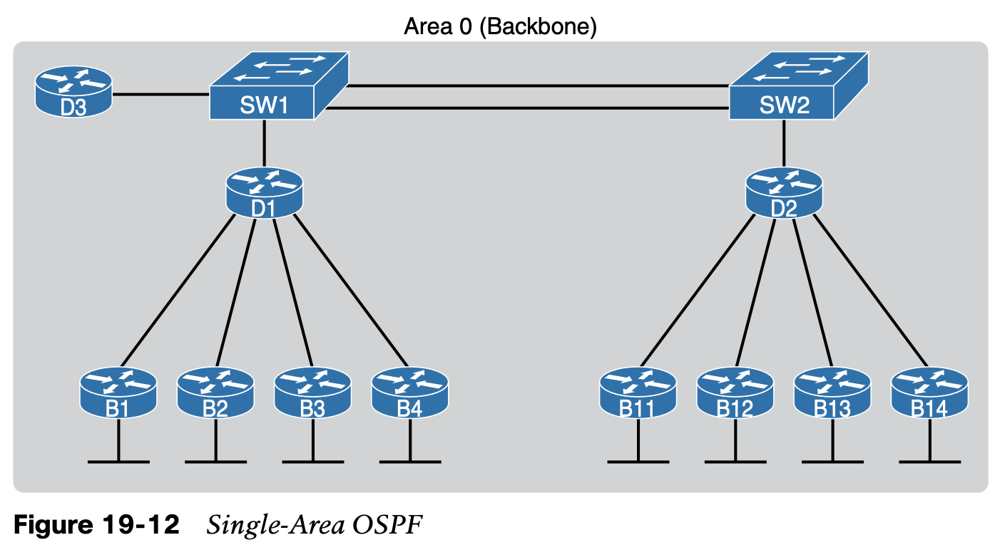

**The solution is to take the one large LSDB and break it into several smaller LSDBs by using OSPF areas.**

For instance, an internetwork with 1000 routers and 2000 subnets, broken in 100 areas, would average 10 routers and 20 subnets per area. The SPF calculation on a router would have to only process topology about 10 routers and 20 links, rather than 1000 routers and 2000 links.

### 3.1 **OSPF Areas**

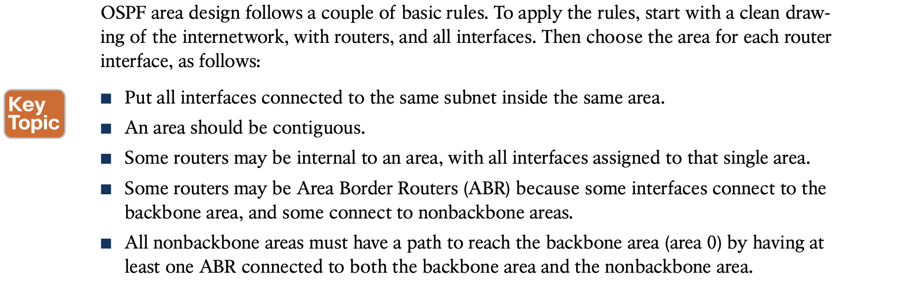

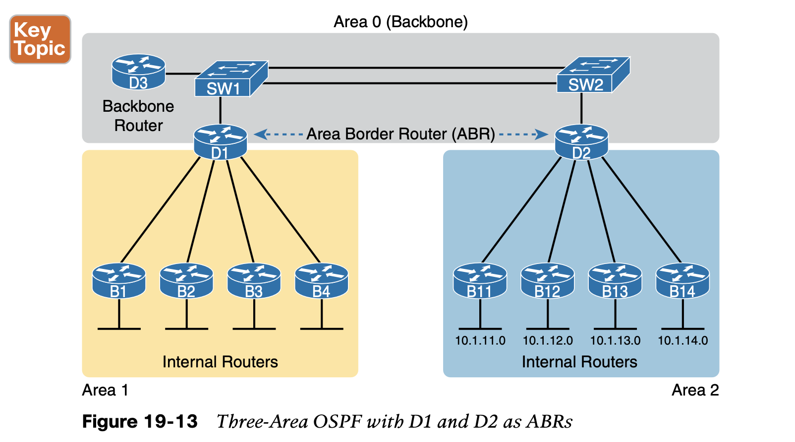

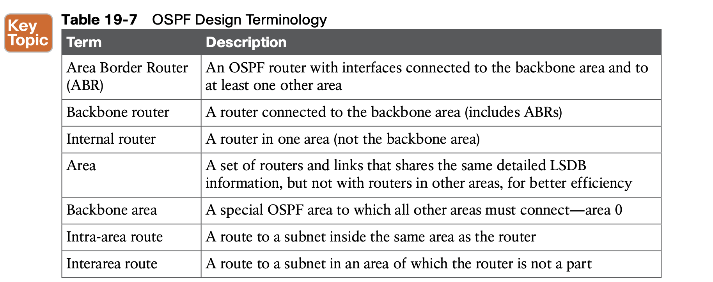

### 3.2 **How Areas Reduce SPF Calculation Time**

SPF spends most of its processing time working through all the topology details, namely routers and the links that connect routers. Areas reduce SPF’s workload because, for a given area, the LSDB lists only routers and links inside that area, as shown on the left side of Figure 19-14.

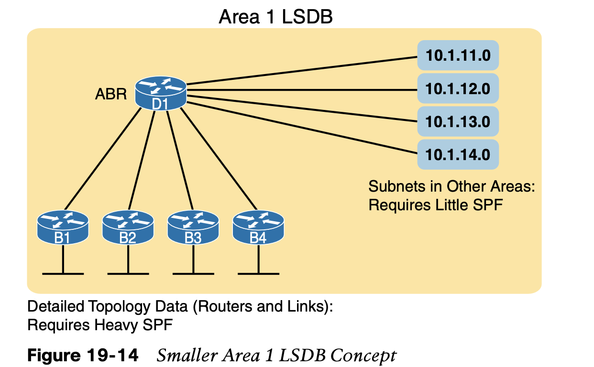

While the LSDB has less topology information, it still has to have information about all subnets in all areas, so that each router can create IPv4 routes for all subnets. So, with an area design, OSPFv2 uses very brief summary information about the subnets in other areas.

### 3.3 **(OSPFv2) Link-State Advertisements**

**Router LSAs Build Most of the Intra-Area Topology**

To see a specific instance, first review Figure 19-15. It lists internetwork topology, with sub- nets listed. Because it’s a small internetwork, the engineer chose a single-area design, with all interfaces in backbone area 0.

With the single-area design planned for this small internetwork, the LSDB will contain four router LSAs. Each router creates a router LSA for itself, with its own RID as the LSA identi- fier. The LSA lists that router’s own interfaces, IP address/mask, with pointers to neighbors.

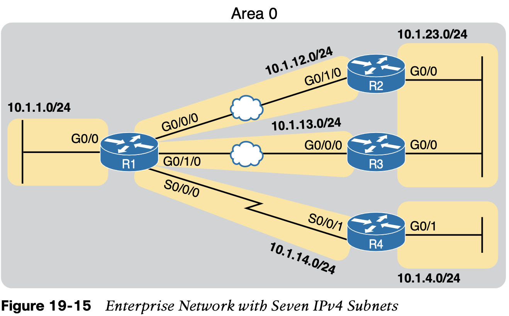

Once all four routers have copies of all four router LSAs, SPF can mathematically analyze the LSAs to create a model. 

**Network LSAs Complete the Intra-Area Topology**

Whereas router LSAs define most of the intra-area topology, network LSAs define the rest. As it turns out, when OSPF elects a DR on some subnet and that DR has at least one neigh- bor, OSPF treats that subnet as another node in its mathematical model of the network. To represent that network, the DR creates and floods a network (Type 2) LSA for that network (subnet).

