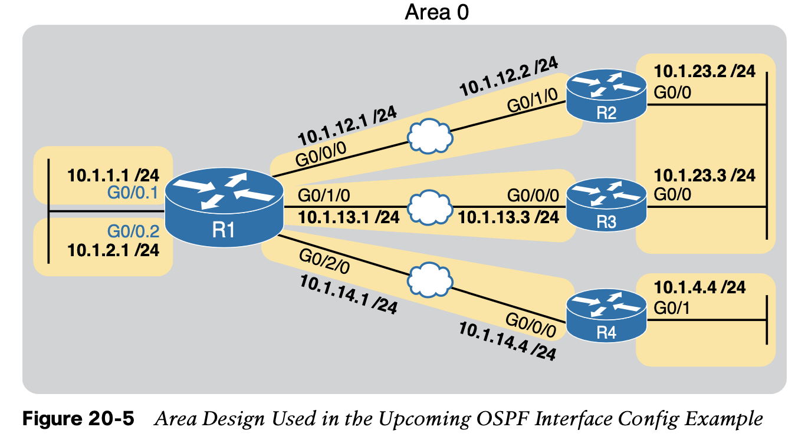
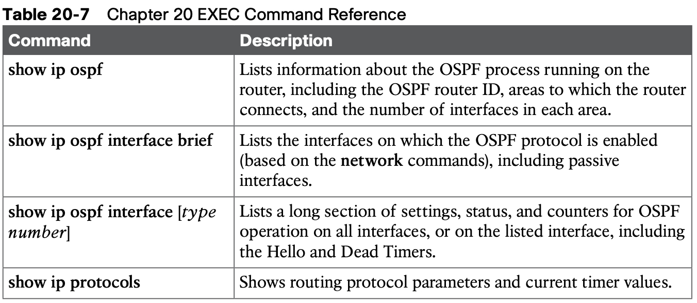

# **Implementing OSPF**

## 1. **Implementing Single-Area OSPFv2**

### 1.1 **OSPF Single-Area Configuration**

**Figure 20-2 shows a sample network that will be used for most examples throughout this chapter.** 

1. All links reside in area 0, making the area design a single-area design, with four routers. 
2. You can think of Router R1 as a router at a central site, with WAN links to each remote site, and using router-on-a-stick (ROAS) to connect to two LAN subnets on the left. 
3. Routers R2 and R3 might be at one large remote site that needs two WAN links and two routers for WAN redundancy, with both routers connected to the LAN at that remote site. 
4. Router R4 might be a typical smaller remote site with a single router needed for that site.

**How to config?**

1. The OSPF configuration begins with the **router ospf** process-id global command, which puts the user in OSPF configuration mode, and sets the OSPF process-id value.

2. The process-id number just needs to be unique on the local router, allowing the router to support multiple OSPF processes in a single router by using different process IDs. (The **router** command uses the process-id to distinguish between the processes.) **The process-id does not have to match on each router, and it can be any integer between 1 and 65,535.**
3. Second, the configuration needs one or more **network** commands in OSPF mode. These commands tell the router to find its local interfaces that match the first two parameters on the **network** command. Then, for each matched interface, the router enables OSPF on those interfaces, discovers neighbors, creates neighbor relationships, and assigns the interface to the area listed in the **network** command. 

**Wildcard Matching with the network Command**

The key to understanding the traditional OSPFv2 configuration shown in this first example is to understand the OSPF **network** command. The OSPF **network** command compares the first parameter in the command to each interface IP address on the local router, trying to find a match. However, rather than comparing the entire number in the **network** command to the entire IPv4 address on the interface, the router can compare a subset of the octets, based on the wildcard mask, as follows:

**Verifying OSPF Operation**

**Verifying OSPF Configuration**

Once you can configure OSPF with confidence, you will likely verify OSPF focusing on OSPF neighbors and the IP routing table as just discussed. However, if OSPF does not work immediately, you may need to circle back and check the configuration. To do so, you can use these steps:

**Configuring the OSPF Router ID**

While OSPF has many other optional features, most enterprise networks that use OSPF choose to configure each router’s OSPF router ID. OSPF-speaking routers must have a router ID (RID) for proper operation. By default, routers will choose an interface IP address to use as the RID. However, many network engineers prefer to choose each router’s router ID, so com- mand output from commands like **show ip ospf neighbor** lists more recognizable router IDs.

### 1.2 **Implementing Multiarea OSPF**

## 2. **Using OSPFv2 Interface Subcommands**

From the earliest days of OSPFv2 support in Cisco routers, the configuration used the OSPF **network** command as discussed in this chapter. However, **that configuration style can be confusing**, and it does require some interpretation of the **network** commands and interface IP addresses to decide on which interfaces IOS will enable OSPF. **As a result, Cisco added another option for OSPFv2 configuration called OSPF interface configuration.**

The newer interface-style OSPF configuration still enables OSPF on interfaces, but it does so directly with the **ip ospf** interface subcommand instead of using the **network** command in router configuration mode. Basically, instead of matching interfaces with indirect logic using **network** commands, you directly enable OSPFv2 on interfaces by configuring an interface subcommand on each interface.

**OSPF Interface Configuration Example**

**Verifying OSPF Interface Configuration**

OSPF operates the same way whether you use the new style or old style of configuration. The OSPF area design works the same, neighbor relationships form the same way, routers negotiate to become the DR and BDR the same way, and so on. However, you can see a few small differences in show command output when using the newer OSPFv2 configuration if you look closely.

## 3. **Additional OSPFv2 Features**

This final major section of the chapter discusses some very popular but optional OSPFv2 configuration features, as listed here in their order of appearance:

- Passive interfaces
- Default routes 
- Metrics 
- Load balancing

### 3.1 **OSPF Passive Interfaces**

Sometimes, a router does not need to form neighbor relationships with neighbors on an interface. Often, no other routers exist on a particular link, so the router has no need to keep sending those repetitive OSPF Hello messages. In such cases, an engineer can make the inter- face passive, which means

### 3.2 **OSPF Default Routes**

### 3.3 **OSPF Metrics (Cost)**

### 3.4 **OSPF Load Balancing**

When a router uses SPF to calculate the metric for each of several routes to reach one sub- net, one route may have the lowest metric, so OSPF puts that route in the routing table. However, when the metrics tie for multiple routes to the same subnet, the router can put multiple equal-cost routes in the routing table (the default is four different routes) based on the setting of the **maximum-paths** number router subcommand. 

For example, if an internet- work has six possible paths between some parts of the network, and the engineer wants all routes to be used, the routers can be configured with the **maximum-paths 6** subcommand under **router ospf**.

## **Command References**

