# **OSPF Network Types and Neighbors**

## 1. **OSPF Network Types**

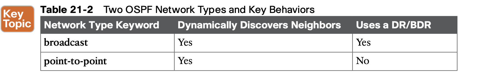

### 1.1 **The OSPF Broadcast Network Type**

OSPF defaults to use a broadcast network type on all types of Ethernet interfaces. Note that all the Ethernet interfaces in examples in Chapter 20 relied on that default setting.

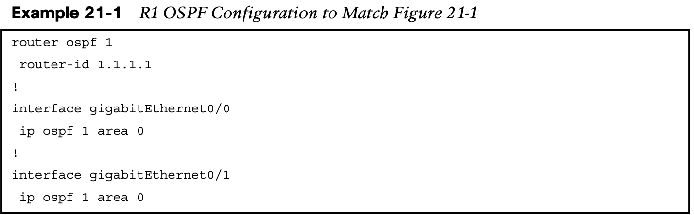

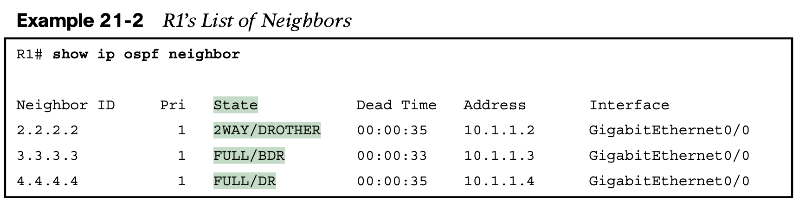

**Verifying Operations with Network Type Broadcast**

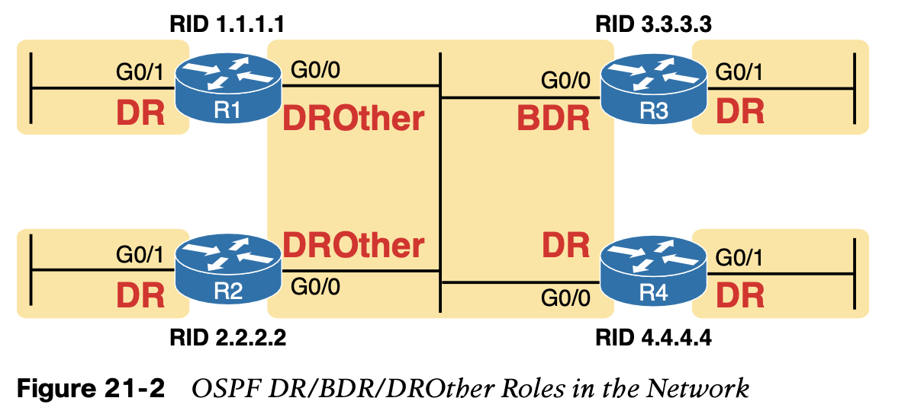

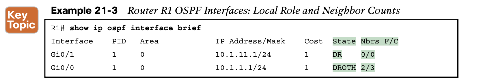

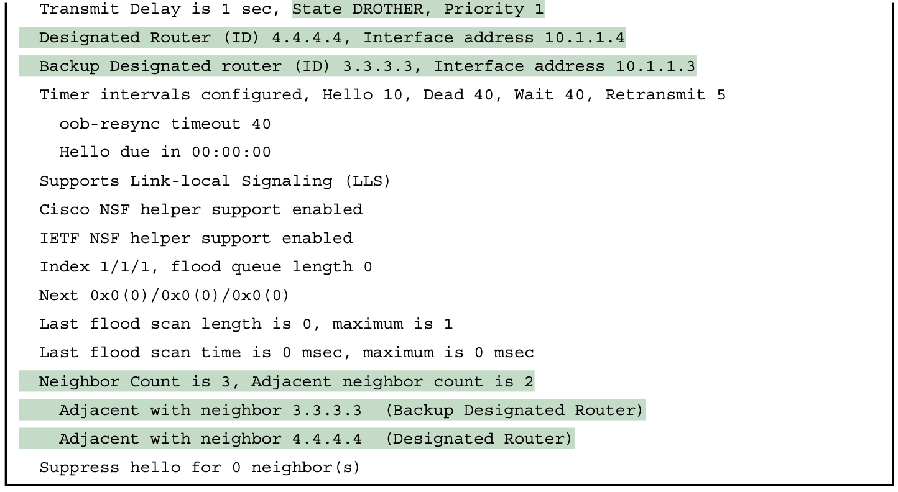

**Configuring to Influence the DR/BDR Election**

In some cases, you may want to influence the DR/BDR election with two configurable settings, listed here in order of precedence:

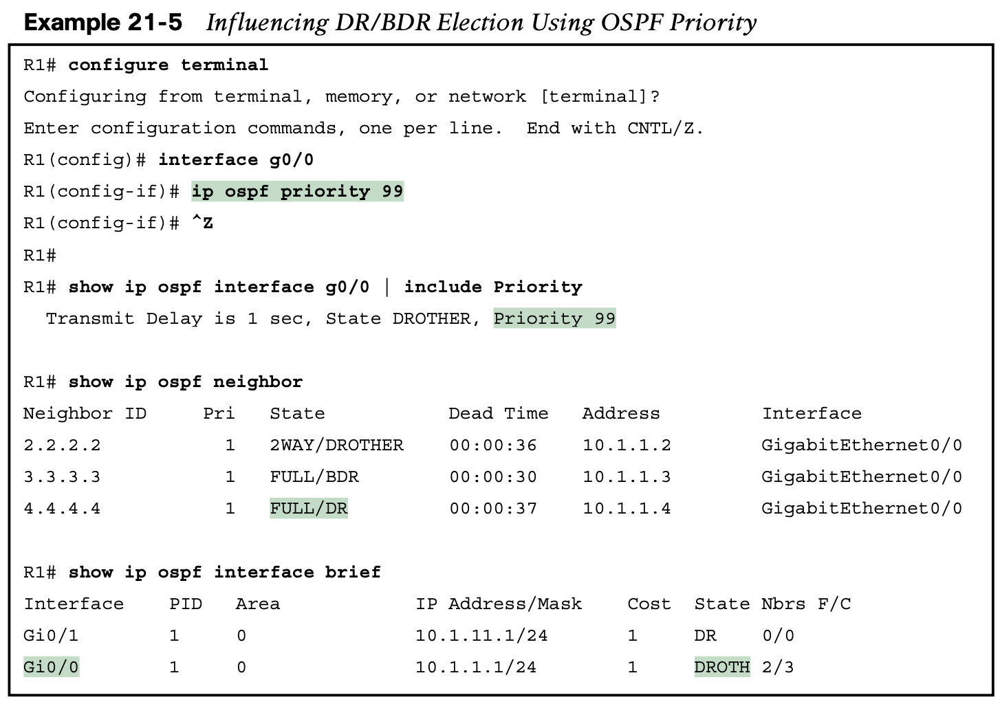

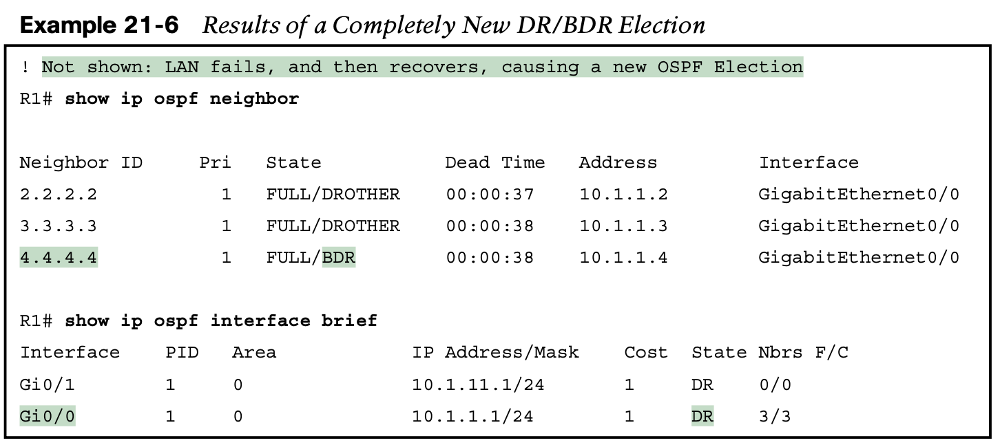

### 1.2 **The OSPF Point-to-Point Network Type**

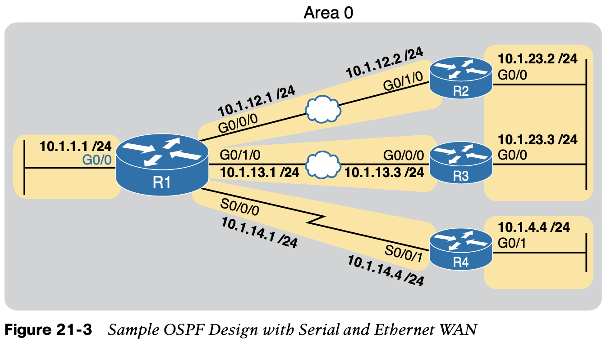

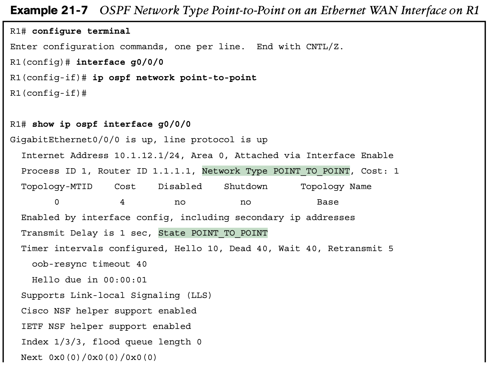

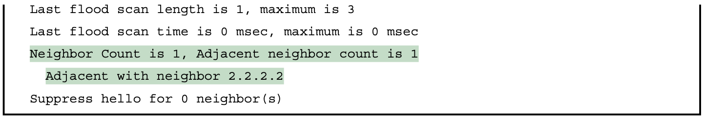

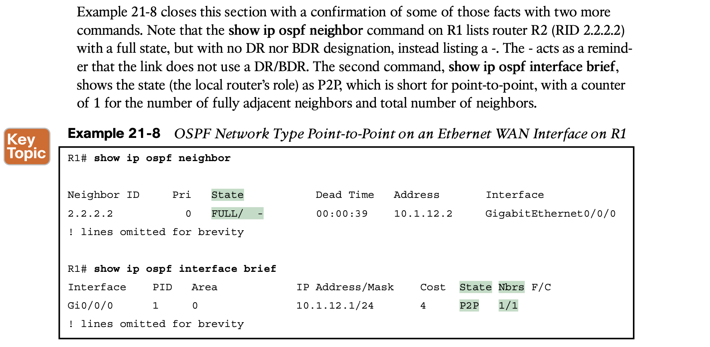

## 2. **OSPF Neighbor Relationships**

A router’s OSPF configuration enables OSPF on a set of interfaces. IOS then attempts to dis- cover other neighbors on those interfaces by sending and listening for OSPF Hello messages. However, once discovered, two routers may not become neighbors. 

### 2.1 **OSPF Neighbor Requirements**

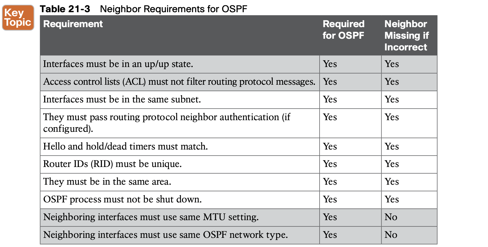

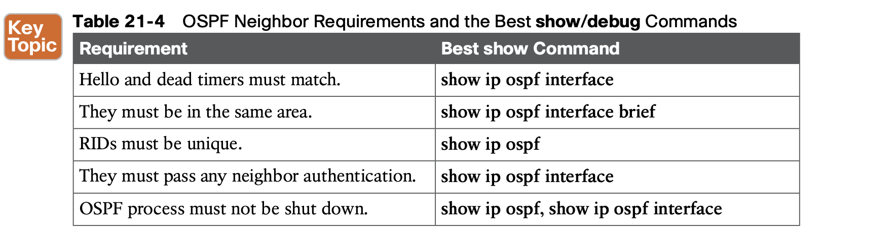

### 2.2 **Issues That Prevent Neighbor Adjacencies**

this section uses the same topology shown earlier in Figure 21-1 but now with some incorrect configuration introduced. In other words, the configuration matches Example 21-1 that began this chapter, but with the following errors introduced:

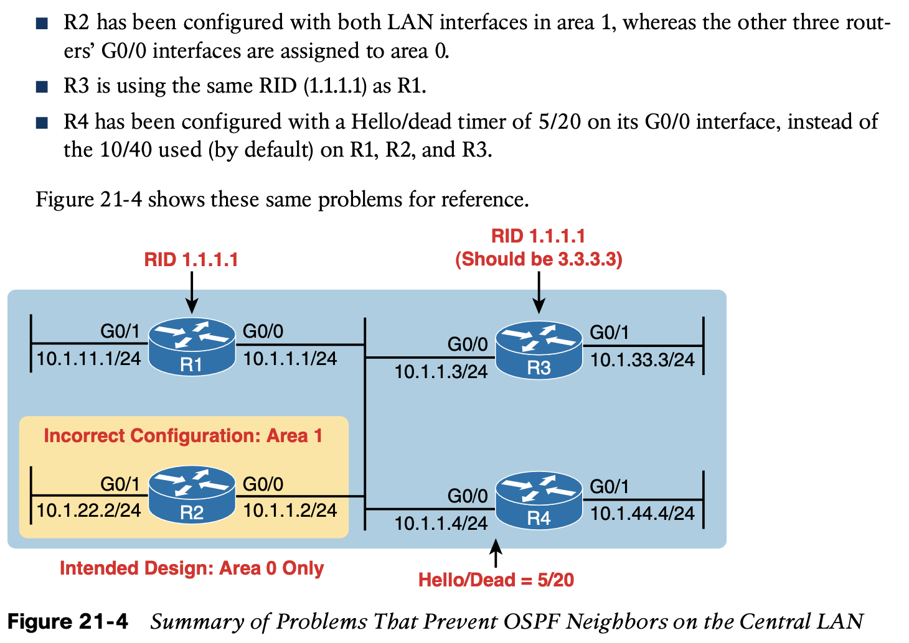

**Finding Area Mismatches**

**Finding Duplicate OSPF Router IDs**

**Finding OSPF Hello and Dead Timer Mismatches**

**Shutting Down the OSPF Process**

### 2.3 **Issues That Allow Adjacencies but Prevent IP Routes**

The last two issues to discuss in this section have a symptom in which the **show ip ospf neighbor** command does list a neighbor, but some other problem exists that prevents the eventual addition of OSPF routes to the routing table. The two issues: 

- **Mismatched MTU Settings**

- **Mismatched OSPF Network Types**

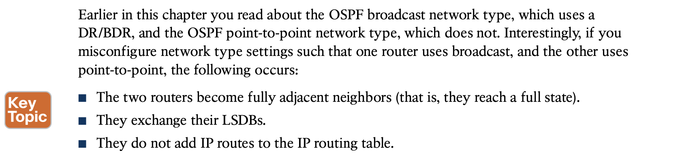

## **Command References**

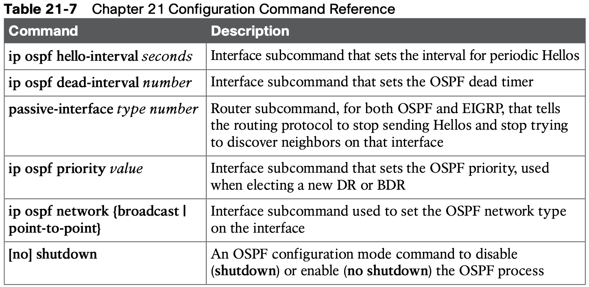

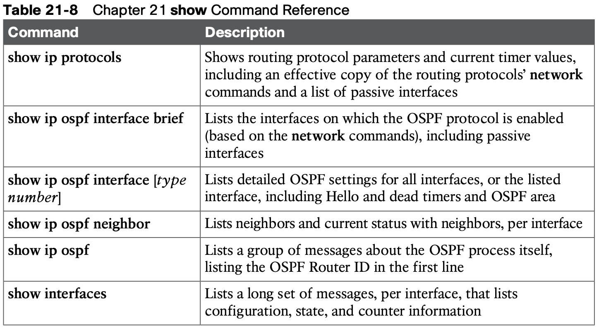

