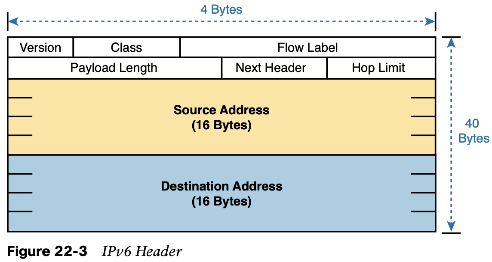
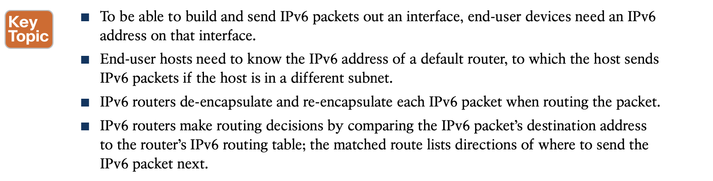
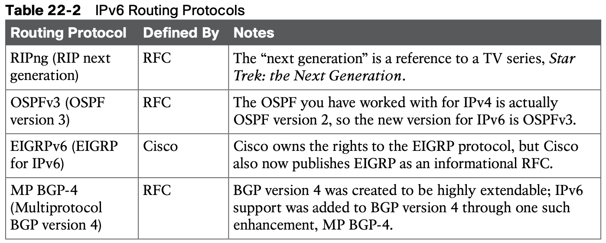
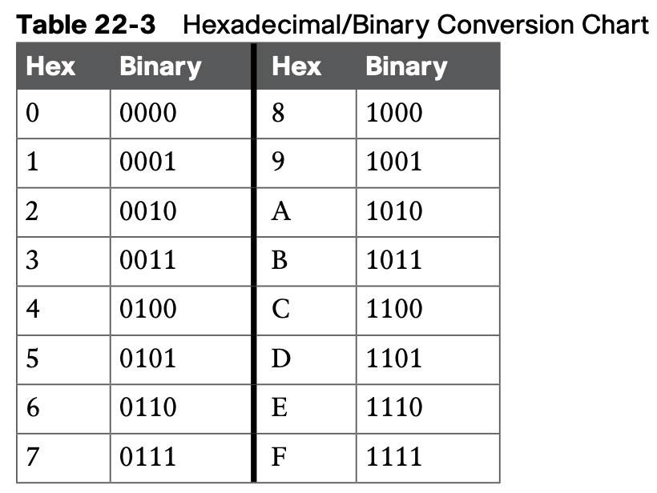
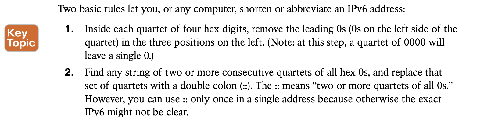
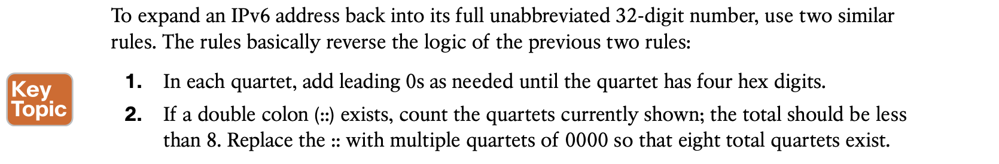
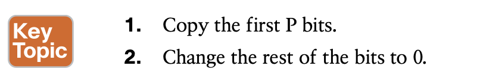
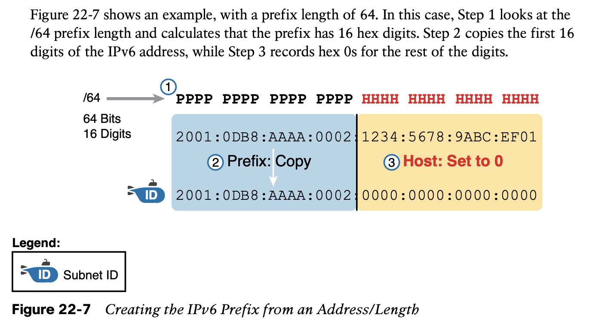

# Fundamentals of IP Version 6

## 1. **Introduction to IPv6**

Others define new versions of familiar protocols or replace old protocols with new ones. For example:

1. **Older OSPF Version 2 Upgraded to OSPF Version 3:** The older Open Shortest Path First (OSPF) version 2 works for IPv4, but not for IPv6, so a newer version, OSPF version 3, was created to support IPv6. (Note: OSPFv3 was later upgraded to support advertising both IPv4 and IPv6 routes.)

2. **ICMP Upgraded to ICMP Version 6:** Internet Control Message Protocol (ICMP) worked well with IPv4 but needed to be changed to support IPv6. The new name is ICMPv6.

3. **ARP Replaced by Neighbor Discovery Protocol:** For IPv4, Address Resolution Protocol (ARP) discovers the MAC address used by neighbors. IPv6 replaces ARP with a more gen- eral Neighbor Discovery Protocol (NDP).

Although the term IPv6, when used broadly, includes many protocols, the one specific pro- tocol called IPv6 defines the new 128-bit IPv6 address. IPv6 defines a shorter hexadecimal format, requiring at most 32 hexadecimal digits (one hex digit per 4 bits), with methods to abbreviate the hexadecimal addresses as well.



**IPv6 Routing**



**IPv6 Routing Protocols**



## 2. **IPv6 Addressing Formats and Conventions**

### 2.1 **Representing Full (Unabbreviated) IPv6 Addresses**

1. IPv6 uses a convenient hexadecimal (hex) format for addresses. To make it more readable, IPv6 uses a format with eight sets of four hex digits, with each set of four digits separated by a colon. For example:

   ```
   2340:1111:AAAA:0001:1234:5678:9ABC:1234
   ```

Converting from hex to binary is relatively easy. Just change each hex digit to the equivalent 4-bit value listed in Table 22-3.



## 2.2 **Abbreviating and Expanding IPv6 Addresses**

**Abbreviating IPv6 Addresses**



For example, consider the following IPv6 address. The bold digits represent digits in which the address could be abbreviated.

```
FE00:0000:0000:0001:0000:0000:0000:0056
```

Pick the longest such sequence, and replace it with ::, giving you the shortest legal abbreviation:

```
FE00:0:0:1::56
```

**Expanding Abbreviated IPv6 Addresses**



| Full                                    | Abbreviation                           |
| --------------------------------------- | -------------------------------------- |
| 2340:0000:0010:0100:1000:ABCD:0101:1010 | 2340:0:10:100\:1000:ABCD\:101:1010     |
| 30A0:ABCD:EF12:3456:0ABC:B0B0:9999:9009 | 30A0:ABCD:EF12:3456:ABC:B0B0:9999:9009 |
| 2222:3333:4444:5555:0000:0000:6060:0707 | 2222:3333:4444:5555::6060:707          |
| 3210:0000:0000:0000:0000:0000:0000:0000 | 3210::                                 |
| 210F:0000:0000:0000:CCCC:0000:0000:000D | 210F::CCCC:0:0:D                       |
| 34BA:000B:000B:0000:0000:0000:0000:0020 | 34BA:B:B::20                           |
| FE80:0000:0000:0000:DEAD:BEFF:FEEF:CAFE | FE80::DEAD:BEFF:FEEF:CAFE              |
| FE80:0000:0000:0000:FACE:BAFF:FEBE:CAFE | FE80::FACE:BAFF:FEBE:CAFE              |

## 2.3 **Representing the Prefix Length of an Address**

IPv6 uses a mask concept, called the prefix length, similar to IPv4 subnet masks.

When writing an IPv6 address and prefix length in documentation, you can choose to leave a space before the /, or not, as shown in the next two examples.

2222:1111:0:1:A:B:C:D/64

2222:1111:0:1:A:B:C:D /64

## 2.4 **Calculating the IPv6 Prefix (Subnet ID)**

## 2.5 **Finding the IPv6 Prefix**

As with IPv4, you can start with an IPv6 address and prefix length, and find the prefix, with the same general rules that you use in IPv4. If the prefix length is /P, use these rules:



When using a prefix length that happens to be a multiple of 4, you do not have to think in terms of bits, but in terms of hex digits. 

1. Identify the number of hex digits in the prefix by dividing the prefix length (which is in bits) by 4.
2. Copy the hex digits determined to be in the prefix per the first step.
3. Change the rest of the hex digits to 0.



**Table 22-5 Finding the IPv6 Prefix from an Address/Length Value**

| **Address/Length**                        | **Prefix**               |
| ----------------------------------------- | ------------------------ |
| 2340:0:10\:100:1000:ABCD:101:1010/64      | 2340:0:10\:100::/64      |
| 30A0:ABCD:EF12:3456:ABC:B0B0:9999:9009/64 | 30A0:ABCD:EF12:3456::/64 |
| 2222:3333:4444:5555::6060:707/64          | 2222:3333:4444:5555::/64 |
| 3210::ABCD:101:1010/64                    | 3210::/64                |
| 210F::CCCC:B0B0:9999:9009/64              | 210F::/64                |
| 34BA:B:B:0:5555:0:6060:707/64             | 34BA:B:B::/64            |
| 3124::DEAD:CAFE:FF:FE00:1/64              | 3124:0:0:DEAD::/64       |
| 2BCD::FACE:BEFF:FEBE:CAFE/64              | 2BCD::/64                |

## 2.6 **Working with More-Difficult IPv6 Prefix Lengths**

**Table 22-6 Finding the IPv6 Prefix from an Address/Length Value**

| **Address/Length**                | **Prefix**           |
| --------------------------------- | -------------------- |
| 34BA:B:B:0:5555:0:6060:707/80     | 34BA:B:B:0:5555::/80 |
| 3124::DEAD:CAFE:FF:FE00:1/80      | 3124:0:0:DEAD::/80   |
| 2BCD::FACE:BEFF:FEBE:CAFE/48      | 2BCD::/48            |
| 3FED:F:E0:D00:FACE:BAFF:FE00:0/48 | 3FED:F:E0::/48       |
| 210F:A:B:C:CCCC:B0B0:9999:9009/40 | 210F:A::/40          |
| 34BA:B:B:0:5555:0:6060:707/36     | 34BA:B::/36          |
| 3124::DEAD:CAFE:FF:FE00:1/60      | 3124:0:0:DEA0::/60   |
| 2BCD::FACE:1:BEFF:FEBE:CAFE/56    | 2BCD:0:0:FA00::/56   |