# IPv6 Addressing and Subnetting

## 1. **Global Unicast Addressing Concepts**

### 1.1 **Public and Private IPv6 Addresses**

IPv6 allows two similar options of public and private unicast addressing, beginning with **global unicast addresses** as the public IPv6 address space.

The second IPv6 option uses **unique local IPv6 addresses**, which work more like the IPv4 private addresses. 

The following lists summarizes the comparisons between global unicast addresses and unique local addresses:

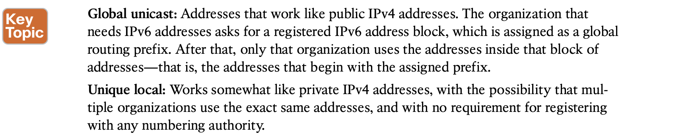

### 1.2 **The IPv6 Global Routing Prefix**

Each organization asks for a block of IPv6 addresses, which no one else can use. That organization further subdivides the address block into smaller chunks, called subnets

That reserved block of IPv6 addresses—a set of addresses that only one company can use— is called a **global routing prefix.** 

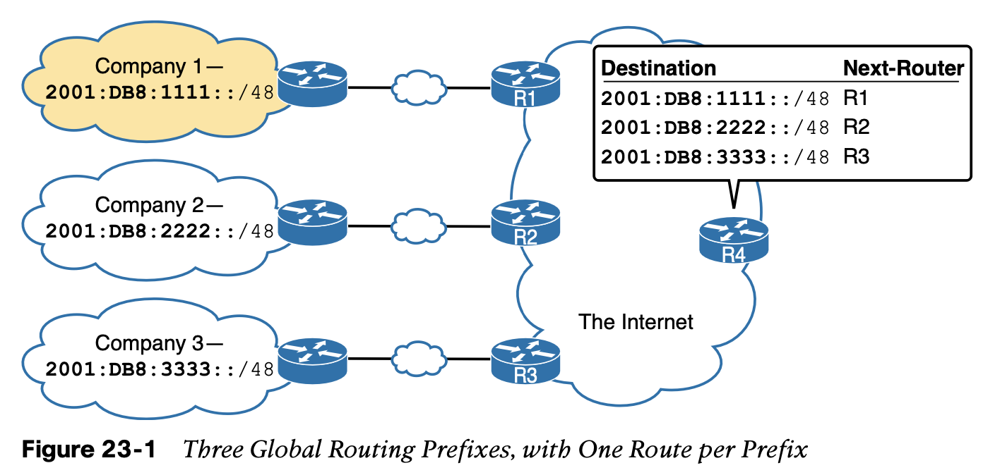

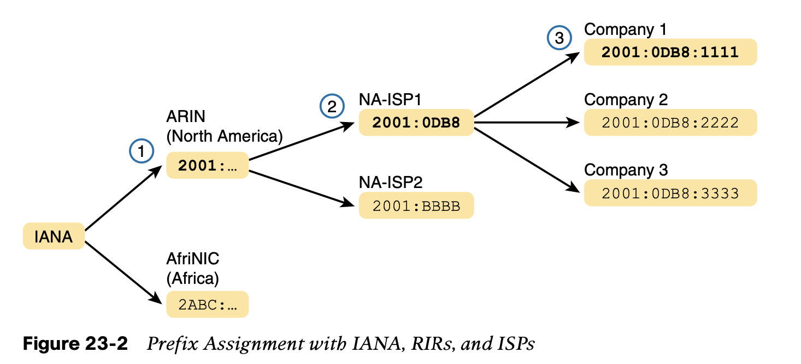

### 1.3 **Address Ranges for Global Unicast Addresses**

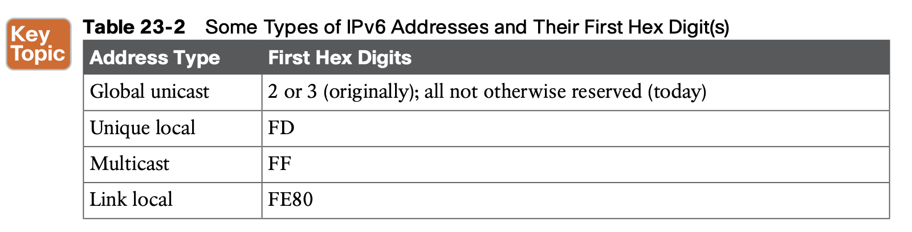

### 1.4 **IPv6 Subnetting Using Global Unicast Addresses**

This section does walk you through the different parts of IPv6 subnetting, while mostly using examples that use a /64 prefix length.

**Deciding Where IPv6 Subnets Are Needed**

 Using the same logic you would use for IPv4, Company 1 needs four IPv6 subnets.

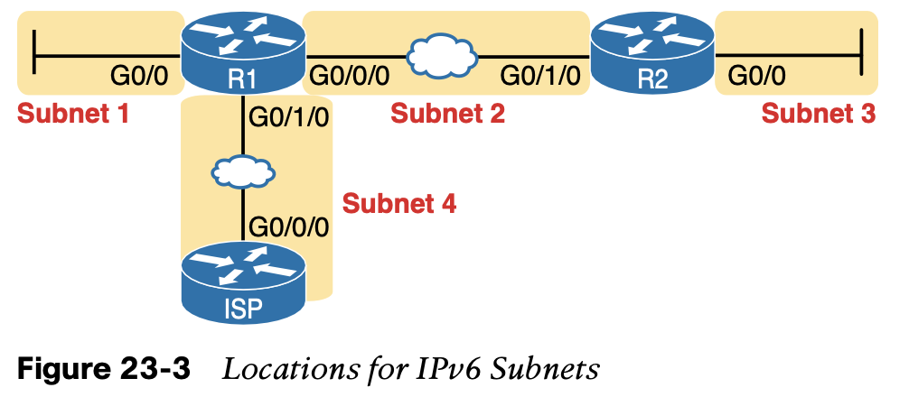

**The Mechanics of Subnetting IPv6 Global Unicast Addresses**

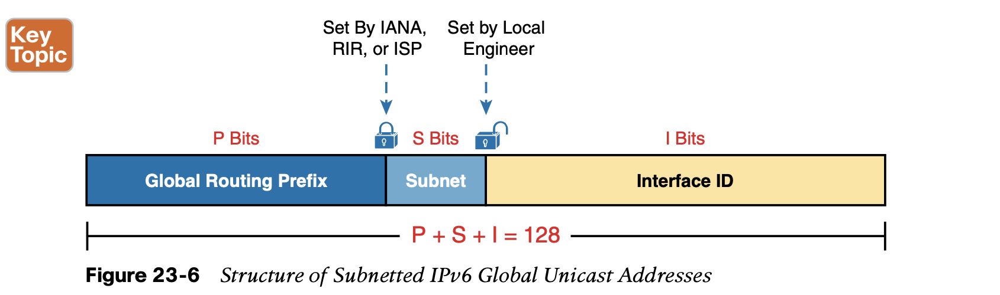

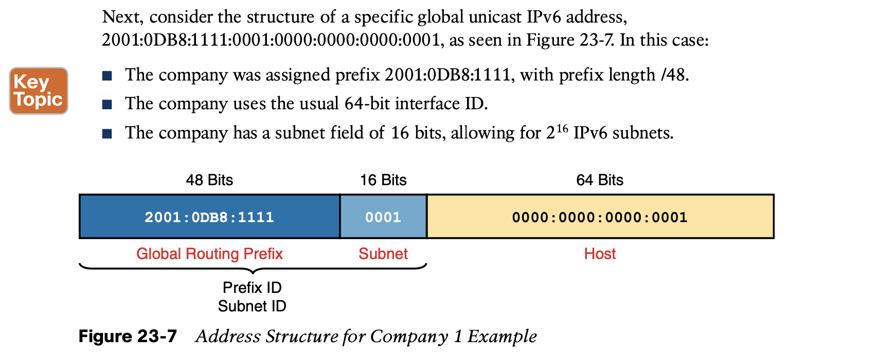

**Assign Subnets to the Internetwork Topology**

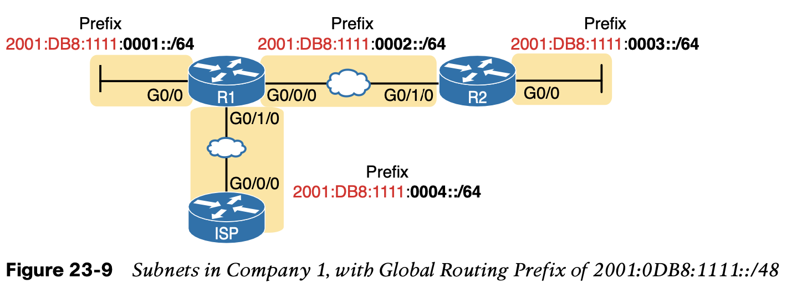

**Assigning Addresses to Hosts in a Subnet**

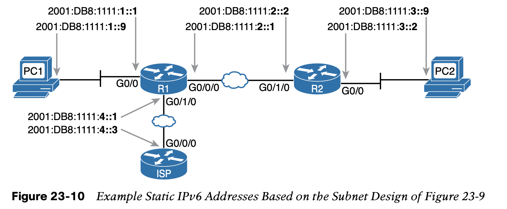

## 2. **Unique Local Unicast Addresses**

The biggest difference lies in the literal number (unique local addresses begin with hex FD) and with the administra- tive process: **the unique local prefixes are not registered with any numbering authority and can be used by multiple organizations.**

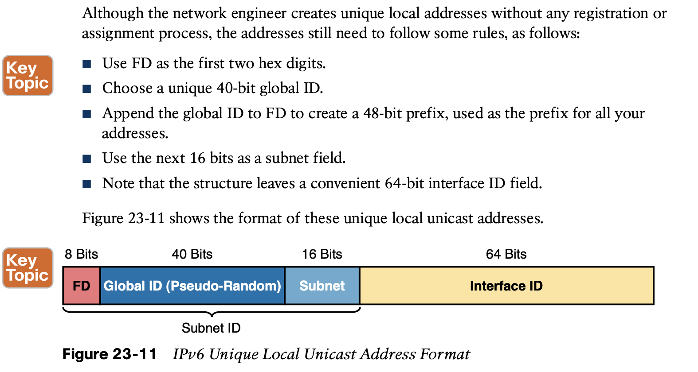

**Subnetting with Unique Local IPv6 Addresses**

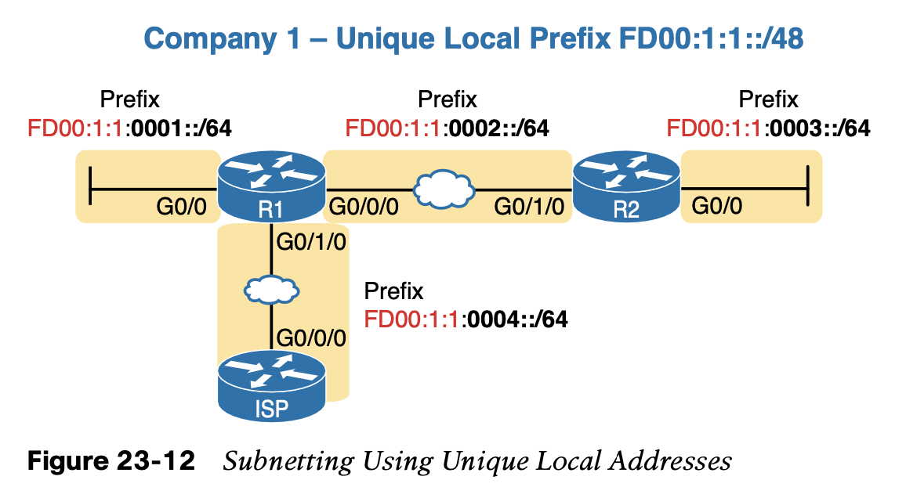
