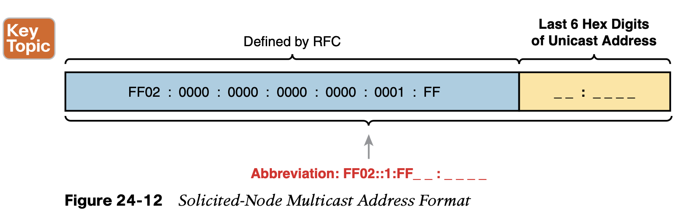

# Implementing IPv6 Addressing on Routers

## 1. **Implementing Unicast IPv6 Addresses on Routers**

### 1.1 **Static Unicast Address Configuration**

Cisco routers give us two options for static configuration of IPv6 addresses. 

1. In one case, you configure the full 128-bit address, 
2. while in the other, you configure a 64-bit prefix and let the router derive the second half of the address (the interface ID). 

**Configuring the Full 128-Bit Address**

**Enabling IPv6 Routing**

The solution takes only a single command—**ipv6 unicast-routing**—which enables IPv6 routing on the router.

**Verifying the IPv6 Address Configuration**

- The **show ipv6 interface brief** command gives you interface IPv6 address info, but not prefix length info, similar to the IPv4 **show ip interface brief** command.
- The **show ipv6 interface** command gives the details of IPv6 interface settings, much like the **show ip interface** command does for IPv4.

**Generating a Unique Interface ID Using Modified EUI-64**

The other method uses this same **ipv6 address** command, but the command configures only the 64-bit IPv6 prefix for the interface and lets the router automatically generate a unique interface ID.

This second method uses rules called modified EUI-64 (extended unique identifier). 

While the examples in Figure 24-5 show most of the steps, they omit the final step. **The final step requires that you convert the first byte (first two hex digits) from hex to binary, invert the seventh of the 8 bits, and convert the bits back to hex.** Inverting a bit means that if the bit is a 0, make it a 1; if it is a 1, make it a 0. Most of the time, with IPv6 addresses, the origi- nal bit will be 0 and will be inverted to a 1.

**Dynamic Unicast Address Configuration**

Cisco routers support two ways for the router interface to dynamically learn an IPv6 address to use:

- Stateful DHCP
- Stateless Address Autoconfiguration (SLAAC)

## 2. **Special Addresses Used by Routers**

After you configure the **ipv6 unicast-routing** global configuration command, to enable the function of IPv6 routing, the addition of a unicast IPv6 address on an interface causes the router to do the following:

## 3. **Link-Local Addresses**

### 3.1 **Link-Local Addresses**

IPv6 uses link-local addresses as a special kind of unicast IPv6 address. These addresses are not used for normal IPv6 packet flows that contain data for applications. **Instead, these addresses are used by some overhead protocols and for routing.**

**Link-Local Address Concepts**

IPv6 defines rules so that packets sent to any link-local address should not be forwarded by any router to another subnet. As a result, several IPv6 protocols make use of link-local addresses when the protocol’s messages need to stay within the local LAN. For example, **Neighbor Discovery Protocol (NDP), which replaces the functions of IPv4’s ARP, uses link- local addresses.**

Routers also use link-local addresses as the next-hop IP addresses in IPv6 routes, as shown in Figure 24-8. IPv6 hosts also use a default router (default gateway) concept, like IPv4, but instead of the router address being in the same subnet, hosts refer to the router’s link-local address. The **show ipv6 route** command **lists the link-local address of the neighboring router, rather than the global unicast or unique local unicast address.**

**Creating Link-Local Addresses on Routers**

the link-local address should always start with FE80:0000:0000:0000 as the first four unabbreviated quartets.

**IOS creates a link-local address for any interface that has configured at least one other uni- cast address using the ipv6 address command (global unicast or unique local).**

**Routing IPv6 with Only Link-Local Addresses on an Interface**

## 4. **IPv6 Multicast Addresses**

Example 24-8 repeats the output of the **show ipv6 interface** command to show the mul- ticast addresses used by Router R1 on its G0/0 interface.

**Multicast Address Scopes**

IPv6 RFC 4291 defines IPv6 addressing including the ideas of IPv6 address scope. Each scope defines a different set of rules about whether routers should or should not forward a packet, and how far routers should forward packets, based on those scopes.

**Solicited-Node Multicast Addresses**

IPv6 Neighbor Discovery Protocol (NDP) replaces IPv4 ARP, as discussed in Chapter 25. NDP improves the MAC-discovery process by sending IPv6 multicast packets that can be processed by the correct host but discarded with less processing by the rest of the hosts in the subnet. The process uses the solicited-node multicast address associated with the unicast IPv6 address.

## 5. **Miscellaneous IPv6 Addresses**

## 6. **Anycast Addresses**

Imagine that routers collectively need to implement some service. Rather than have one router supply that service, that service works best when implemented on several routers. But the hosts that use the service need to contact only the nearest such service, and the network wants to hide all these details from the hosts. Hosts can send just one packet to an IPv6 address, and the routers will forward the packet to the nearest router that supports that ser- vice by virtue of supporting that destination IPv6 address.

IPv6 anycast addresses provide that exact function. 

## 7. **IPv6 Addressing Configuration Summary**

## **Command References**

