# **Fundamentals of Wireless Networks**

## 1. **Wireless LAN Topologies**

#### 1.1 **Basic Service Set**

The 802.11 standard calls this a **basic service set (BSS)**. At the heart of every BSS is **a wireless access point (AP)**, as shown in Figure 26-4. The AP operates in **infrastructure mode**, which means it offers the services that are necessary to form the infrastructure of a wireless network.

Because the operation of a BSS hinges on the AP, the BSS is bounded by the area where the AP’s signal is usable. This is known as the **basic service area (BSA) or cell.** 

The AP serves as a single point of contact for every device that wants to use the BSS. It advertises the existence of the BSS so that devices can find it and try to join. **To do that, the AP uses a unique BSS identifier (BSSID) that is based on the AP’s own radio MAC address.**

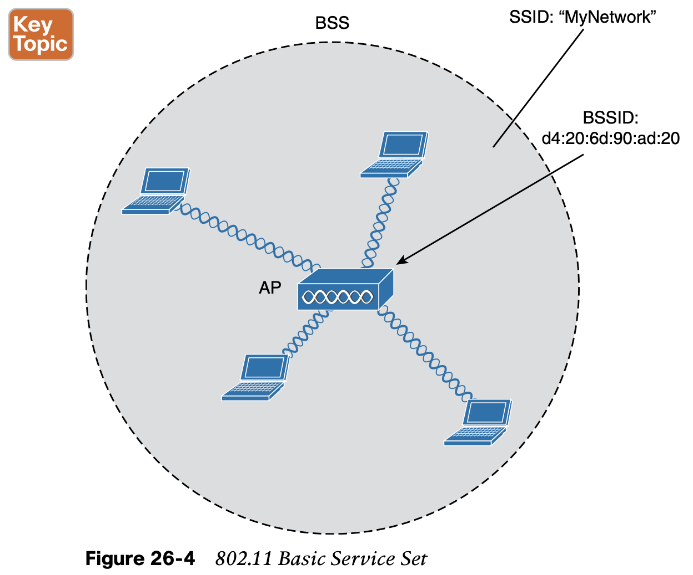

In addition, the AP advertises the wireless network with a Service Set Identifier (SSID), which is a text string containing a logical name. **Think of the BSSID as a machine-readable name tag that uniquely identifies the BSS ambassador (the AP), and the SSID as a nonunique, human-readable name tag that identifies the wireless service.**

Membership with the BSS is called an association. A wireless device must send an association request to the AP and the AP must either grant or deny the request. Once associated, a device becomes a client, or an 802.11 station **(STA),** of the BSS. 

#### 1.2 **Distribution System**

The 802.11 standard refers to the upstream wired Ethernet as the distribution system (DS) for the wireless BSS, as shown in Figure 26-6.

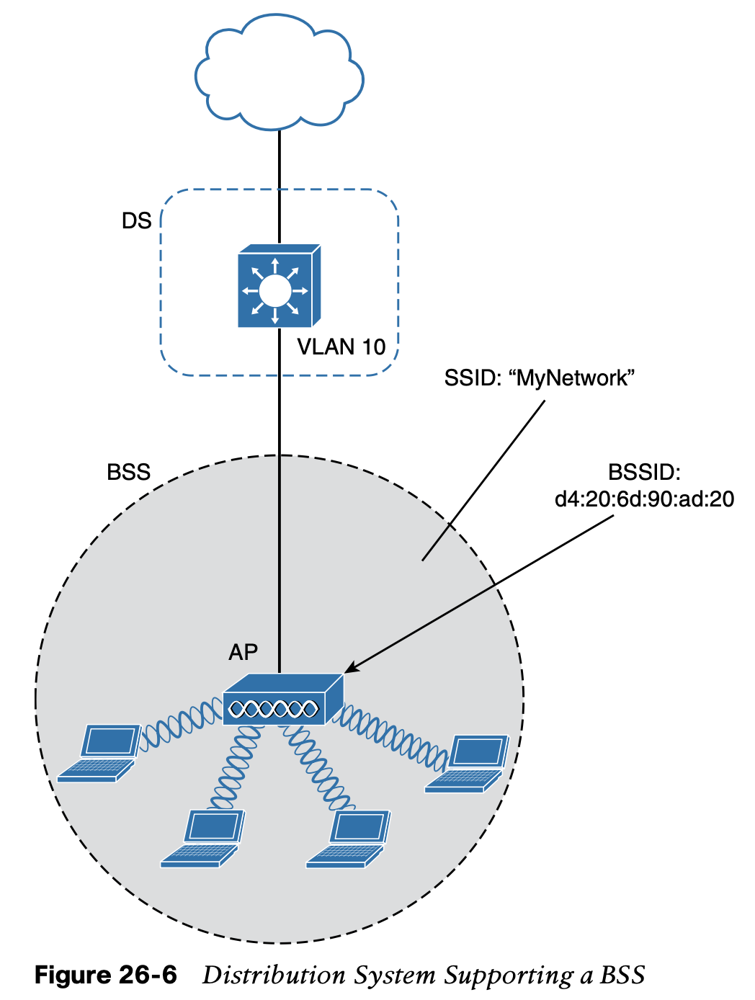

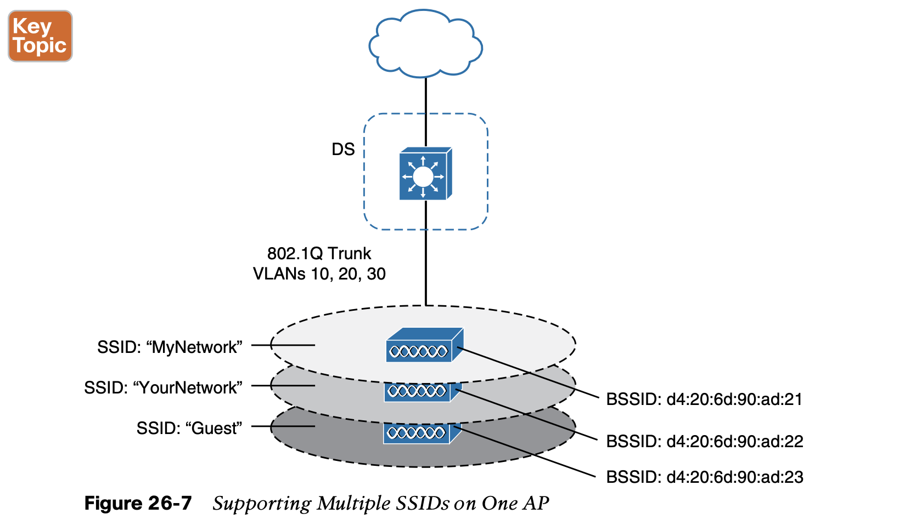

#### 1.3 **Extended Service Set**

Normally, one AP cannot cover the entire area where clients might be located. For example, you might need wireless coverage throughout an entire floor of a business, hotel, hospital, or other large building.

The idea is to make multiple APs cooperate so that the wireless service is consistent and seamless from the client’s perspective. Ideally, any SSIDs that are defined on one AP should be defined on all the APs in an ESS; 

Notice that each cell in Figure 26-8 has a unique BSSID, but both cells share one common SSID. Regardless of a client’s location within the ESS, the SSID will remain the same but the client can always distinguish one AP from another.

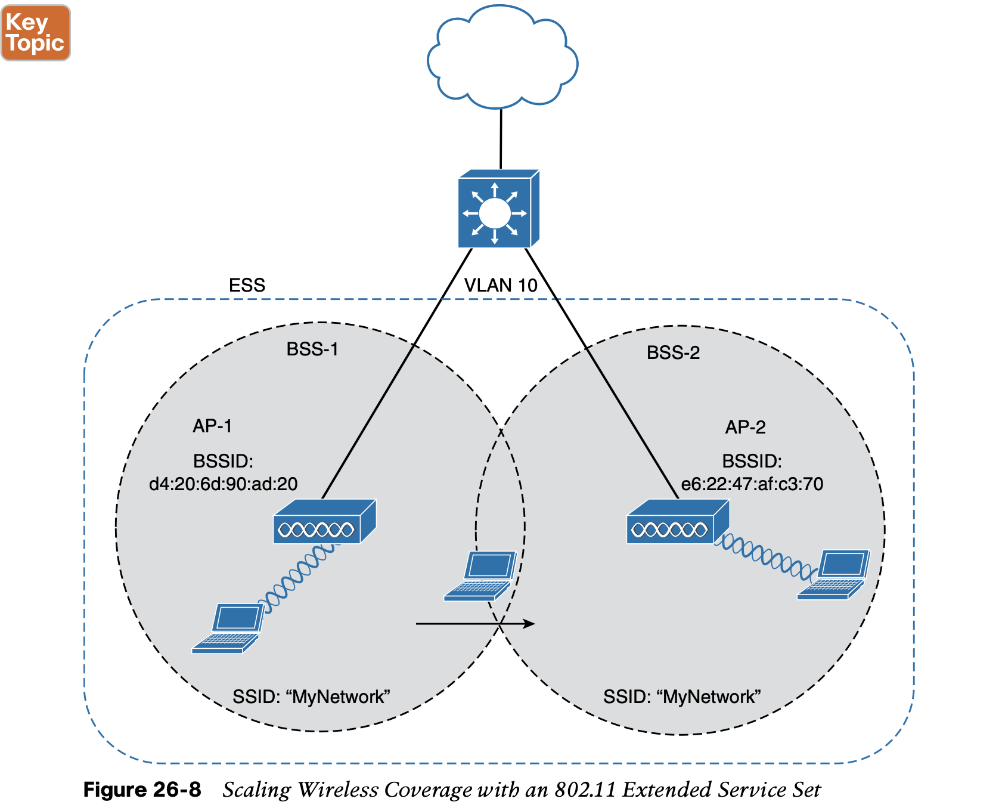

#### 1.4 **Independent Basic Service Set**

The 802.11 standard allows two or more wireless clients to communicate directly with each other, with no other means of network connectivity. This is known as **an ad hoc wireless network**, or an **independent basic service set (IBSS)**, as shown in Figure 26-9. 

1. For this to work, one of the devices must take the lead and begin advertising a network name and the necessary radio parameters, much like an AP would do. 
2. Any other device can then join as needed. IBSSs are meant to be organized in an impromptu, distributed fashion; therefore, they do not scale well beyond eight to ten devices.

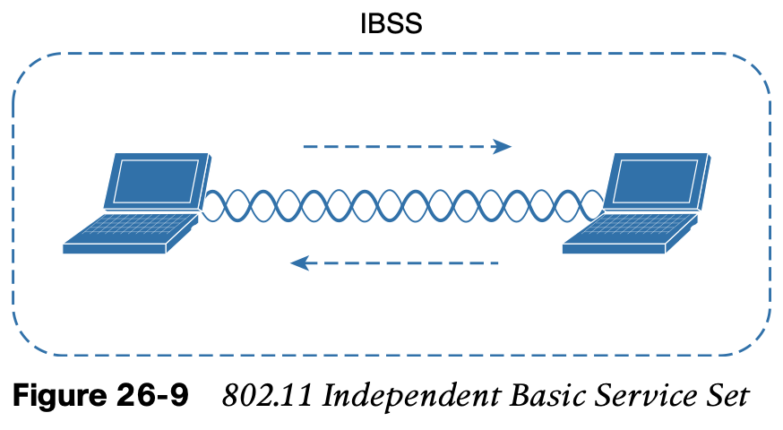

## 2. **Other Wireless Topologies**

Wireless APs can be configured to operate in **noninfrastructure modes** when a normal BSS cannot provide the functionality that is needed. **The following sections cover the most common modes.**

### 2.1 **Repeater**

In some scenarios, it is not possible to run a wired connection to a new AP because the cable distance is too great to support Ethernet communication.

In that case, you can add an additional AP that is configured for repeater mode. **A wireless repeater takes the signal it receives and repeats or retransmits it in a new cell area around the repeater.**

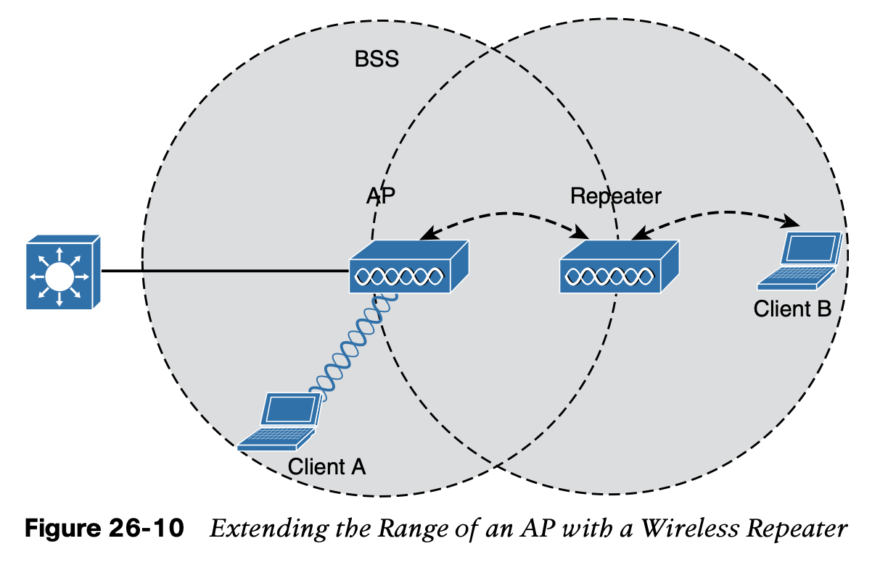

### 2.2 **Workgroup Bridge**

For example, some mobile medical devices might be designed with only a wired connection. While it is possible to plug the device into an Ethernet connection when needed, a wireless connection would be much more practical. You can use a workgroup bridge (WGB) to connect the device’s wired network adapter to a wireless network.

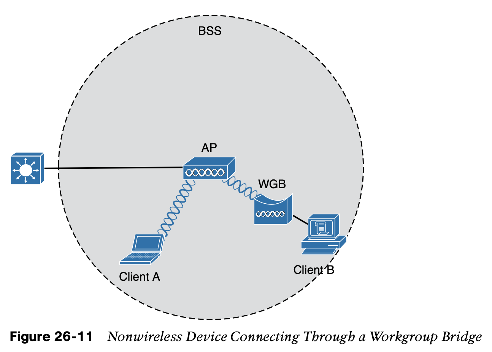

### 2.3 **Outdoor Bridge**

An AP can be configured to act as a bridge to form a single wireless link from one LAN to another over a long distance. Outdoor bridged links are commonly used for connectivity between buildings or between cities.

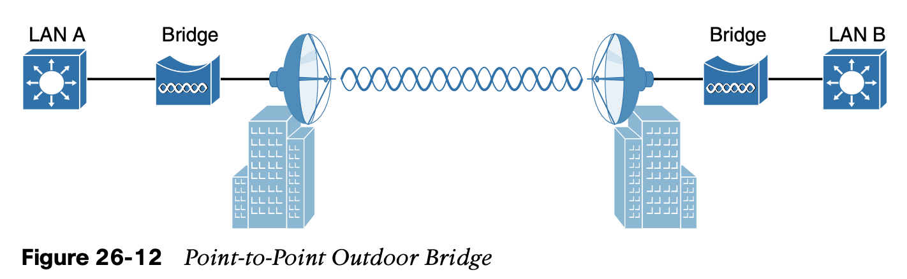

### 2.4 **Mesh Network**

To provide wireless coverage over a very large area, it is not always practical to run Ethernet cabling to every AP that would be needed. Instead, you could use multiple APs configured in mesh mode. In a mesh topology, wireless traffic is bridged from AP to AP, in a daisy-chain fashion, using another wireless channel.

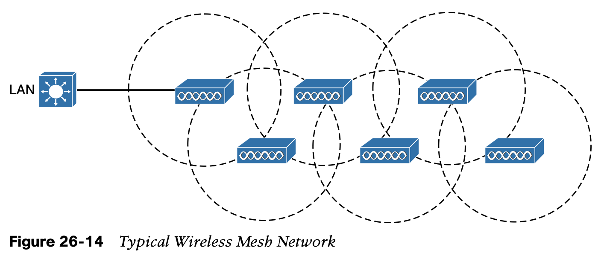

## 3. **RF Overview**

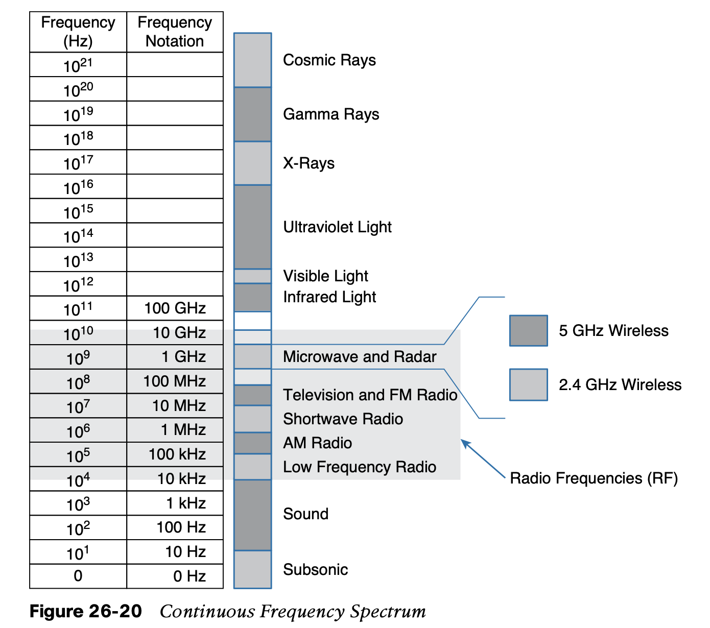

### 3.1 **Wireless Bands and Channels**

One of the two main frequency ranges used for wireless LAN communication lies between 2.400 and 2.4835 GHz. This is usually called the 2.4-GHz band, even though it does not encompass the entire range between 2.4 and 2.5 GHz. It is much more convenient to refer to the band name instead of the specific range of frequencies included.

The other wireless LAN range is usually called the 5-GHz band because it lies between 5.150 and 5.825 GHz. The 5-GHz band actually contains the following four separate and dis- tinct bands:

- 5.150 to 5.250 GHz 

- 5.250 to 5.350 GHz 

- 5.470 to 5.725 GHz 

- 5.725 to 5.825 GHz

You might assume that an AP can use any channel number without affecting any APs that use other channel numbers. In the 5-GHz band, this is the case because each channel is allo- cated a frequency range that does not encroach on or overlap the frequencies allocated for any other channel. In other words, the 5-GHz band consists of nonoverlapping channels.

The same is not true of the 2.4-GHz band. Each of its channels is much too wide to avoid overlapping the next lower or upper channel number.

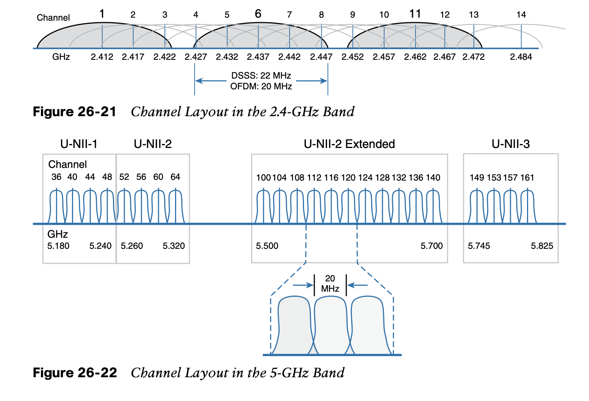

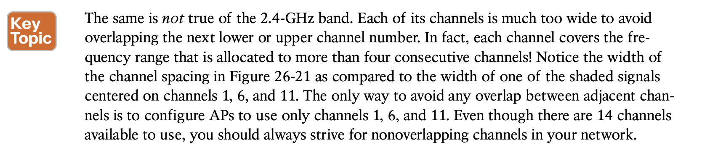

### 3.2 **APs and Wireless Standards**

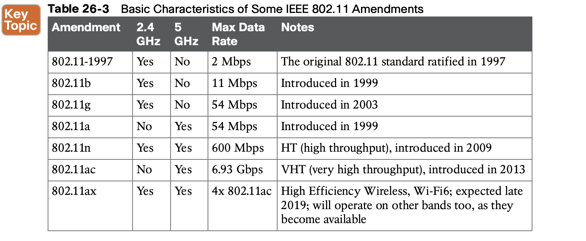