#  **Analyzing Cisco Wireless Architectures**

## 1 **Autonomous AP Architecture**

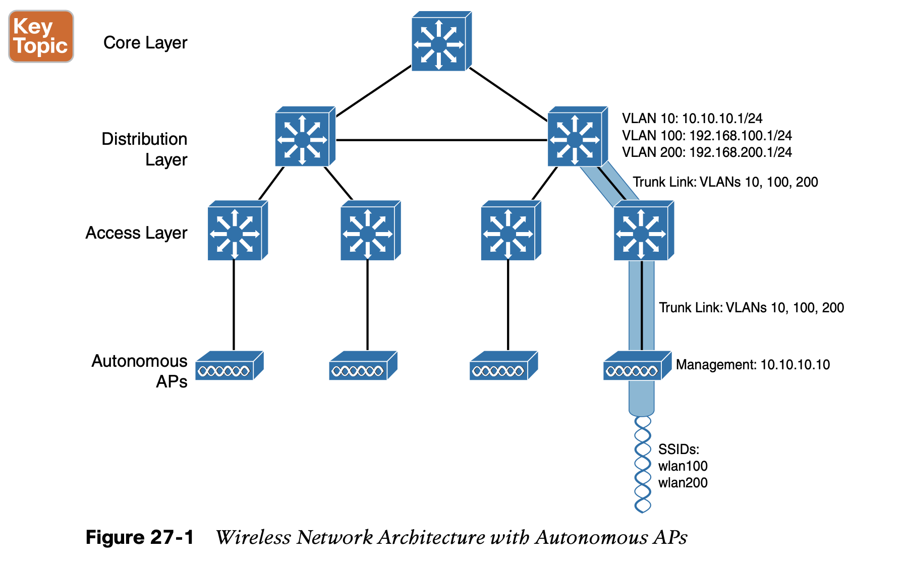

Autonomous APs offer one or more fully functional, standalone basic service sets (BSSs). 

They are also a natural extension of a switched network, connecting wireless service set identifiers (SSIDs) to wired virtual LANs (VLANs) at the access layer.

Figure 27-1 shows the basic architecture; even though only four APs are shown across the bottom, a typical enter- prise network could consist of hundreds or thousands of APs.

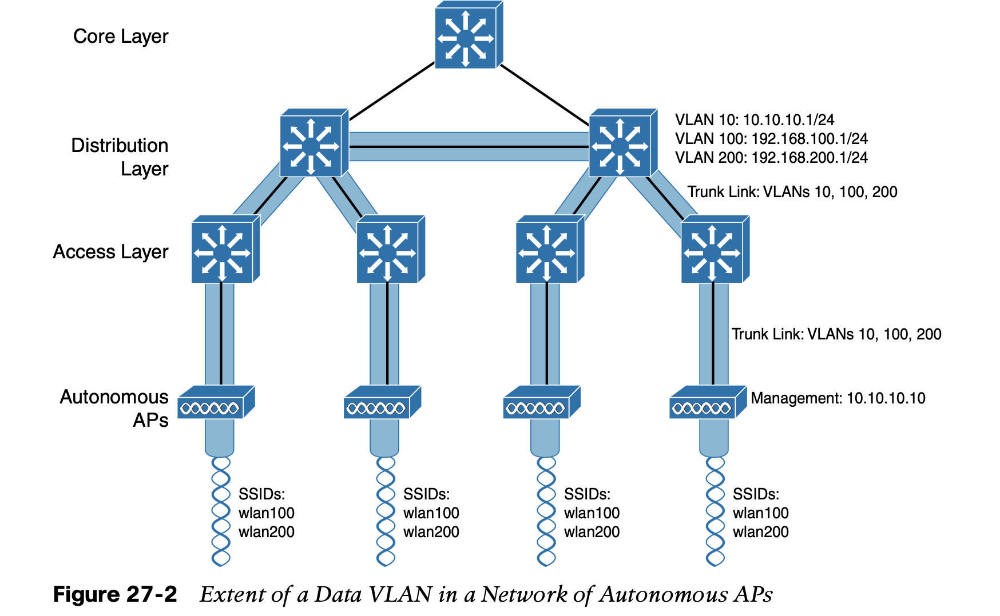

## 2 **Cloud-based AP Architecture**

an autonomous AP needs quite a bit of configuration and management. To help manage more and more autonomous APs as the wireless network grows, 

1. you could place an AP management platform such as Cisco Prime Infrastructure in a central location within the enterprise. 
2. A simpler approach is a cloud-based AP architecture, where the AP management function
    is pushed out of the enterprise and into the Internet cloud. Cisco Meraki is cloud-based
    and offers centralized management of wireless, switched, and security networks built from Meraki products.

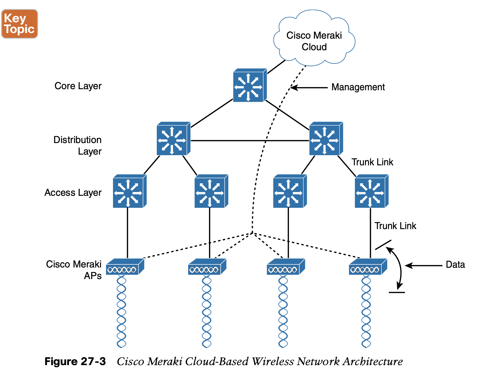

## 3 **Split-MAC Architectures**

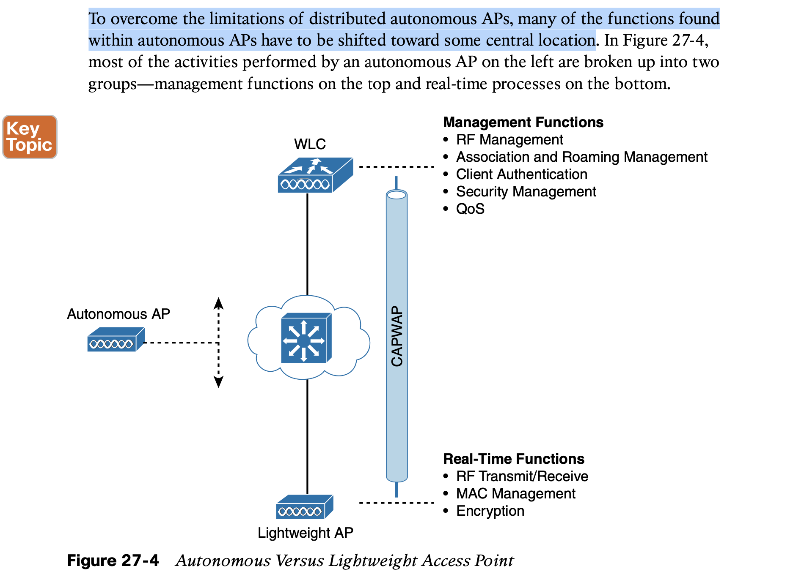

When the functions of an autonomous AP are divided, the AP hardware is known as a **light- weight access point**, and performs only the real-time 802.11 operation. The lightweight AP gets its name because the code image and the local intelligence are stripped down, or light- weight, compared to the traditional autonomous AP.

The management functions are usually performed on a **wireless LAN controller (WLC)**, which controls many lightweight APs. This is shown in the bottom right portion of Figure 27-4. Notice that the AP is left with duties in Layers 1 and 2, where frames are moved into and out of the RF domain. The AP becomes totally dependent on the WLC for every other WLAN function, such as authenticating users, managing security policies, and even selecting RF channels and output power.

**The lightweight AP-WLC division of labor is known as a split-MAC architecture,** where the normal MAC operations are pulled apart into two distinct locations. This occurs for every AP in the network; each one must boot and bind itself to a WLC to support wireless clients. The WLC becomes the central hub that supports a number of APs scattered about in the network.

**How does a lightweight AP bind with a WLC to form a complete working access point?** The two devices must use a tunneling protocol between them, to carry 802.11-related messages and also client data. Remember that the AP and WLC can be located on the same VLAN or IP subnet, but they do not have to be. 

**The Control and Provisioning of Wireless Access Points (CAPWAP) tunneling protocol makes this all possible by encapsulating the data between the LAP and WLC within new IP packets.** 

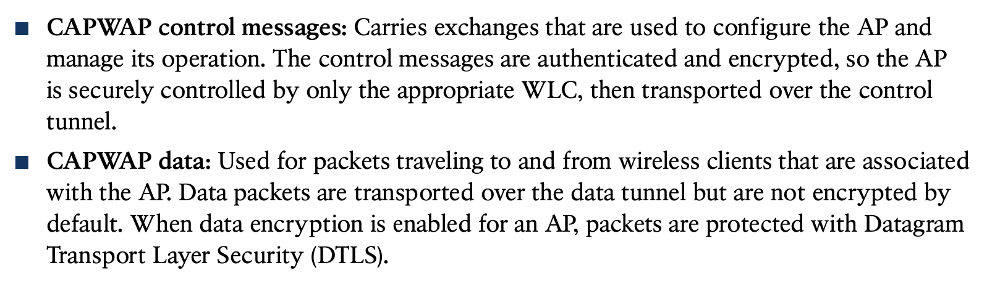

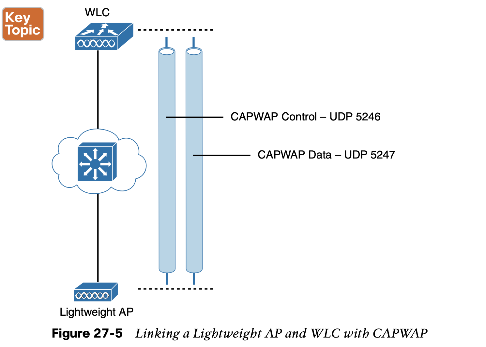

Every AP and WLC must also authenticate each other with digital certificates. An X.509 certificate is preinstalled in each device when it is purchased.

## 4 **Comparing Wireless LAN Controller Deployments**

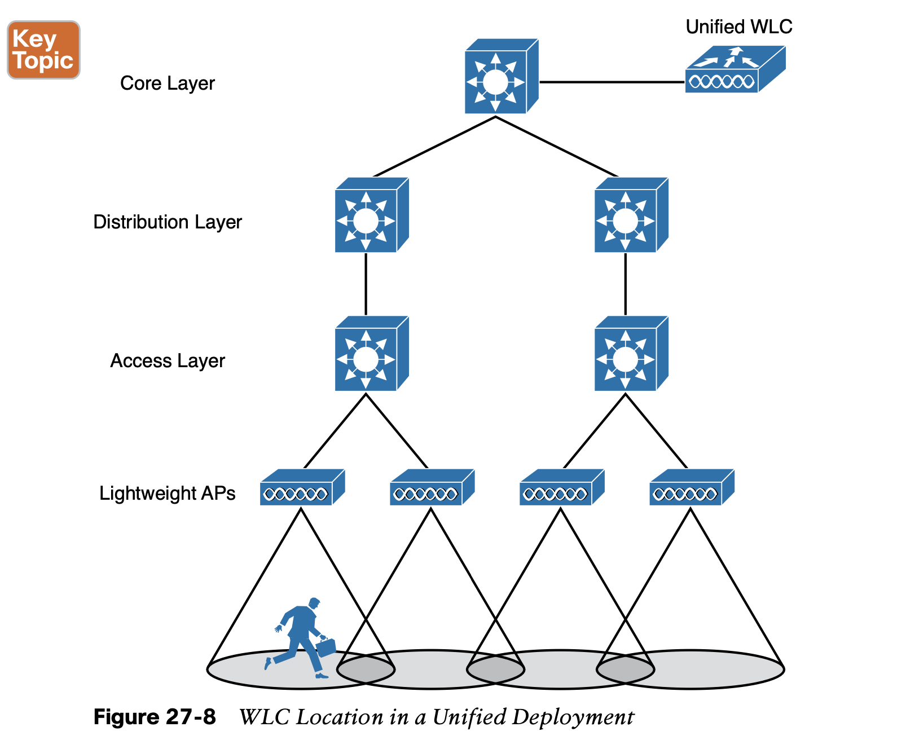

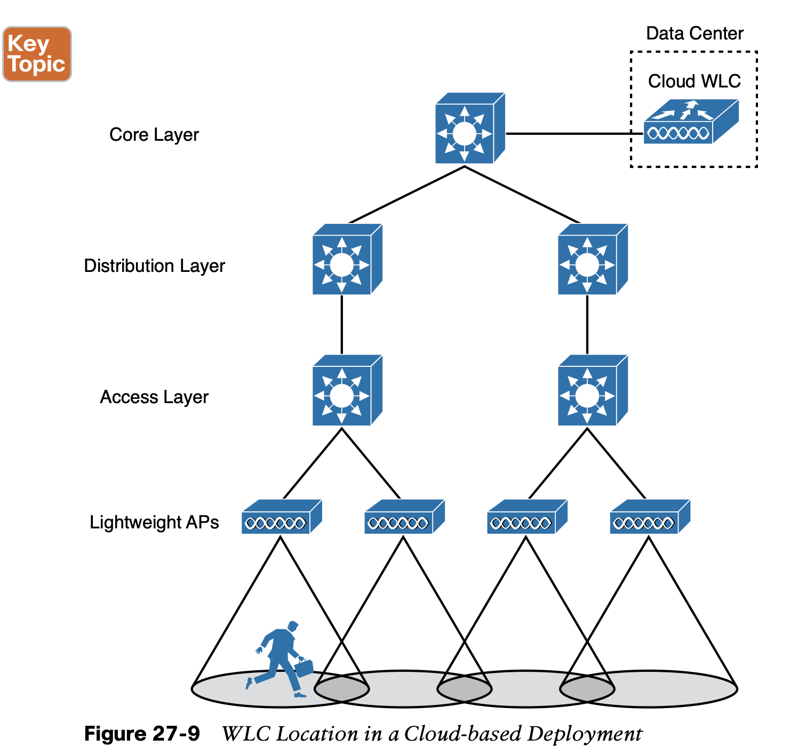

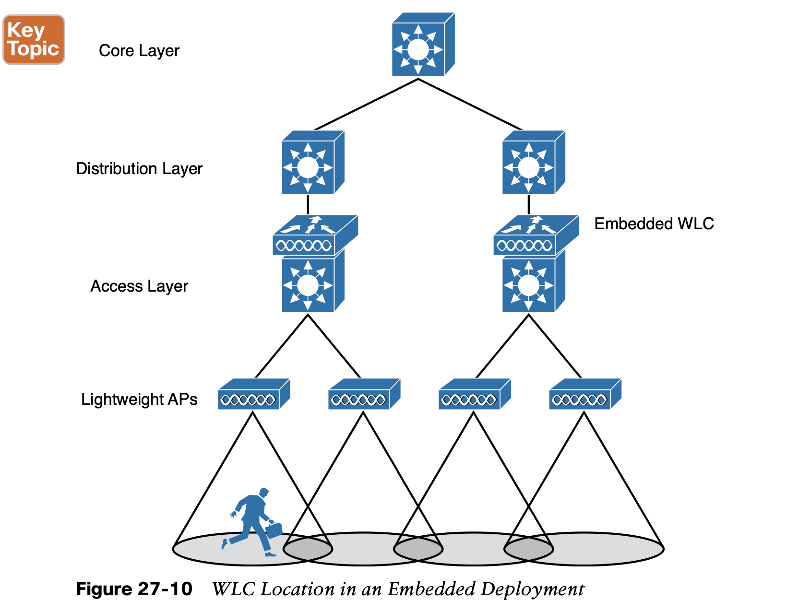

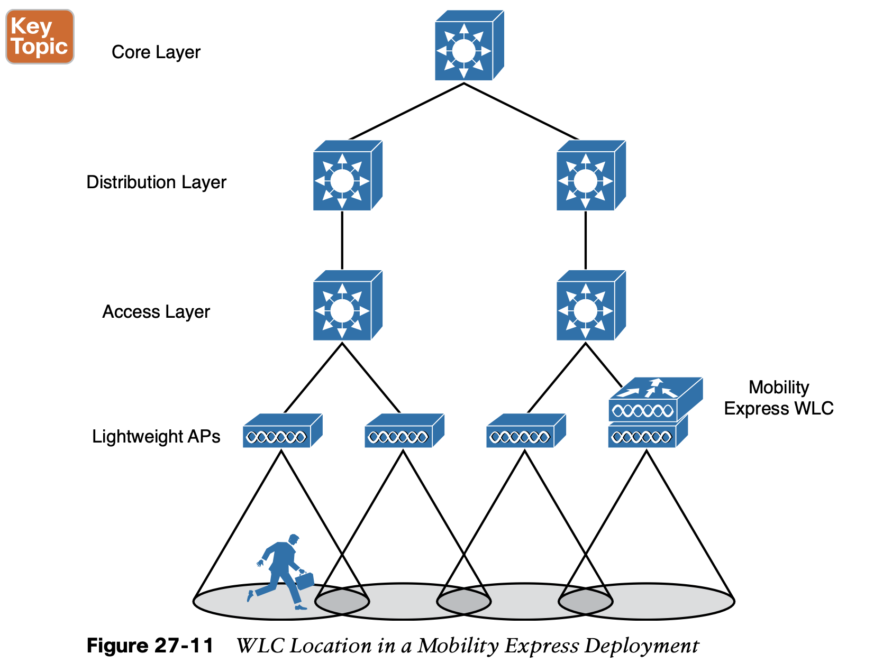

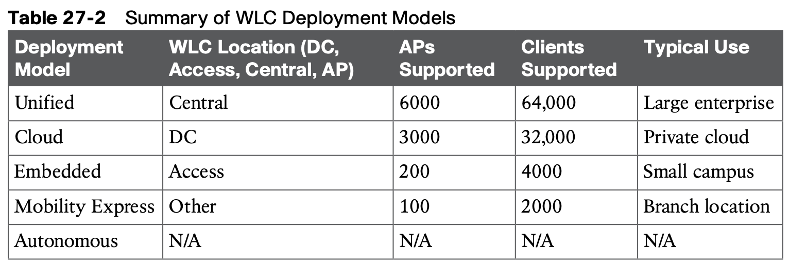

**Cisco AP Modes**

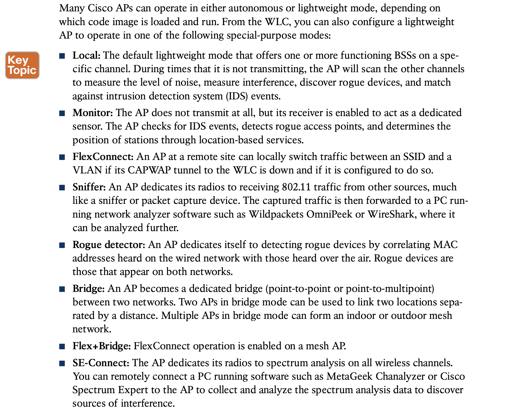