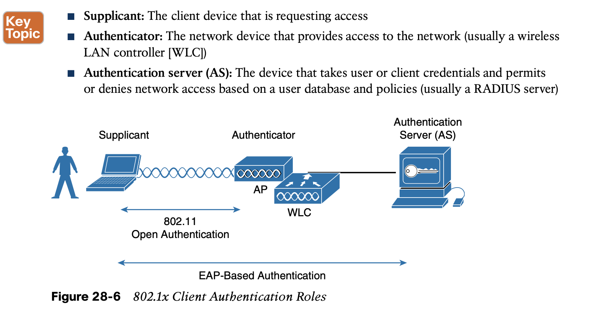
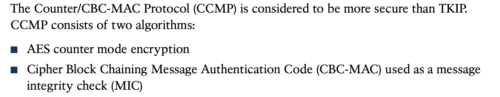
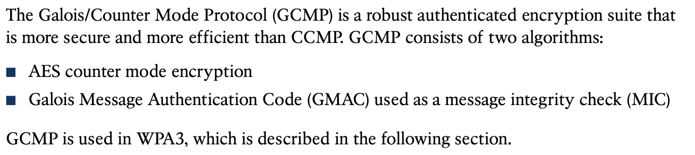
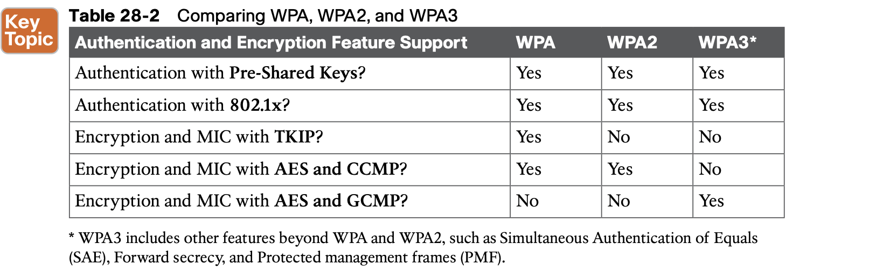
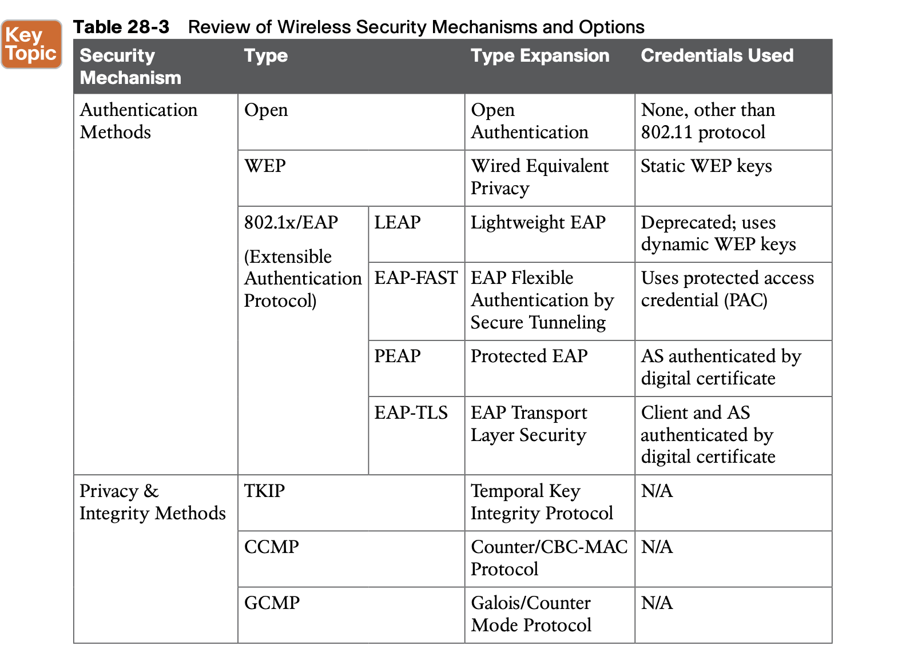

# **Securing Wireless Networks**

## 1. **Anatomy of a Secure Connection**

#### 1.1 **Authentication**

#### 1.2 **Message Privacy** - encrytion

#### 1.3 **Message Integrity**

- message integrity check (MIC)

## 2. **Wireless Client Authentication Methods**

### 2.1 **Open Authentication**

The original 802.11 standard offered only two choices to authenticate a client: open authen- tication and WEP.

### 2.2 **WEP**

### 2.3 **802.1x/EAP**

the Extensible Authentication Protocol (EAP)

EAP has another interesting quality: it can integrate with the IEEE 802.1x port-based access control standard. When 802.1x is enabled, it limits access to a network media until a client authenticates.

The following sections provide an overview of several common EAP-based authentication methods.

- **LEAP**
- **EAP-FAST**
- **PEAP**

- **EAP-TLS**

## 3. **Wireless Privacy and Integrity Methods**

### 3.1 **TKIP**

### 3.2 **CCMP**

### 3.3 **GCMP**

## 4. **WPA, WPA2, and WPA3**

