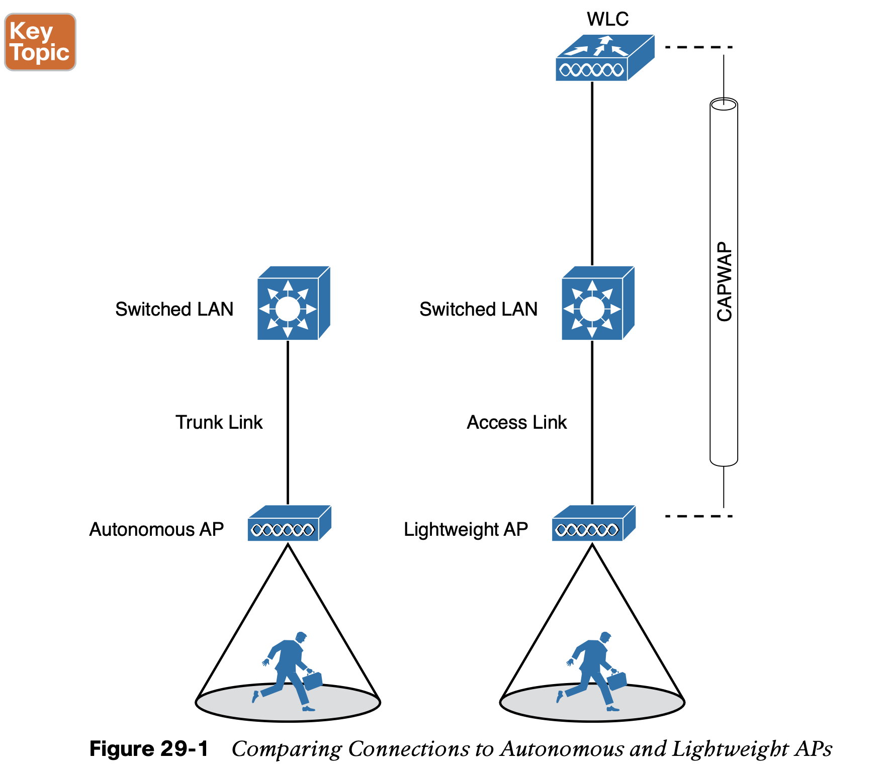
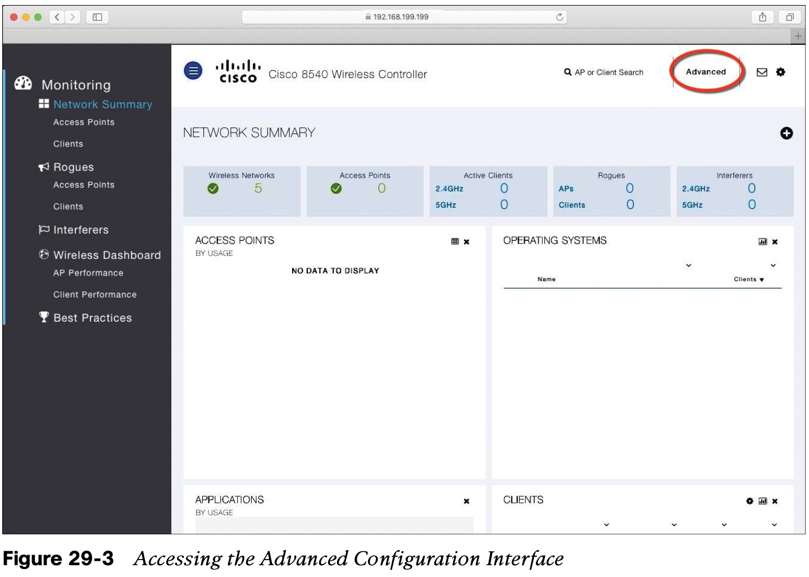
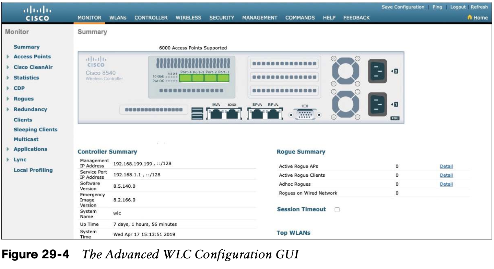
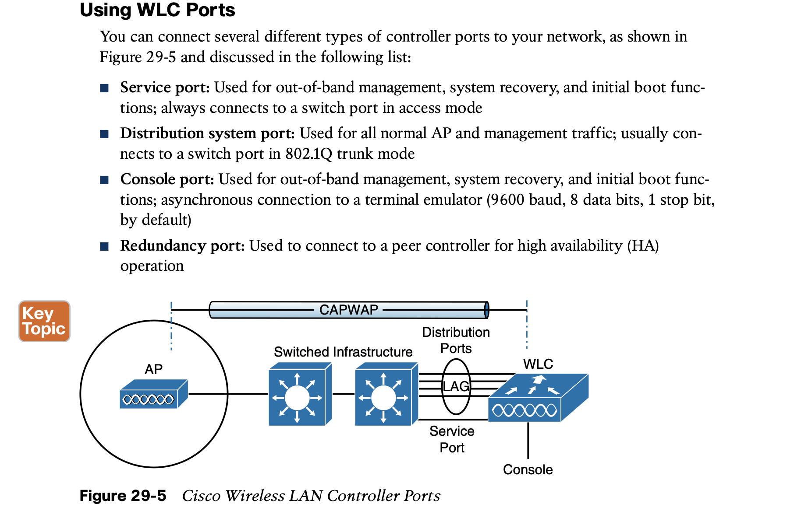
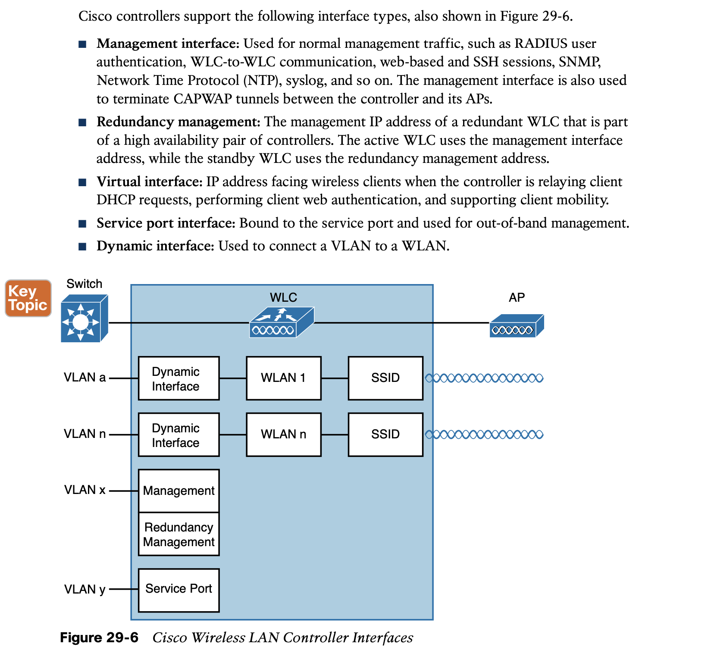
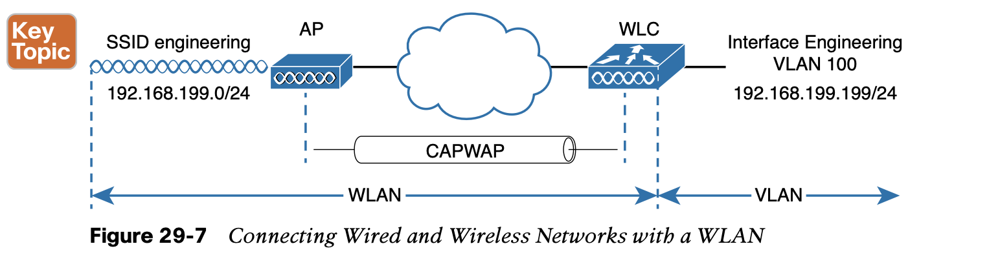
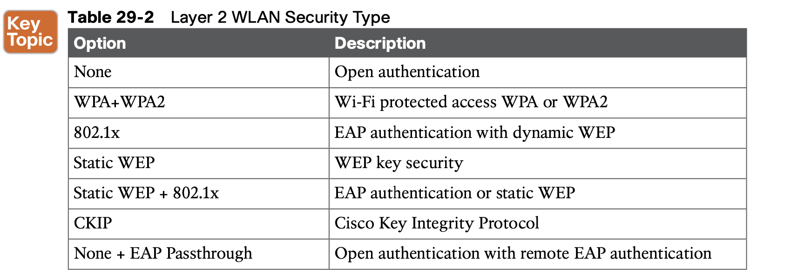

# **Building a Wireless LAN**

## 1. **Connecting a Cisco AP**

## 2. **Accessing a Cisco WLC**

To connect and configure a WLC, you will need to open a web browser to the WLC’s man- agement address with either HTTP or HTTPS. This can be done only after the WLC has an initial configuration and a management IP address assigned to its management interface.

## 3. **Connecting a Cisco WLC**

#### 3.1 **Using WLC Ports**

#### 3.2 **Using WLC Interfaces**

## 4. **Configuring a WLAN**

