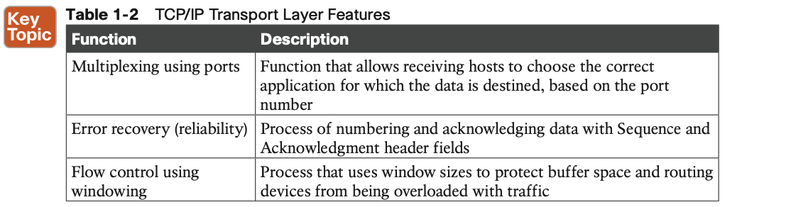

# Introduction to TCP/IP Transport and Applications

## 1. **TCP/IP Layer 4 Protocols: TCP and UDP**

Table 1-2 lists the main features supported by TCP/UDP. Note that only the first item listed in the table is supported by UDP, whereas all items in the table are supported by TCP.

## 2. **TCP/IP Applications**

**Finding the Web Server Using DNS**

