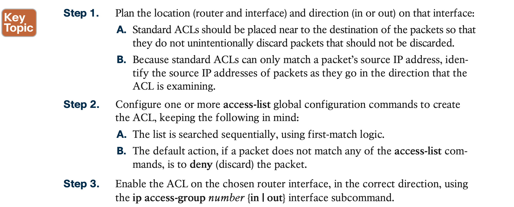

# Basic IPv4 Access Control Lists

## 1. **IPv4 Access Control List Basics**

### 1.1 **ACL Location and Direction**


### 1.2 **Matching Packets**

### 1.3 **Taking Action When a Match Occurs**

### 1.4 **Types of IP ACLs**


This chapter focuses solely on standard numbered IP ACLs, while the next chapter discusses the other three primary categories of IP ACLs.

## 2. **Standard Numbered IPv4 ACLs**

This section is about a type of Cisco filter (ACL) that **matches only the source IP address of the packet (standard)**, is configured to identify the ACL using numbers rather than names (numbered), and looks at IPv4 packets.

### 2.1 **List Logic with IP ACLs**


### 2.2 **Matching Logic and Command Syntax**


For standard ACLs, means that you can only match the source IP address or portions of the source IP address using something called an ACL wildcard mask.

**Matching the Exact IP Address**

```
access-list 1 permit 10.1.1.1
```

**Matching a Subset of the Address with Wildcards**


**Binary Wildcard Masks**

**Finding the Right Wildcard Mask to Match a Subnet**


**Matching Any/All Addresses**

```
access-list 1 permit any
access-list 1 deny any
```

### 2.3 **Implementing Standard IP ACLs**

```
access-list access-list-number {deny | permit} source [source-wildcard]
```



#### 2.3.1 **Standard Numbered ACL Example 1** 


Restated, the requirements for this ACL are as follows:

1. Enable the ACL inbound on R2’s S0/0/1 interface.
2. Permit packets coming from host A.
3. Deny packets coming from other hosts in host A’s subnet.
4. Permit packets coming from any other address in Class A network 10.0.0.0.
5. The original example made no comment about what to do by default, so simply deny all other traffic.


 

#### 2.3.2 Standard Numbered ACL Example 2

the requirements might be reduced to the following:

1. Enable the ACL inbound on R2’s F0/0 interface.
2. Permit packets from server S1 going to hosts in A’s subnet.
3. Deny packets from server S1 going to hosts in C’s subnet. **2**
4. Permit packets from server S2 going to hosts in C’s subnet.
5. Deny packets from server S2 going to hosts in A’s subnet.
6. (There was no comment about what to do by default; use the implied **deny all** default.)


As it turns out, you cannot do everything your boss asked with a standard ACL. To solve this problem, you should get a new boss! No, seriously, you have to rethink the problem and change the rules. In real life, you would probably use an extended ACL instead, which lets you check both the source and destination IP address.


#### 2.3.3 **Troubleshooting and Verification Tips**


## 3. **Practice Applying Standard IP ACLs**

First, the following list summarizes some important tips to consider when choosing match- ing parameters to any **access-list** command:


## **Command References**


