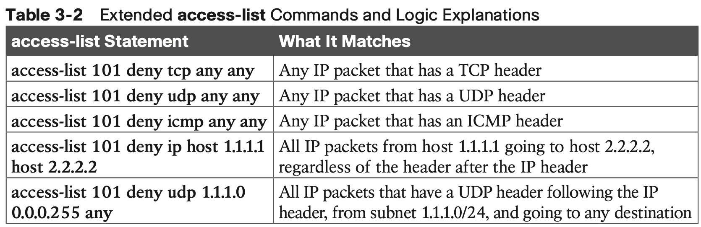

# Advanced IPv4 Access Control Lists

## 1. **Extended Numbered IP Access Control Lists**

### 1.1 **Matching the Protocol, Source IP, and Destination IP**

### 1.2 **Matching TCP and UDP Port Numbers**

### 1.3 **Extended IP ACL Configuration**

however, when configuring, keep the following differences in mind:

**Extended IP Access Lists: Example 1**

- The first ACL statement prevents Bob’s access to FTP servers in subnet 172.16.1.0. 
- The second statement prevents Larry’s access to web services on Server1. 
- The final statement permits all other traffic.

When you check for TCP or UDP port numbers, you must specify the TCP or UDP protocol. Both FTP and the web use TCP.

This example uses the **eq** parameter, meaning “equals,” to check the destination port num- bers for FTP control (keyword **ftp**) and HTTP traffic (keyword **www**). You can use the numeric values—or, for the more popular options, a more obvious text version is valid. (If you were to type **eq 80**, the config would show **eq www**.)

This example enables the ACL in two places on R1: inbound on each serial interface. These locations achieve the goal of the ACL. However, that initial placement was made to make the point that Cisco suggests that you locate them as close as possible to the source of the packet. Therefore, Example 3-2 achieves the same goal as Example 3-1 of stopping Bob’s access to FTP servers at the main site, and it does so with an ACL on R3.

**Extended IP Access Lists: Example 2**

### 1.4 **Practice Building access-list Commands**

## 2. **Named ACLs and ACL Editing**

Named ACLs and ACL sequence numbers make it easier to remember ACL names and edit existing ACLs when an ACL needs to change.

### 2.1 **Named IP Access Lists**

Named IP ACLs have many similarities with numbered IP ACLs. They can be used for filtering packets, plus for many other purposes. They can match the same fields as well: standard numbered ACLs can match the same fields as a standard named ACL, and extended numbered ACLs can match the same fields as an extended named ACL.

Of course, there are differences between named and numbered ACLs. **Named ACLs originally had three big differences compared to numbered ACLs:**

The only truly new part of the named ACL configuration is the **ip access-list** global con- figuration command. This command defines whether an ACL is a standard or extended ACL and defines the name. It also moves the user to ACL configuration mode, as shown in upcoming Example 3-4. 

### 2.2 **Editing ACLs Using Sequence Numbers**

The ACL editing feature uses an ACL sequence number that is added to each ACL **permit** or **deny** statement, with the numbers representing the sequence of statements in the ACL.

To take advantage of the ability to delete and insert lines in an ACL, both numbered and named ACLs must use the same overall configuration style and commands used for named ACLs. 

### 2.3 **Numbered ACL Configuration Versus Named ACL Configuration**

### 2.4 **ACL Implementation Considerations**

ACLs can be a great tool to enhance the security of a network, but engineers should think about some broader issues before simply configuring an ACL to fix a problem. To help, Cisco makes the following general recommendations in the courses on which the CCNA exam is based:

## Command Reference

