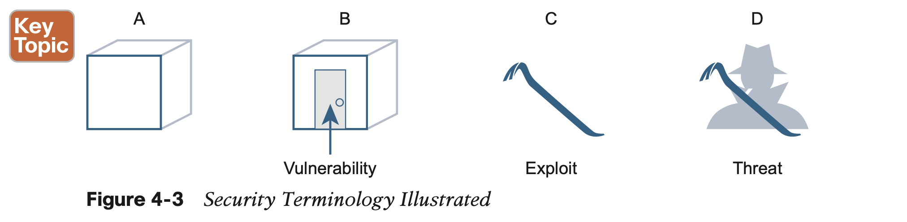
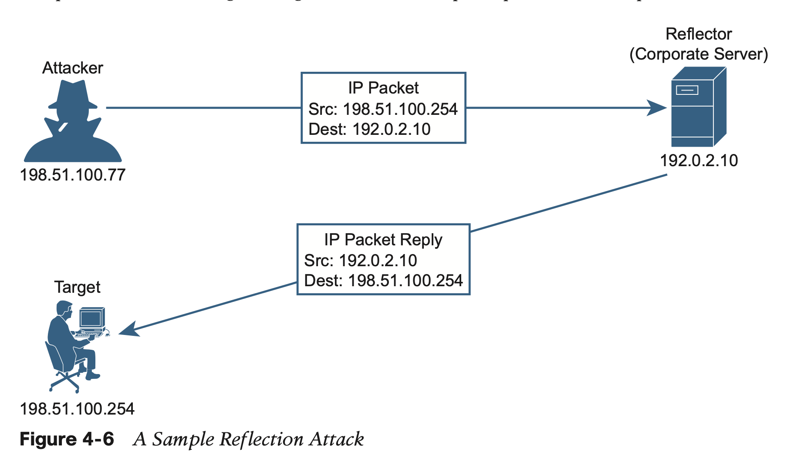
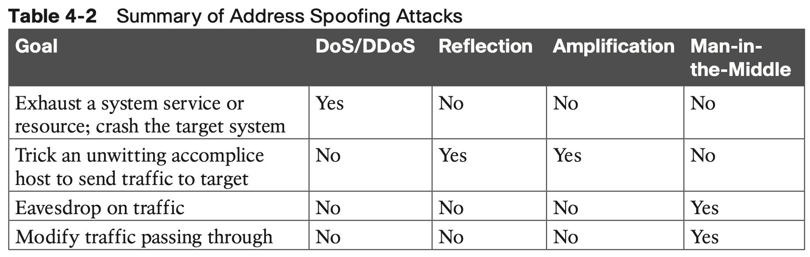
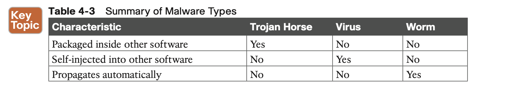
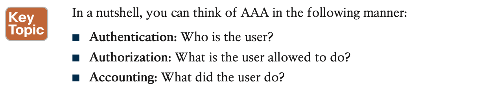
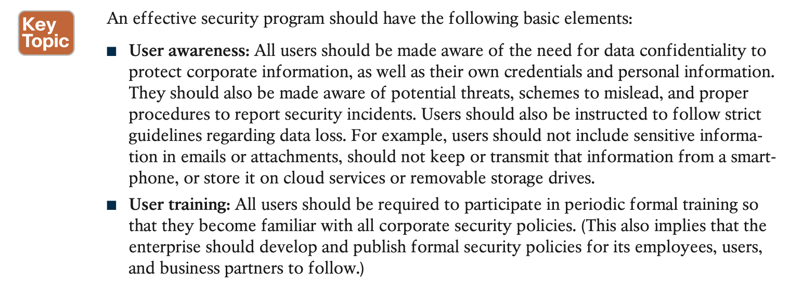
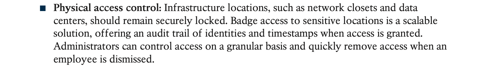

# Security Architectures

## 1. **Security Terminology**

In fact, the tool itself is called an exploit, as shown by the pry bar in part C of Figure 4-3. An exploit is not very effective if it is used against anything other than the targeted weakness or vulnerability.

## 2. **Common Security Threats**

**Malware**

## 3. **Controlling and Monitoring User Access**

## 4. **Developing a Security Program to Educate Users**

