# Securing Network Devices

## 1 **Securing IOS Passwords**

### 1.1 **Encrypting Older IOS Passwords with service password-encryption**

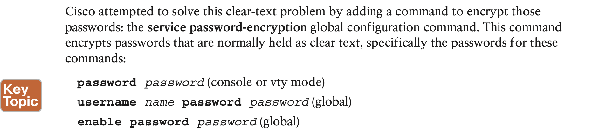

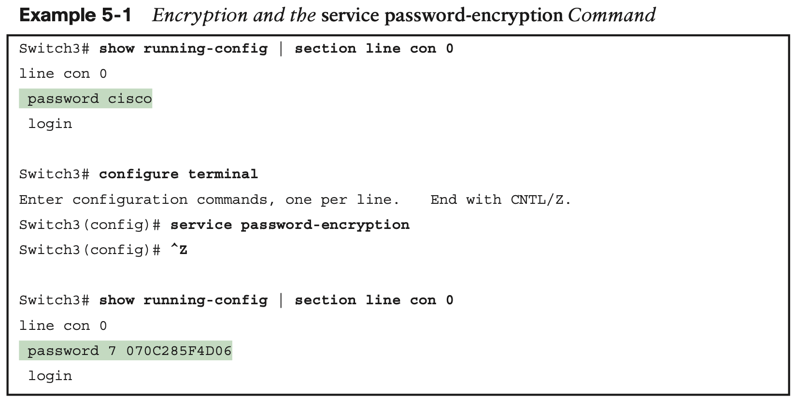

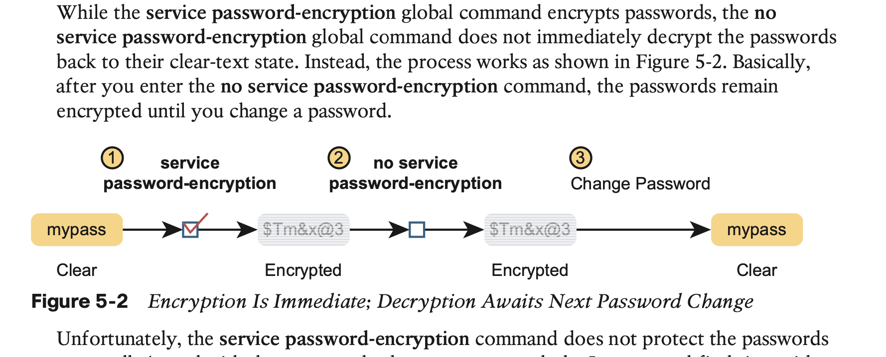

### 1.2 **Encoding the Enable Passwords with Hashes**

Cisco solved the problem of only weak ways to store the password of the **enable password** password global command by making a more secure replacement: the **enable secret** password global command. However, both these commands exist in IOS even today. 

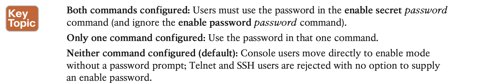

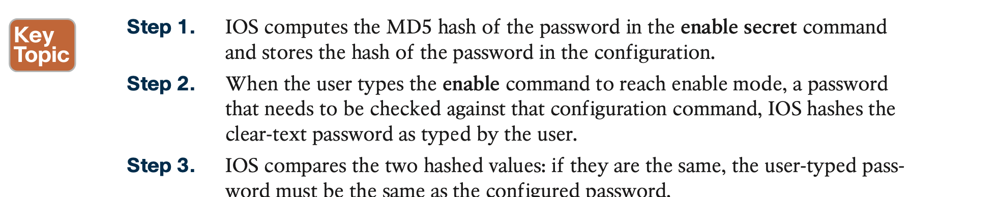

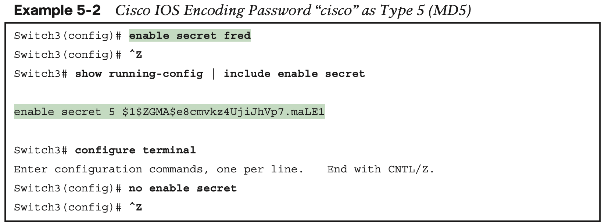

IOS now supports two alternative algorithm types in the more recent router and switch IOS images. Both use an SHA-256 hash instead of MD5

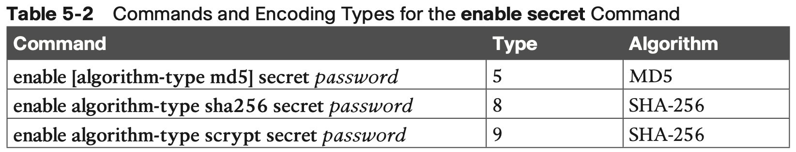

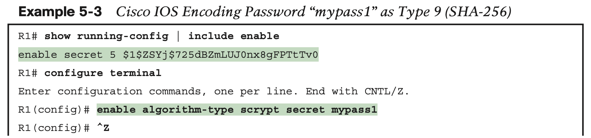

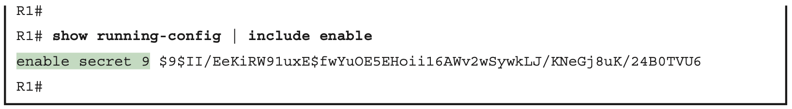

### 1.3 **Encoding the Passwords for Local Usernames**

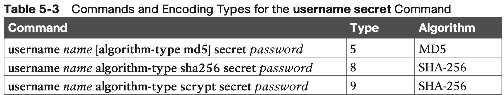

### 1.4 **Controlling Password Attacks with ACLs**

When an external user connects to a router or switch using Telnet or SSH, IOS uses a vty line to represent that user connection. IOS can apply an ACL to the vty lines, filtering the addresses that can telnet or SSH into the router or switch. If filtered, the user never sees a login prompt.

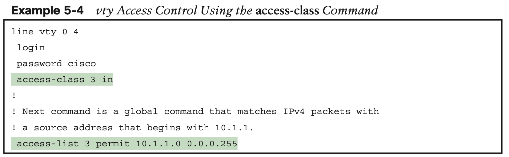

The **access-class** command refers to the matching logic in **access-list 3**. The keyword **in** refers to Telnet and SSH connections into this router—in other words, people telnetting into this router. As configured, ACL 3 checks the source IP address of packets for incoming Telnet connections.

## 2 **Firewalls and Intrusion Prevention Systems**

### 2.1 **Traditional Firewalls**

**Security Zones**

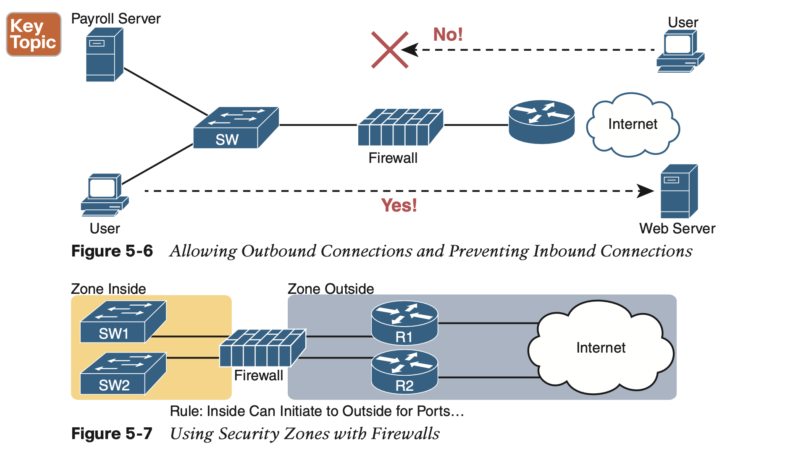

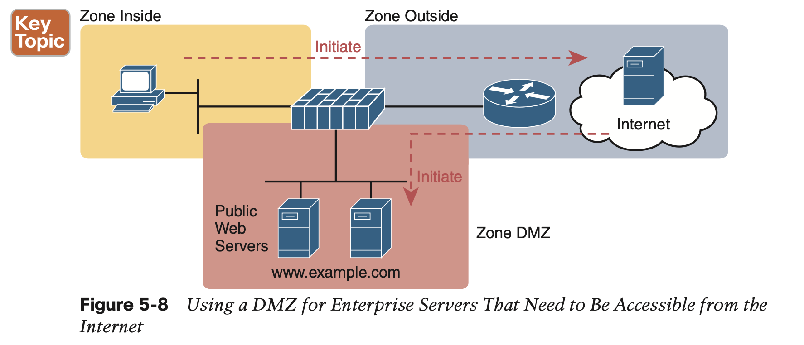

demilitarized zone (DMZ)

### 2.2 **Intrusion Prevention Systems (IPS)**

The IPS first downloads a database of exploit signatures. Each signature defines different header field values found in sequences of packets used by different exploits. Then the IPS can examine packets, compare them to the known exploit signatures, and notice when packets may be part of a known exploit. Once identified, the IPS can log the event, discard packets, or even redirect the packets to another security application for further examination.

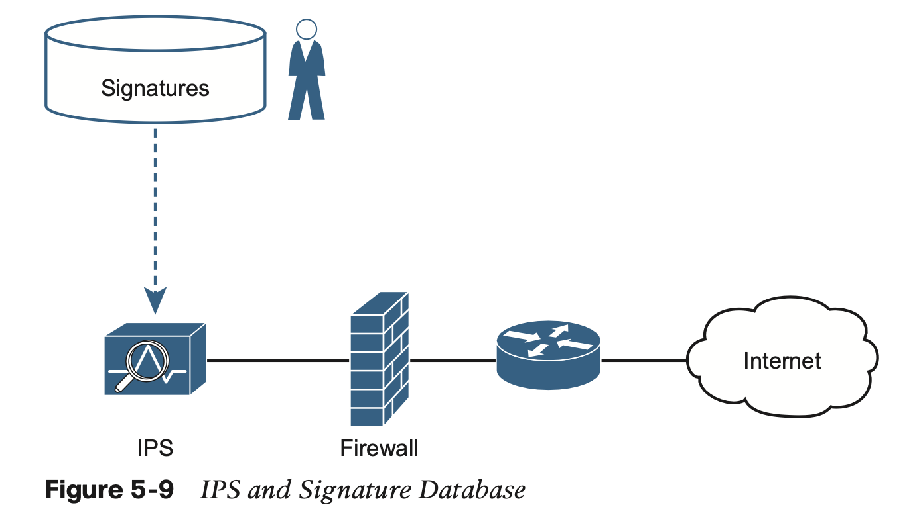

**Cisco Next-Generation Firewalls**

The following list mentions a few of the features of an NGFW. 

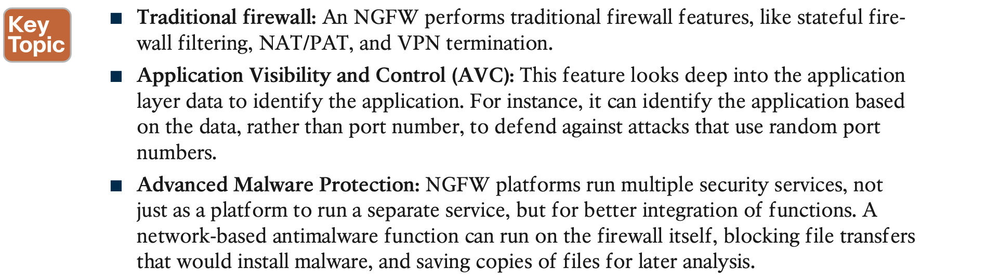

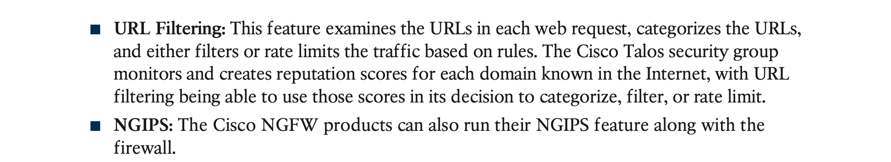

**Cisco Next-Generation IPS**

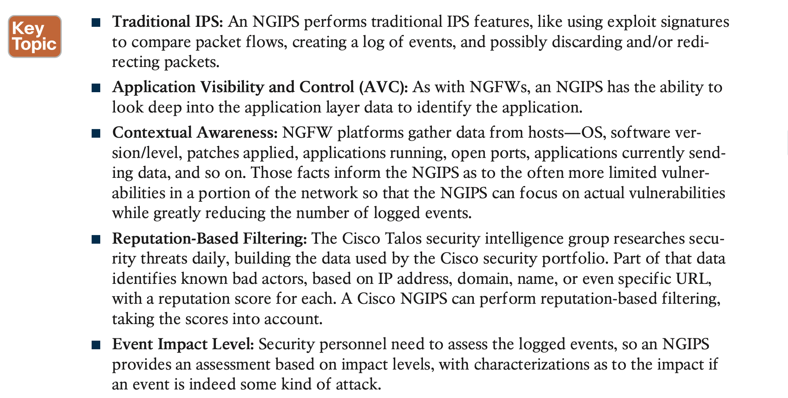

## **Command References**

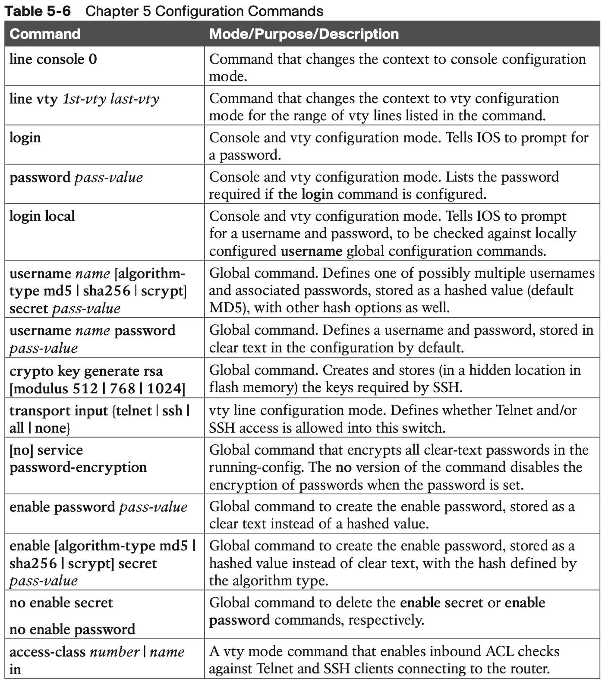

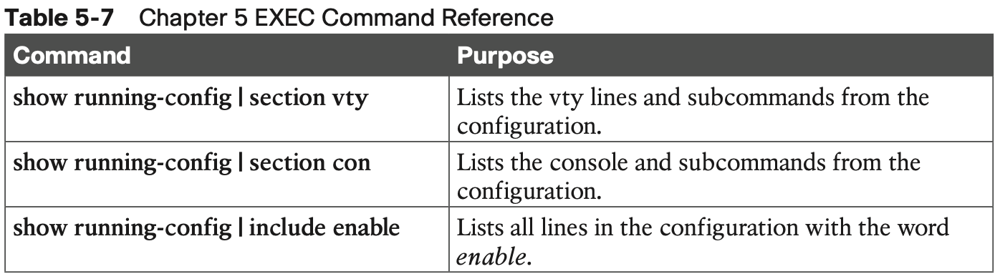