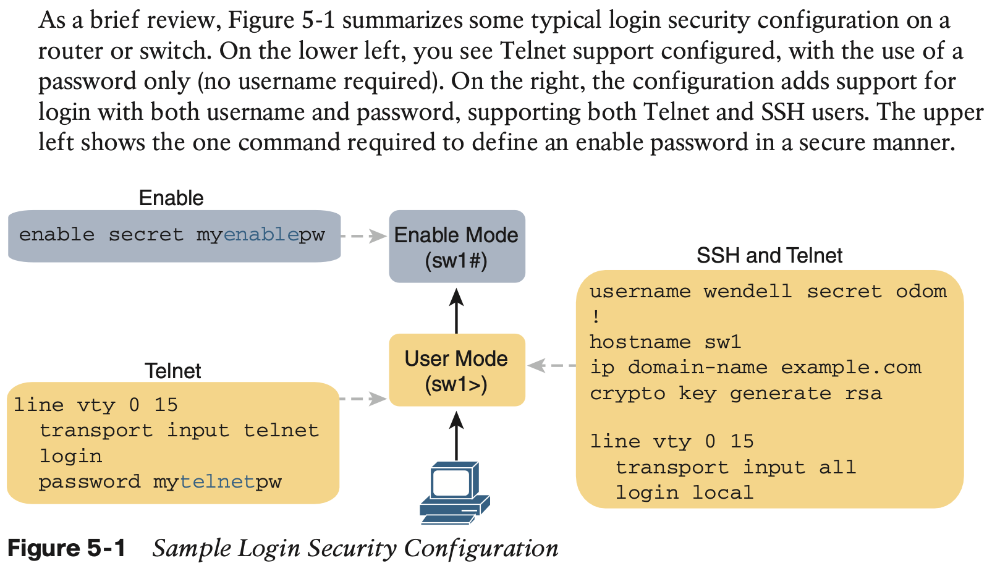

# Securing Network Devices

## 1 **Securing IOS Passwords**

### 1.1 **Encrypting Older IOS Passwords with service password-encryption**

### 1.2 **Encoding the Enable Passwords with Hashes**

Cisco solved the problem of only weak ways to store the password of the **enable password** password global command by making a more secure replacement: the **enable secret** password global command. However, both these commands exist in IOS even today. 

IOS now supports two alternative algorithm types in the more recent router and switch IOS images. Both use an SHA-256 hash instead of MD5

### 1.3 **Encoding the Passwords for Local Usernames**

### 1.4 **Controlling Password Attacks with ACLs**

When an external user connects to a router or switch using Telnet or SSH, IOS uses a vty line to represent that user connection. IOS can apply an ACL to the vty lines, filtering the addresses that can telnet or SSH into the router or switch. If filtered, the user never sees a login prompt.

## 2 **Firewalls and Intrusion Prevention Systems**

