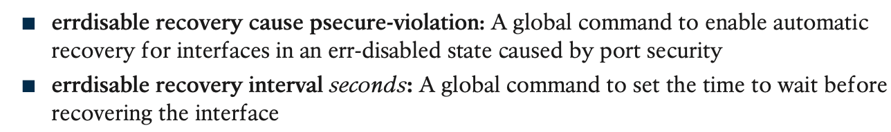

# Implementing Switch Port Security

## 1. **Port Security Concepts and Configuration**

### 1.1 **Configuring Port Security**

1. The first interface, FastEthernet 0/1, adds one optional port security subcommand: **switchport port-security mac-address 0200.1111.1111**, which defines a specific source MAC address. With the default maximum source address setting of 1, only frames with source MAC 0200.1111.1111 will be allowed in this port. When a frame with a source other than 0200.1111.1111 enters F0/1, the switch would normally perform MAC address learning and want to add the new source MAC address to the MAC address table. Port security will see that action as learning one too many MAC addresses on the port, taking the default violation action to disable the interface.
2. As a second example, FastEthernet 0/2 uses the same logic as FastEthernet 0/1, except that it uses the sticky learning feature. For port F0/2, the configuration of the **switchport port-security mac-address sticky** command tells the switch to dynamically learn source MAC addresses and add **port-security** commands to the running-config. Example 6-2 shows the running-config file that lists the sticky-learned MAC address in this case.

Port security does not save the configuration of the sticky addresses, so use the **copy running-config startup-config** command if desired.

3. The other two interfaces in Example 6-1 do not predefine MAC addresses, nor do they sticky-learn the MAC addresses. The only difference between these two interfaces’ port security configuration is that FastEthernet 0/4 supports eight MAC addresses because it connects to another switch and should receive frames with multiple source MAC addresses. Interface F0/3 uses the default maximum of one MAC address.

### 1.2 **Verifying Port Security**

The **show port-security interface** command provides the most insight to how port security operates, as shown in Example 6-3.

### 1.3 **Port Security MAC Addresses**

Once a switch port has been configured with port security, the switch no longer considers MAC addresses associated with that port as being dynamic entries as listed with the **show mac address-table dynamic** EXEC command. Even if the MAC addresses are dynamically learned, once port security has been enabled, you need to use one of these options to see the MAC table entries associated with ports using port security:

## 2. **Port Security Violation Modes**

The violation mode defines how port security should react when a violation occurs.

### 2.1 **Port Security Shutdown Mode**

when using port security shutdown mode and a violation occurs, the following happens:

**To recover from an err-disabled state**, the interface must be shut down with the **shutdown** command and then enabled with the **no shutdown** command. Alternately, the switch can be configured to automatically recover from the err-disabled state, when caused by port security, with these commands:

### 2.2 **Port Security Protect and Restrict Modes**

The restrict and protect violation modes take a much different approach to securing ports. These modes still discard offending traffic, but the interface remains in a connected (up/ up) state and in a port security state of secure-up. As a result, the port continues to forward good traffic but discards offending traffic.

**With protect mode,** the only action the switch takes for a frame that violates the port secu- rity rules is to discard the frame. The switch does not change the port to an err-disabled state, does not generate messages, and does not even increment the violations counter. Also, note that the counter at the bottom shows 0, even though several violations have occurred, because protect mode does not count the violating frames.

If Example 6-7 had used the **restrict violation mode** instead of protect, the port status would have also remained in a secure-up state; however, IOS would show some indi- cation of port security activity, such as an accurate incrementing violation counter, as well as syslog messages. 

## **Command References**

