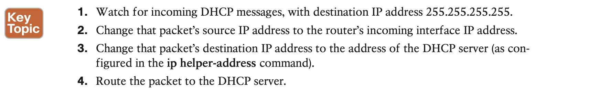

# Implementing DHCP

## 1. **Dynamic Host Configuration Protocol**

DHCP uses the following four messages between the client and server. (Also, as a way to help remember the messages, note that the first letters spell DORA):

 

#### 1.1 **Supporting DHCP for Remote Subnets with DHCP Relay**

- Cisco routers can act as the DHCP server, so a distributed design could use the router at each site as the DHCP server.

- However, a centralized DHCP server approach has advantages as well. 

With a centralized DHCP server, those DHCP messages that flowed only on the local subnet in Figure 7-1 somehow need to flow over the IP network to the centralized DHCP server and back. To make that work, the routers connected to the remote LAN subnets need an interface subcommand: the **ip helper-address** server-ip command.

The **ip helper-address** server-ip subcommand tells the router to do the following for the messages coming in an interface, from a DHCP client:

#### 1.2 **Information Stored at the DHCP Server**

Once such interfaces have been identified, the configuration requires the **ip helper-address** interface subcommand on each of those interfaces. For instance, with earlier Figure 7-3, R1’s G0/0 interface needs to be configured with the **ip helper-address 172.16.2.11** inter- face subcommand. 

#### 1.3 **Configuring a Switch as DHCP Client**

#### 1.4 Configuring a Router as DHCP Client

Just as with switches, you can configure router interfaces to lease an IP address using DHCP rather than using a static IP address, although those cases will be rare.

## 2. **Identifying Host IPv4 Settings**

To work correctly, an IPv4 host needs to know these values:

#### 2.1 **Host IP Settings on Windows**

#### 2.2 **Host IP Settings on macOS**

#### 2.3 **Host IP Settings on Linux**

## **Command References**

