# DHCP Snooping and ARP Inspection

This section now examines how attackers might use DHCP for their own ends and how two specific tools—DHCP Snooping and Dynamic ARP Inspection (DAI)—help defeat those attacks.

## 1. **DHCP Snooping**

### 1.1 **DHCP Snooping Concepts**

**DHCP Snooping on a switch acts like a firewall or an ACL in many ways.** It analyzes incoming messages on the specified subset of ports in a VLAN. **DHCP Snooping never filters non-DHCP messages**, but it may choose to filter DHCP messages, applying logic to make a choice—allow the incoming DHCP message or discard the message.

While DHCP itself provides a Layer 3 service, DHCP Snooping operates on LAN switches and is commonly used on Layer 2 LAN switches and enabled on Layer 2 ports. The reason to put DHCP Snooping on the switch is that the function needs to be performed between a typical end-user device—the type of device that acts as a DHCP client—and DHCP servers or DHCP relay agents.

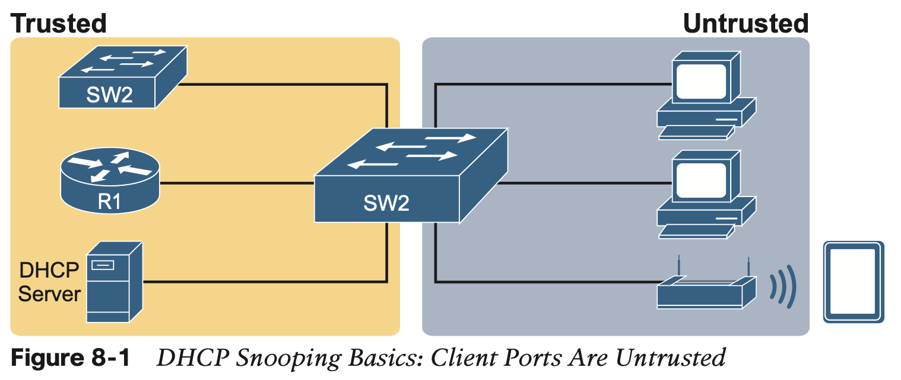

**DHCP Snooping works first on all ports in a VLAN, but with each port being trusted or untrusted by DHCP Snooping.**

**A Sample Attack: A Spurious DHCP Server**

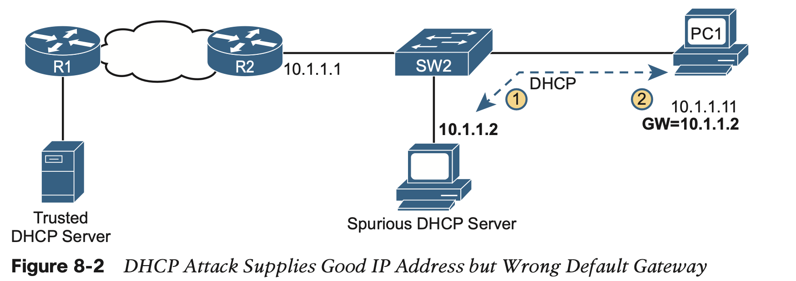

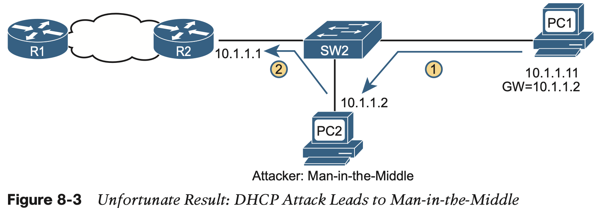

**DHCP Snooping Logic**

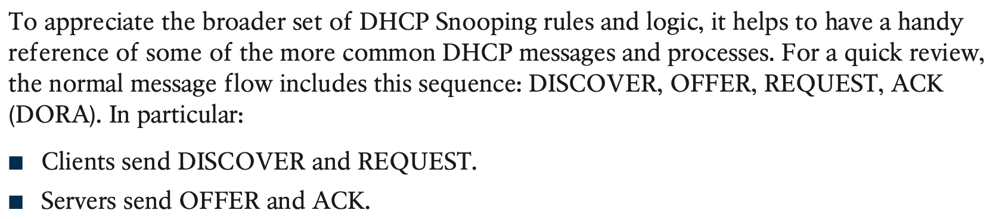

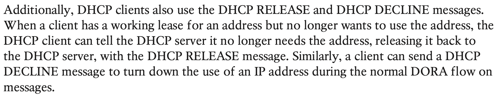

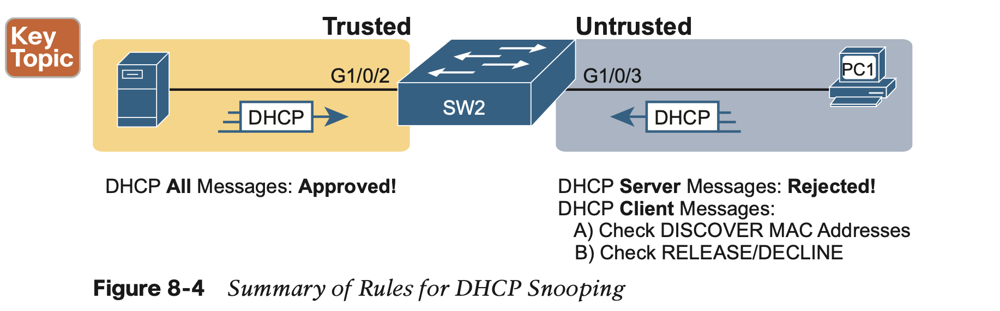

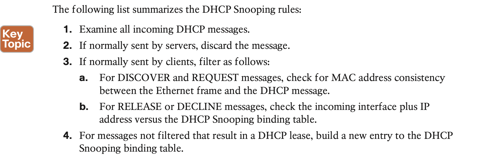

**Filtering DISCOVER Messages Based on MAC Address**

The core feature of DHCP Snooping defeats this type of attack on untrusted ports. It checks **the Ethernet header source MAC address** and compares that **address to the MAC address in the DHCP header**, and if the values do not match, DHCP Snooping discards the message.

**Filtering Messages that Release IP Addresses**

DHCP Snooping builds the **DHCP Snooping binding table** for all the DHCP flows it sees that it allows to complete. That is, for any working legitimate DHCP flows, it keeps a list of some of the important facts. Then DHCP Snooping, and other features like Dynamic ARP Inspection, can use the table to make decisions.

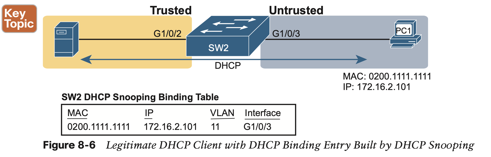

The switch’s DHCP Snooping feature combines the informa- tion from the DHCP messages, with information about the port (interface G1/0/3, assigned to VLAN 11 by the switch), and puts that in the DHCP Snooping binding table.

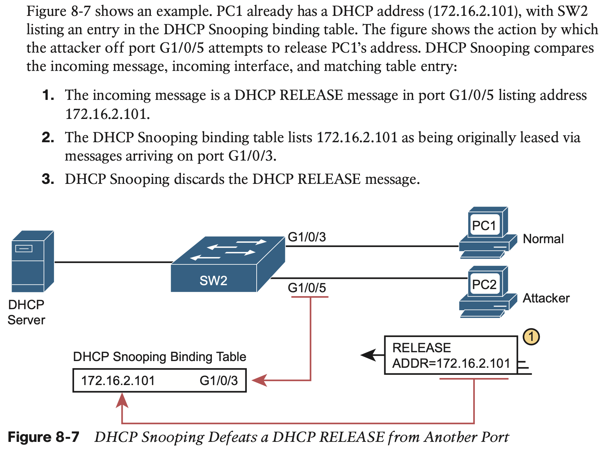

### 1.2 **DHCP Snooping Configuration**

The upcoming examples all rely on the topology illustrated in Figure 8-8, with Layer 2 switch SW2 as the switch on which to enable DHCP Snooping. 

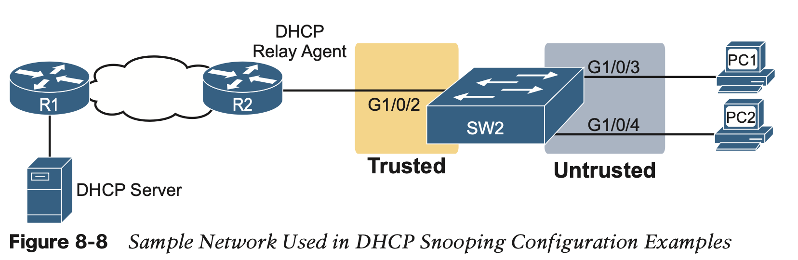

#### 1.2.1 Configuring DHCP Snooping on a Layer 2 Switch

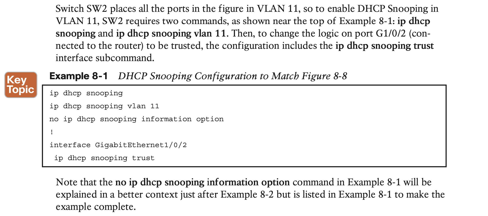

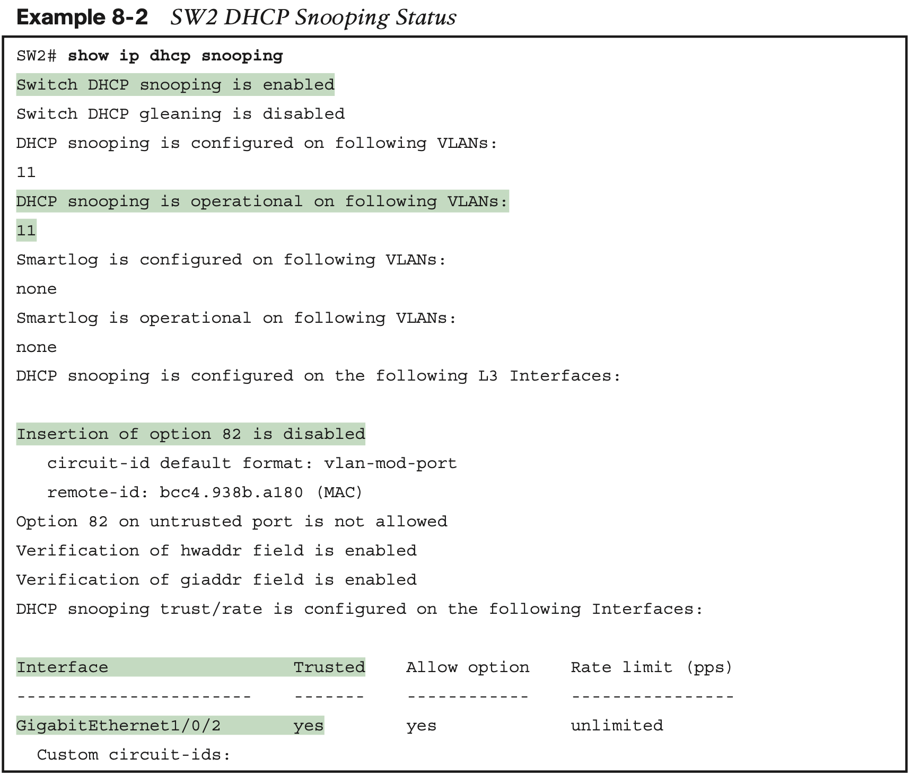

Also, you might have noticed that highlighted line in the middle that states **Insertion of option 82 is disabled**. That line confirms the addition of the **no ip dhcp information option** command to the configuration back in Example 8-1. To understand why the example includes this command, consider these facts about DHCP relay agents:

- The conclusion: To make DHCP Snooping work on a switch that is not also a DHCP relay agent, disable the option 82 feature using the **no ip dhcp snooping information option** global command.

#### 1.2.2 Limiting DHCP Message Rates

One way to attack DHCP Snooping takes advantage of the fact that it uses the general- purpose CPU in a switch. Knowing that, attackers can devise attacks to generate large volumes of DHCP messages in an attempt to overload the DHCP Snooping feature and the switch CPU itself. 

**To help prevent this kind of attack**, DHCP Snooping includes an optional feature that tracks the number of incoming DHCP messages. 

1. If the number of incoming DHCP mes- sages exceeds that limit over a one-second period, DHCP Snooping treats the event as an attack and moves the port to an err-disabled state. Also, the feature can be enabled both on trusted and untrusted interfaces. Although rate limiting DHCP messages can help, placing the port in an err-disabled state can itself create issues. As a reminder, once in the err-disabled state, the switch will not send or receive frames for the interface. However, the err-disabled state might be too severe an action because the default recovery action for an err-disabled state requires the configura- tion of a **shutdown** and then a **no shutdown** subcommand on the interface. 
2. To help strike a better balance, you can enable DHCP Snooping rate limiting and then also configure the switch to automatically recover from the port’s err-disabled state, without the need for a **shutdown** and then **no shutdown** command. using the **ip dhcp snooping rate limit** number inter- face subcommands. 

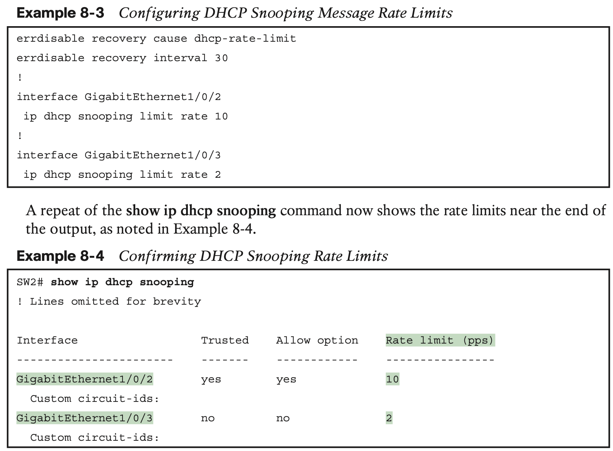

#### 1.2.3 DHCP Snooping Configuration Summary

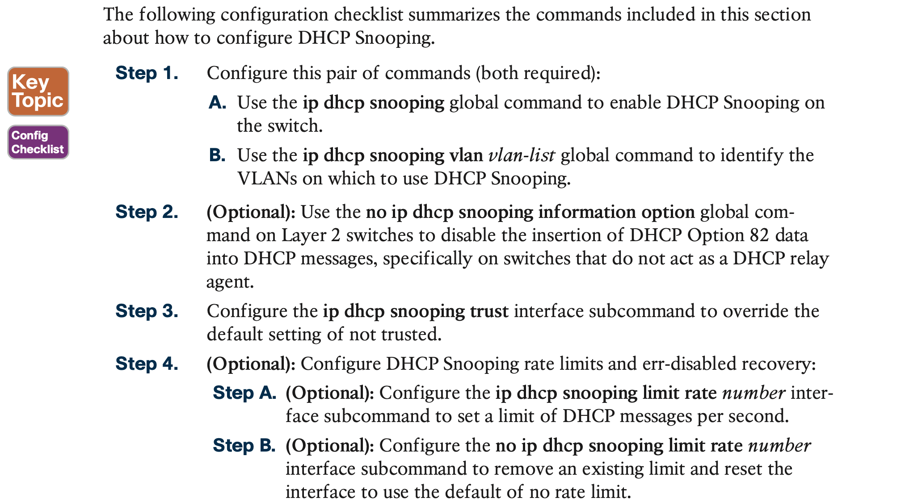

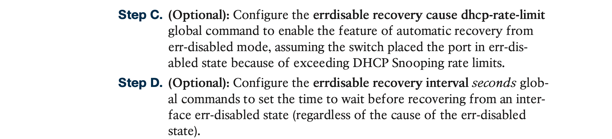

## 2. **Dynamic ARP Inspection**

The Dynamic ARP Inspection (DAI) feature on a switch examines incoming ARP messages on untrusted ports to filter those it believes to be part of an attack. 

DAI’s core feature compares incoming ARP messages with two sources of data: the DHCP Snooping binding table and any configured ARP ACLs. If the incoming ARP message does not match the tables in the switch, the switch discards the ARP message.

### 2.1 **DAI Concepts**

**Review of Normal IP ARP**

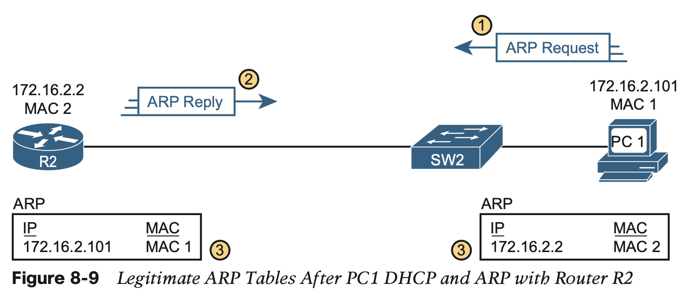

**The ARP tables at bottom of the figure imply an important fact: both hosts learn the other host’s MAC address with this two-message flow.** 

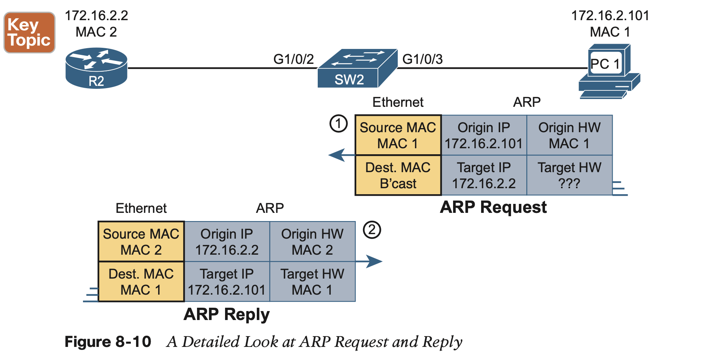

**Gratuitous ARP as an Attack Vector**

Normally, a host uses ARP when it knows the IP address of another host and wants to learn that host’s MAC address. However, for legitimate reasons, a host might also want to inform all the hosts in the subnet about its MAC address. That might be useful when a host changes its MAC address, for instance. So, ARP supports the idea of a gratuitous ARP message with these features:

Attackers can take advantage of gratuitous ARPs because they let the sending host make other hosts change their ARP tables. Figure 8-11 shows just such an example initiated by PC A (an attacker) with a gratuitous ARP.

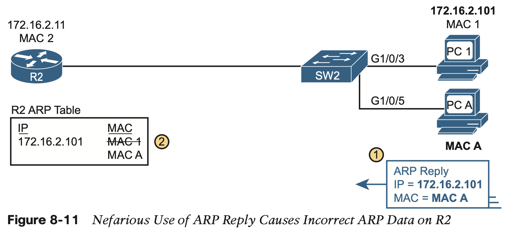

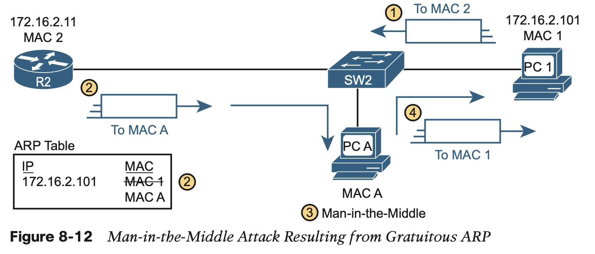

### 2.2 **Dynamic ARP Inspection Configuration**

DAI has a variety of features that can prevent these kinds of ARP attacks.

To understand how, consider the sequence of a typical client host with regards to both DHCP and ARP. When a host does not have an IP address yet—that is, before the DHCP process completes—it does not need to use ARP. Once the host leases an IP address and learns its subnet mask, it needs ARP to learn the MAC addresses of other hosts or the default router in the subnet, so it sends some ARP messages. **In short, DHCP happens first, then ARP.**

For any DAI untrusted ports, DAI compares the ARP message’s origin IP and origin MAC address fields to the DHCP Snooping binding table.

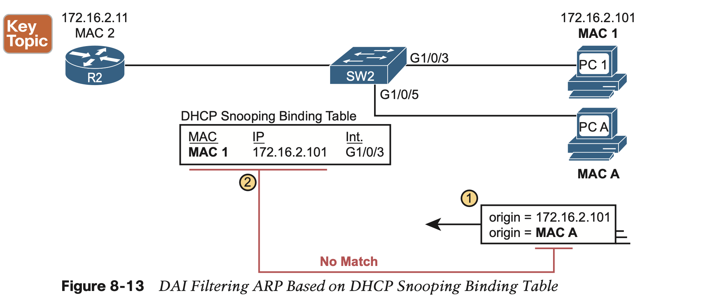
