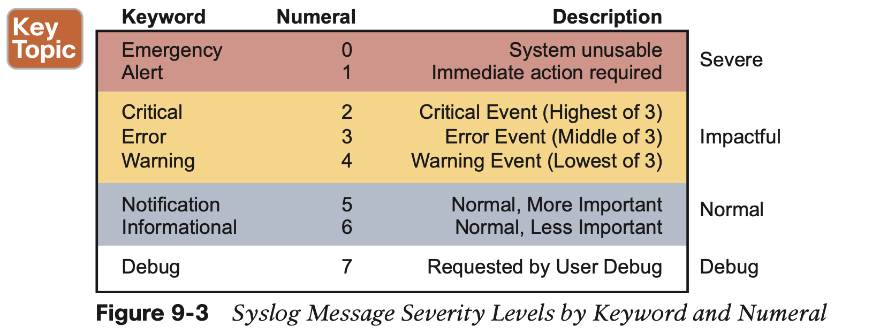
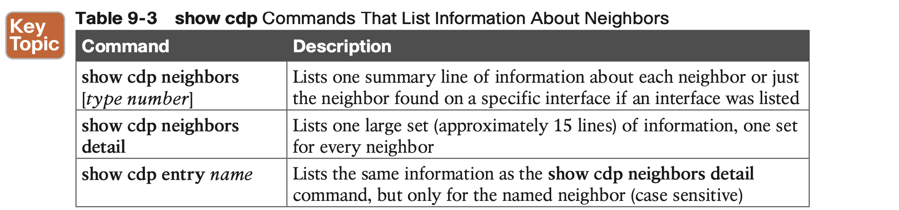
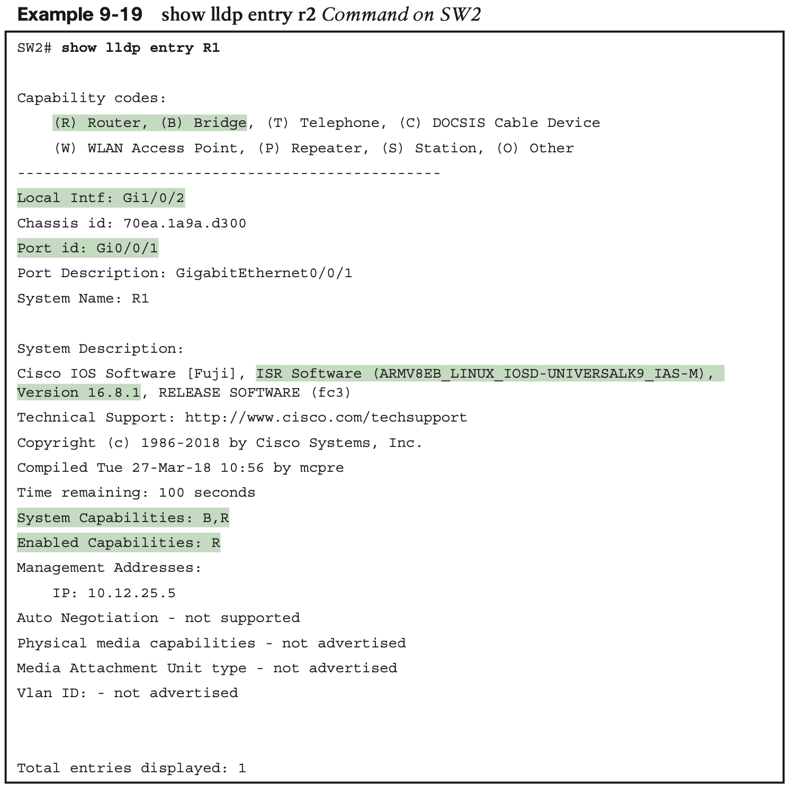

# Device Management Protocols

## 1. **System Message Logging (Syslog)**

**Sending Messages in Real Time to Current Users**

Figure 9-1 summarizes these key points about how IOS on a Cisco router or switch process- es log messages for currently connected users. In the figure, user A sits at the console and always receives log messages. On the right, the fact that user B sees messages (because user B issued the **terminal monitor** command after login), and user C does not, shows that each user can control whether or not she receives log messages.

**Storing Log Messages for Later Review**

With logging to the console and to terminals, an event happens, IOS sends the messages to the console and terminal sessions, and then IOS can discard the message. However, clearly, it would be useful to keep a copy of the log messages for later review, so IOS provides two primary means to keep a copy.

IOS can store copies of the log messages in RAM by virtue of the **logging buffered** global configuration command. Then any user can come back later and see the old log messages by using the **show logging** EXEC command.

**Log Message Format**

**Log Message Severity Levels**

Table 9-2 summarizes the configuration commands used to enable logging and to set the severity level for each type. **When the severity level is set, IOS will send messages of that severity level and more severe ones (lower severity numbers) to the service identified in the command.** 

For example, the command **logging console 4** causes IOS to send severity level 0–4 messages to the console. Also, note that the command to disable each service is the **no** version of the command, with no in front of the command (**no logging console**, **no logging monitor**, and so on).

**Configuring and Verifying System Logging**

**The debug Command and Log Messages**

Of the eight log message severity levels, one level, debug level (7), has a special purpose: for messages generated as a result of a user logged in to the router or switch who issues a **debug** command.

The **debug** EXEC command gives the network engineer a way to ask IOS to monitor for certain internal events, with that monitoring process continuing over time, so that IOS can issue log messages when those events occur.

## 2. **Network Time Protocol (NTP)**

NTP gives any device a way to synchronize their time-of-day clocks. NTP provides protocol messages that devices use to learn the timestamp of other devices. Devices send timestamps to each other with NTP messages, continually exchanging messages, with one device chang- ing its clock to match the other, eventually synchronizing the clocks. 

**Setting the Time and Timezone**

1. In the first command, the **clock timezone** part defines the command and a keyword. The next parameter, “EST” in this case, is any value you choose, but choose the name of the timezone of the device. This value shows up in **show** commands, so although you make up the value, the value needs to be meaningful to all. I chose EST, the acronym for US Eastern Standard Time. The “-5” parameter means that this device is 5 hours behind Universal Time Coordinated (UTC).

2. The **clock summer-time** part of the second command defines what to do, again with the “EDT” being a field in which you could have used any value. However, you should use a meaningful value. This is the value shown with the time in **show** commands when daylight savings time is in effect, so I chose EDT because it is the acronym for daylight savings time in that same EST time zone. Finally, the **recurring** keyword tells the router to spring for- ward an hour and fall back an hour automatically over the years.

3. The **clock set** EXEC command then sets the time, day of the month, month, and year. However, note that IOS interprets the time as typed in the command in the context of the time zone and daylight savings time. In the example, the **clock set** command lists a time of 20:52:49 (the command uses a time syntax with a 24-hour format, not with a 12-hour for- mat plus a.m./p.m.). As a result of that time plus the two earlier configuration commands, the **show clock** command (issued seconds later) lists that time, but also notes the time as EDT, rather than UTC time.

**Basic NTP Configuration**

**NTP Reference Clock and Stratum**

**Redundant NTP Configuration**

**NTP Using a Loopback Interface for Better Availability**

Cisco uses the router loopback interface to meet that exact need. Loopback interfaces are virtual interfaces internal to Cisco IOS, created via the command **interface loopback** number, where the number is an integer. Once configured, that loopback interface exists inside that router and is not tied to any physical interface. A loopback interface can be assigned an IP address, routing protocols can advertise about the subnet, and you can ping/ traceroute to that address. It acts like other physical interfaces in many ways, but once configured, it remains in an up/up state as long as

## 3. **Analyzing Topology Using CDP and LLDP**

 This final section shows yet another fea- ture common to both routers and switches, with two similar protocols: **the Cisco Discovery Protocol (CDP)** and **the Link Layer Discovery Protocol (LLDP).** This section focuses on CDP, followed by LLDP.

### 3.1 **Examining Information Learned by CDP**

CDP discovers basic information about neighboring routers and switches without needing to know the passwords for the neighboring devices. 

The next example shows the power of the information in CDP commands. The example uses the network shown in Figure 9-8, with Example 9-15 listing the output of several **show cdp** commands.

**Configuring and Verifying CDP**

IOS typically enables CDP globally and on each interface by default. You can then disable CDP per interface with the **no cdp enable** interface subcommand and later re-enable it with the **cdp enable** interface subcommand. To disable and re-enable CDP globally on the device, use the **no cdp run** and **cdp run** global commands, respectively.

### 3.2 **Examining Information Learned by LLDP**

Link Layer Discovery Protocol (LLDP), defined in IEEE standard 802.1AB, provides a stan- dardized protocol that provides the same general features as CDP. LLDP has similar con- figuration and practically identical **show** commands as compared with CDP.

**Configuring and Verifying LLDP**

LLDP uses a similar configuration model as CDP, but with a few key differences. First, Cisco devices default to disable LLDP. 

