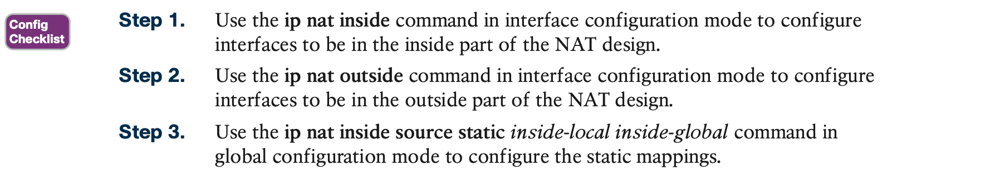

# Network Address Translation

## 1. **Perspectives on IPv4 Address Scalability**

**Private Addressing**

## 2. **Network Address Translation Concepts**

### 2.1 **Static NAT**

Static NAT works just like the example shown in Figure 10-2, but with the IP addresses statically mapped to each other. 

### 2.2 **Dynamic NAT**

### 2.3 **Overloading NAT with Port Address Translation**

The NAT Overload feature, also called **Port Address Translation (PAT)**, solves this problem. Overloading allows NAT to scale to support many clients with only a few public IP addresses.

## 3. **NAT Configuration and Troubleshooting**

### 3.1 **Static NAT Configuration**

When planning a NAT configuration, you must find some IP addresses to use as inside global IP addresses. Because these addresses must be part of some registered IP address range, it is common to use the extra addresses in the subnet connecting the enterprise to the Internet

### 3.2 **Dynamic NAT Configuration**

The next example shows a sample dynamic NAT configuration using the same network topology as the previous example 

**Dynamic NAT Verification**

### 3.3 **NAT Overload (PAT) Configuration**

### 3.4 **NAT Troubleshooting**

