# Quality of Service (QoS)

## 1. **Introduction to QoS**

### 1.1 **QoS: Managing Bandwidth, Delay, Jitter, and Loss**

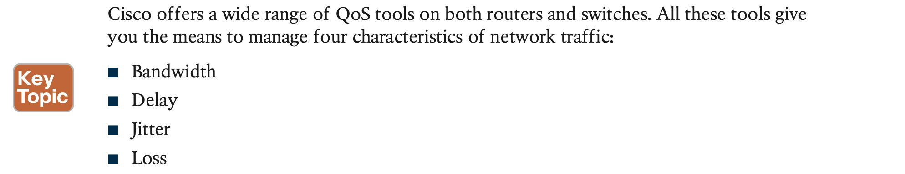

**Jitter** refers to the variation in one-way delay between consecutive packets sent by the same application. For example, imagine an application sends a few hundred packets to one particular host. The first packet’s one-way delay is 300 milliseconds (300 ms, or .3 seconds). The next packet’s one-way delay is 300 ms; so is the third’s; and so on. In that case, there is no jitter. However, if instead the first packet has a one-way delay of 300 ms, the next has a one-way delay of 310 ms, and the next has 325 ms, then there is some variation in the delay; 10 ms between packets 1 and 2, and another 15 ms between packets 2 and 3. That differ- ence is called jitter.

**Types of Traffic**

**Quality of Experience (QoE)**

**Voice and Video Applications**

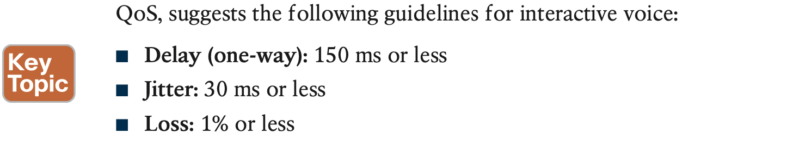

Video has a much more varied set of QoS requirements,

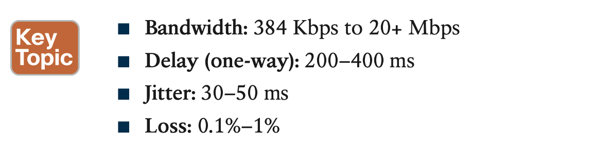

## 2. **Classification and Marking**

### 2.1 **Classification Basics**

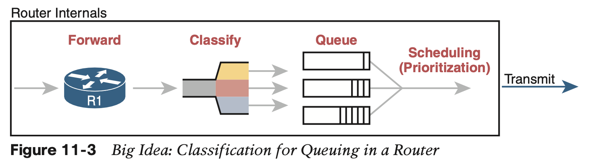

### 2.2 **Matching (Classification) Basics**

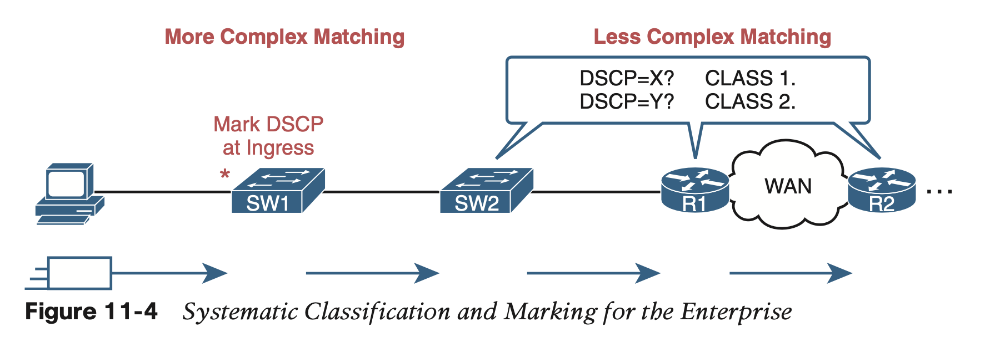

### 2.3 **Classification on Routers with ACLs and NBAR**

For any packet matched by the ACL with a permit action, consider that packet a match for QoS, so do a particular QoS action.

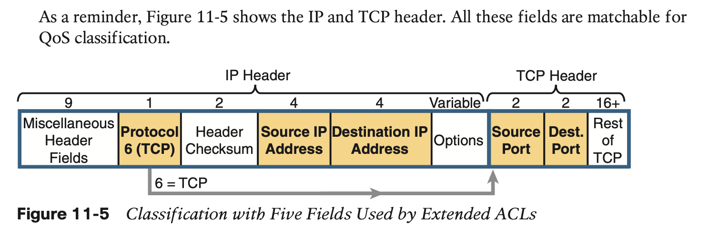

However, not every classification can be easily made by matching with an ACL. In more challenging cases, Cisco **Network Based Application Recognition** **(NBAR)** can be used.

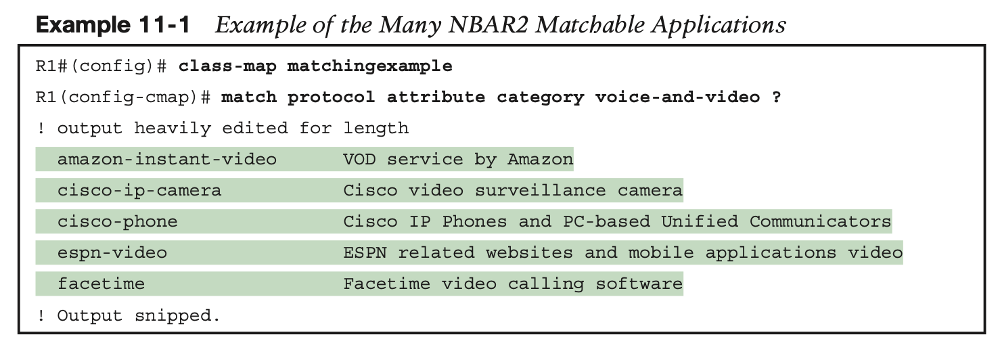

### 2.4 **Marking IP DSCP and Ethernet CoS**

This next topic takes a closer look at the specific fields that can be marked, defining the DSCP and CoS marking fields.

**Marking the IP Header**

IPv4 defines a Type of Service (**ToS**) byte in the IPv4 header

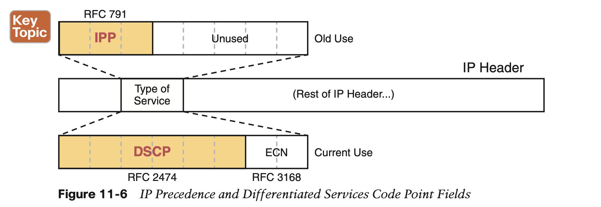

**Marking the Ethernet 802.1Q Header**

**Other Marking Fields**

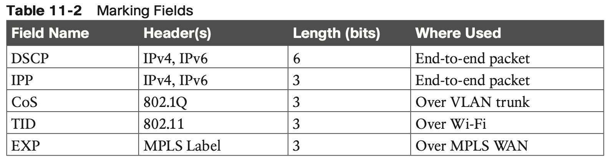

**Defining Trust Boundaries**

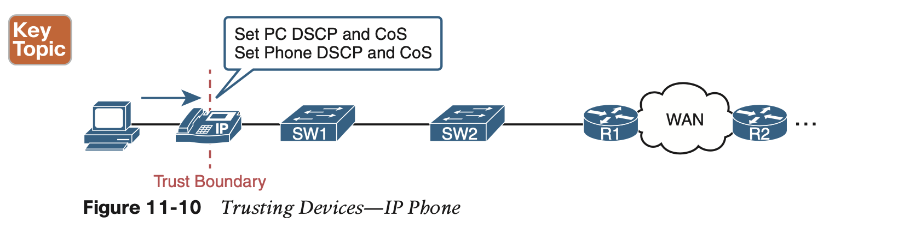

## 3. **Queuing**

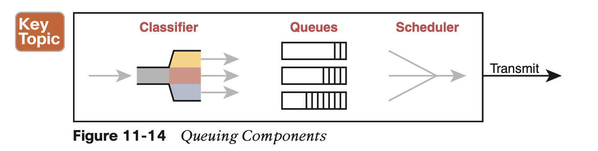

### 3.1 **Round-Robin Scheduling (Prioritization)**

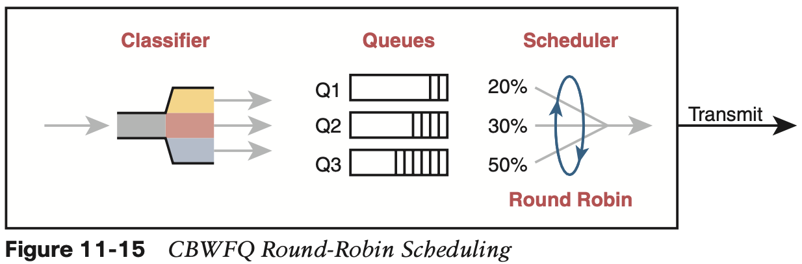

### 3.2 **Low Latency Queuing**

Unfortunately, a round-robin scheduler does not provide low enough delay, jitter, or loss. The solution: add **Low Latency Queuing (LLQ)** to the scheduler.

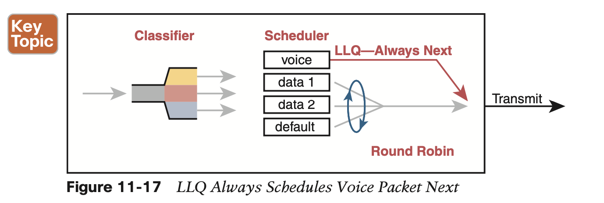

### 3.3 **A Prioritization Strategy for Data, Voice, and Video**

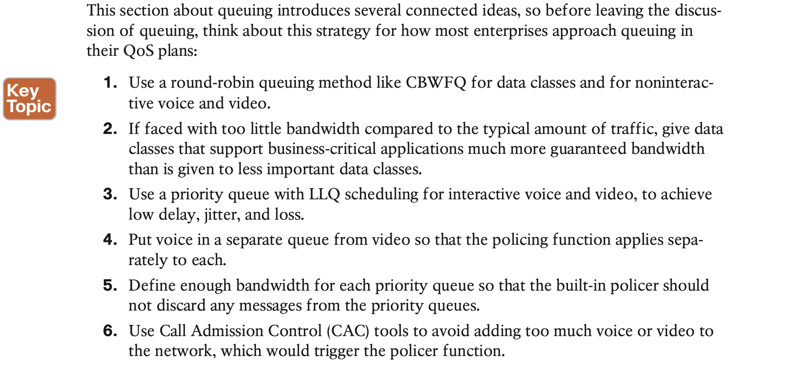

## 4. **Shaping and Policing**

This section introduces two related QoS tools—shaping and policing.

Both policing and shaping monitor the bit rate of the combined messages that flow through a device. Once enabled, the policer or shaper notes each packet that passes and measures the number of bits per second over time. Both attempt to keep the bit rate at or below the configured speed, but by using two different actions: **policers discard packets**, and **shapers hold packets in queues to delay the packets.**

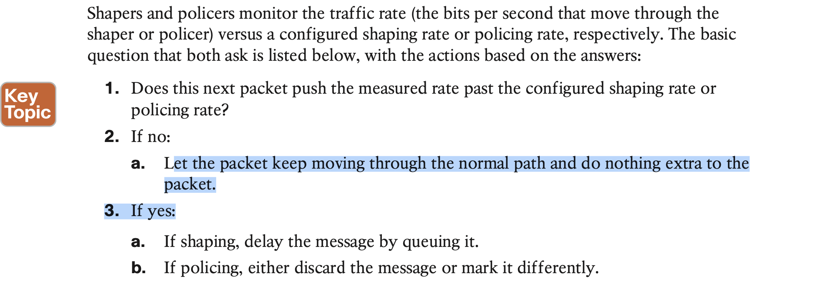

### 4.1 **Policing**

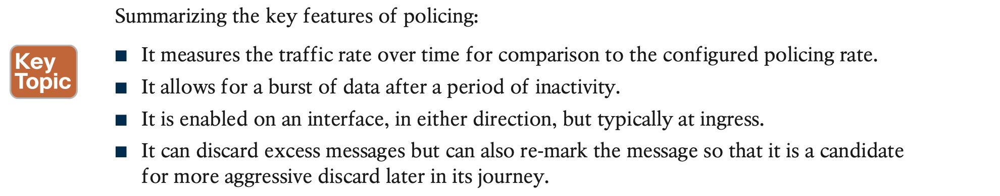

### 4.2 **Shaping**

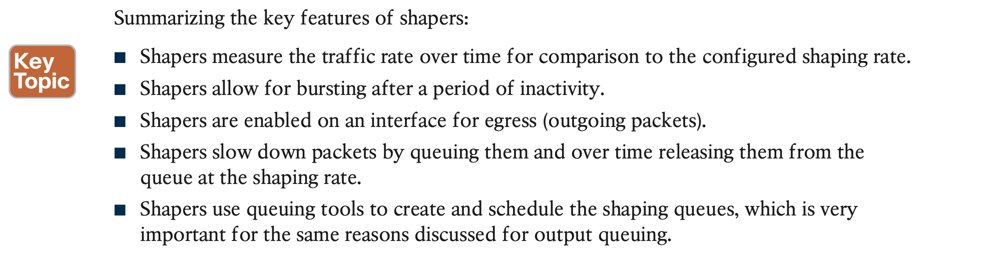

## 5. **Congestion Avoidance**

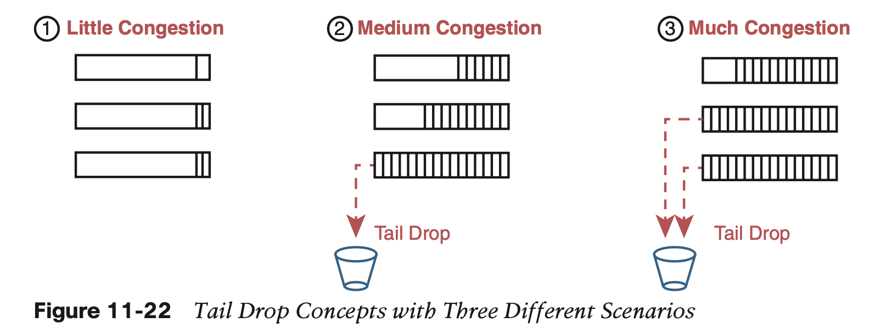

