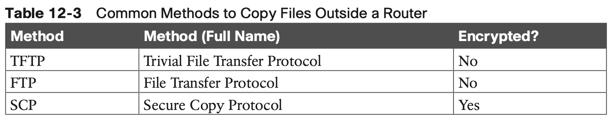

# Miscellaneous IP Services

## 1. **First Hop Redundancy Protocol**

### 1.1 **The Need for Redundancy in Networks**

### 1.2 **The Need for a First Hop Redundancy Protocol**

**All of these options have a problem:** the users have to take action. They have to know an outage occurred. They have to know how to reconfigure their default router setting. And they have to know when to change it back to the original setting.

FHRPs make this design work better. The two routers appear to be a single default router. The users never have to do anything: their default router setting remains the same, and their ARP table even remains the same.

### 1.3 **The Three Solutions for First-Hop Redundancy**

The term First Hop Redundancy Protocol does not name any one protocol. Instead, it names a family of protocols that fill the same role.

Table 12-2 lists the three FHRP protocols in chronological order, based on when these were first used.

This chapter focuses on HSRP and does not discuss VRRP and GLBP other than this brief mention. 

### 1.4 **HSRP Concepts**

The HSRP active router implements a virtual IP address and matching virtual MAC address. This virtual IP address exists as part of the HSRP configuration, which is an additional con- figuration item compared to the usual **ip address** interface subcommand. This virtual IP address is in the same subnet as the interface IP address, but it is a different IP address. The router then automatically creates the virtual MAC address. All the cooperating HSRP routers know these virtual addresses, but only the HSRP active router uses these addresses at any one point in time.

**HSRP Failover**

When the failover happens, some changes do happen, but none of those changes happen on the hosts. The host keeps the same default router setting, set to the virtual IP address (10.1.1.1 in this case). The host’s ARP table does not have to change either, with the HSRP virtual MAC being listed as the MAC address of the virtual router.

When the failover occurs, changes happen on both the routers and the LAN switches. Clearly, the new active router has to be ready to receive packets (encapsulated inside frames) using the virtual IP and MAC addresses. However, the LAN switches, hidden in the last few figures, formerly sent frames destined for VMAC1 to router R1. Now the switches must know to send the frames to the new active router, R2.

To make the switches change their MAC address table entries for VMAC1, R2 sends an Ethernet frame with VMAC1 as the source MAC address. The switches, as normal, learn the source MAC address (VMAC1), but with new ports that point toward R2. The frame is also a LAN broadcast, so all the switches learn a MAC table entry for VMAC1 that leads toward R2.

**HSRP Load Balancing**

The active/standby model of HSRP means that in one subnet all hosts send their off-subnet packets through only one router.

HSRP does support load balancing by preferring different routers to be the active router in different subnets. HSRP then can be configured to prefer one router as active in one VLAN and another router as active in another VLAN, balancing the traffic.

## 2. **Simple Network Management Protocol**

SNMP is an application layer protocol that provides a message format for communication between what are termed managers and agents. 

- An **SNMP manager** is a network manage- ment application running on a PC or server, with that host typically being called a Network Management Station (NMS). 
- Many **SNMP agents** exist in the network, one per device that is managed. The SNMP agent is software running inside each device (router, switch, and so on), with knowledge of all the variables on that device that describe the device’s configura- tion, status, and counters. 
- The SNMP manager uses SNMP protocols to communicate with each SNMP agent.

### 2.1 **SNMP Variable Reading and Writing: SNMP Get and Set**

Specifically, the NMS uses the SNMP Get, GetNext, and GetBulk messages (together referenced simply as Get messages) to ask for information from an agent. The NMS sends an SNMP Set message to write variables on the SNMP agent as a means to change the configu- ration of the device.

### 2.2 **SNMP Notifications: Traps and Informs**

In addition to asking for information with Get commands and setting variables on agents with the Set command, SNMP agents can initiate communications to the NMS. These messages, generally called notifications, use two specific SNMP messages: Trap and Inform.

SNMP Traps and Inform messages have the exact same purpose but differ in the protocol mechanisms.

1. The SNMP agent sends the Trap to the IP address of the NMS, with UDP as the transport protocol as with all SNMP messages, and with no application layer error recovery. If the Trap arrives, great; if it is lost in transit, it is lost.
2. Inform messages are like Trap messages but with reliability added. Added to the protocol with SNMP Version 2 (SNMPv2), Informs still use UDP but add application layer reliability.

### 2.3 **The Management Information Base**

Every SNMP agent has its own Management Information Base. The MIB defines variables whose values are set and updated by the agent. The MIB variables on the devices in the net- work enable the management software to monitor/control the network device.

### 2.4 **Securing SNMP**

SNMPv1 defines both **a read-only community** and **a read-write community**. The read-only (RO) community allows Get messages, and the read-write (RW) community allows both reads and writes (Gets and Sets). 

## 3. **FTP and TFTP**

This final of three major sections of the chapter focuses on two topics: File Transfer Protocol (FTP) and Trivial File Transfer Protocol (TFTP). Both exist as TCP/IP protocols defined in RFCs. Both use a client and server model, in which the client connects to a server and then the client can copy files to the server or from the server. 

### 3.1 **Managing Cisco IOS Images with FTP/TFTP**

#### 3.1.1 The IOS File System

As for the physical storage, Cisco routers typically use flash memory, with no hard disk drive. Flash memory is rewriteable, permanent storage, which is ideal for storing files that need to be retained when the router loses power. 

#### 3.1.2 Upgrading IOS Images

One of the first steps to upgrade a router’s IOS to a new version is to obtain the new IOS image and put it in the right location. 

#### 3.1.3 Copying a New IOS Image to a Local IOS File System Using TFTP

#### 3.1.4 Verifying IOS Code Integrity with MD5

#### 3.1.5 Copying Images with FTP

### 3.2 **The FTP and TFTP Protocols**

The IOS **copy** command, when using the **tftp** or **ftp** keyword, makes the command act as a client. The client connects to a TFTP or FTP server and then attempts to transfer the file. In the examples from the IOS, that **copy** command copied the file from the server into the cli- ent device (a router).

#### 3.2.1 FTP Protocol Basics

Following is a summary of some of the FTP actions:

**FTP Active and Passive Modes**

**FTP over TLS (FTP Secure)**

**FTP Secure (FTPS)**

#### 3.2.2 **TFTP Protocol Basics**

For the basics, Trivial File Transfer Protocol uses UDP well-known port 69. Because it uses UDP, TFTP adds a feature to check each file for transmission errors by using a checksum process on each file after the transfer completes.

## **Command References**

