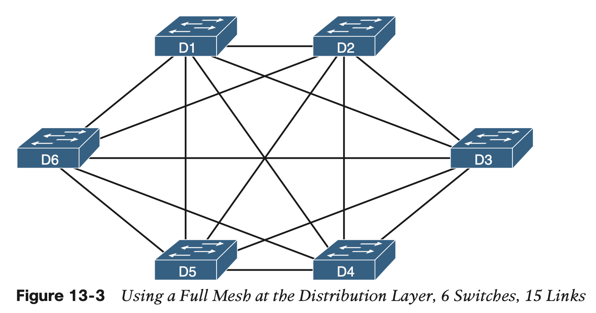

# LAN Architecture

## 1 **Analyzing Campus LAN Topologies**

#### 1.1 The Two-Tier Campus Design

**Topology Terminology Seen Within a Two-Tier Design**

#### 1.2 **Three-Tier Campus Design (Core)**

## 2 **Small Office/Home Office**

## 3 **Power over Ethernet (PoE)**

By using these IEEE autonegotiation messages and watch- ing for the return signal levels, PoE can determine whether the device on the end of the cable requires power (that is, it is a PD) and how much power to supply. This list details the major steps:

