# WAN Architecture

## 1. **Metro Ethernet**

To begin the conversation with a basic view, Metro Ethernet acts much as if the WAN service were created by one Ethernet switch, as shown in Figure 14-1.

1. The figure shows four sites in the same company, each with a router. Each router is connected to the WAN service with an Ethernet link of some kind; 
2. those Ethernet links typically use one of the fiber Ethernet standards due to the distances involved. From the customer’s perspective, the WAN service acts like a LAN switch in that it forwards Ethernet frames.

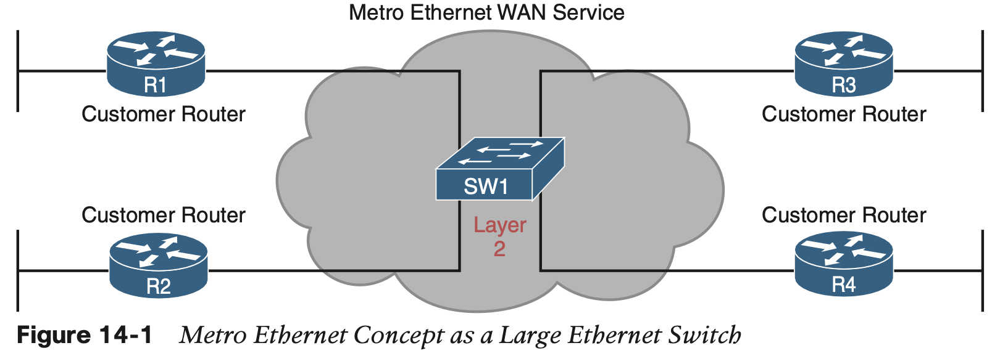

#### 1.1 **Metro Ethernet Physical Design and Topology**

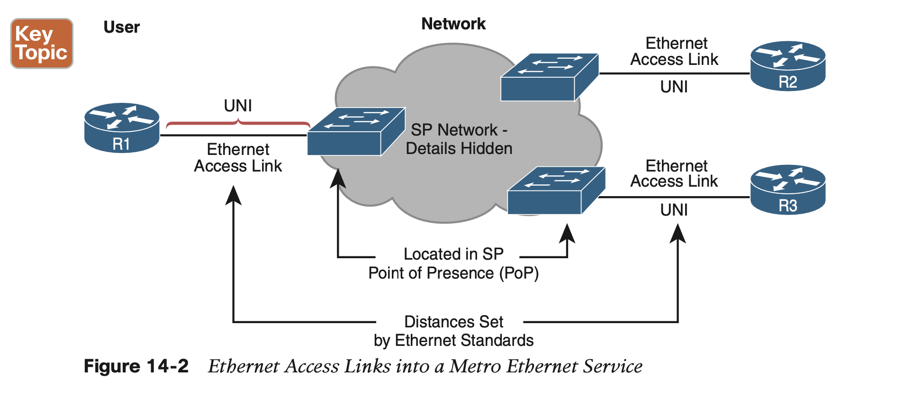

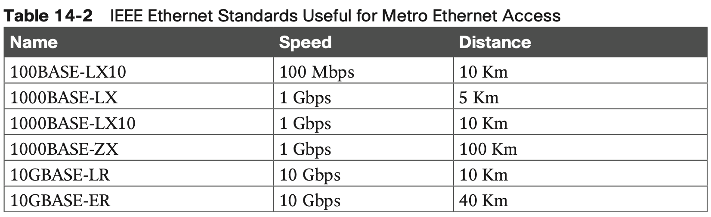

#### 1.2 **Ethernet WAN Services and Topologies**

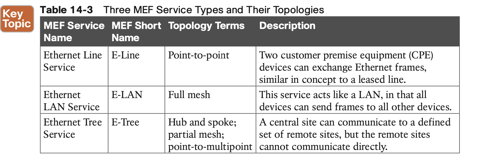

1. **Ethernet Line Service (Point-to-Point)**

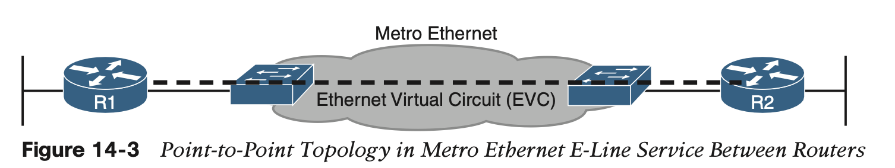

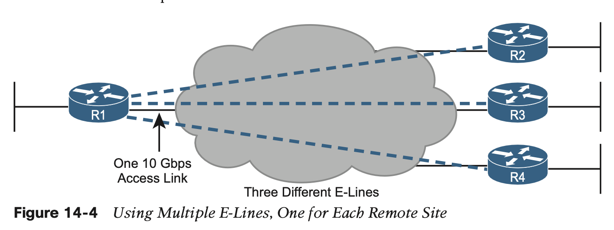

2. **Ethernet LAN Service (Full Mesh)**

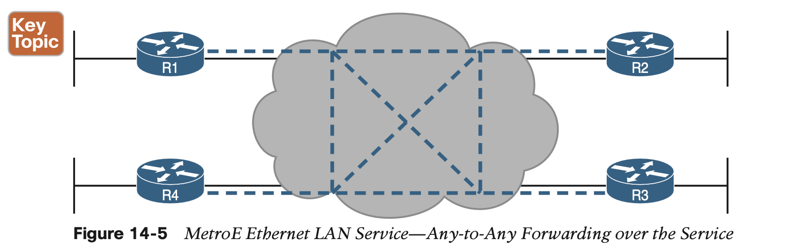

3. **Ethernet Tree Service (Hub and Spoke)**

The Ethernet Tree service (E-Tree) creates a WAN topology in which the central site device can send Ethernet frames directly to each remote (leaf) site, but the remote (leaf) sites can send only to the central site. 

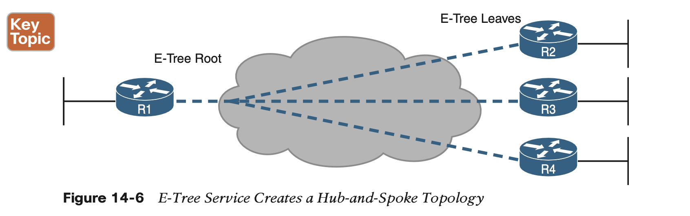

## 2. **Multiprotocol Label Switching (MPLS)**

The routers on the edge of the MPLS network add and remove an MPLS header to packets as they enter and exit the MPLS network. The devices inside the MPLS network then use the label field inside that MPLS header when forwarding data across the MPLS network. 

In particular, the SP’s MPLS VPN network

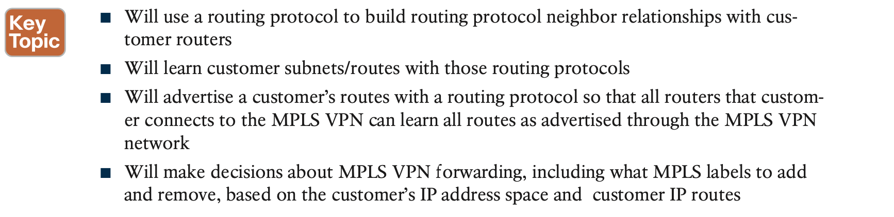

#### 2.1 **MPLS VPN Physical Design and Topology**

MPLS provides a Layer 3 service in that it promises to forward Layer 3 packets (IPv4 and IPv6). To support that service, MPLS SPs typically use routers at the edge of the MPLS net- works because routers provide the function of forwarding Layer 3 packets.

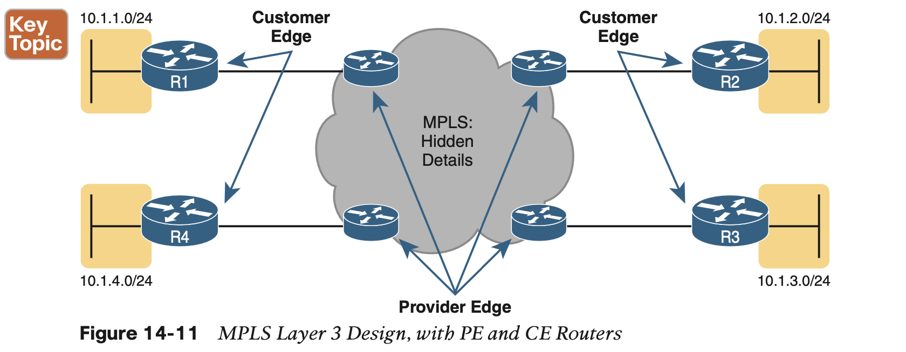

MPLS does support many types of access links, as shown in Figure 14-12.

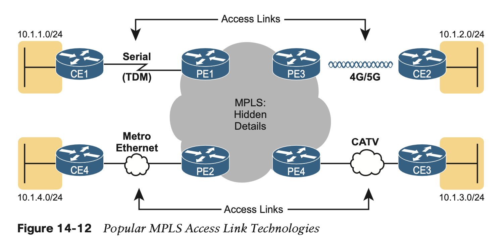

#### 2.2 **MPLS and Quality of Service**

With a QoS-capable WAN, the customer can mark VoIP packets so that the MPLS network can recognize VoIP packets and treat them better, resulting in better voice call quality. But to make it work correctly, the customer and MPLS provider need to cooperate.

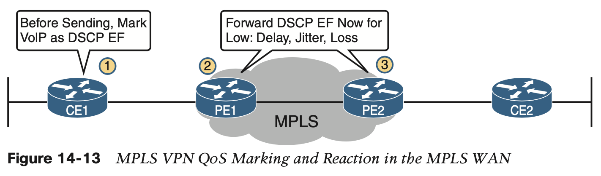

#### 2.3 **Layer 3 with MPLS VPN**

As a Layer 3 service, MPLS must be aware of the customer IP addressing. The SP will even use routing protocols and advertise those customer routes across the WAN. This section takes a closer look at what that means.

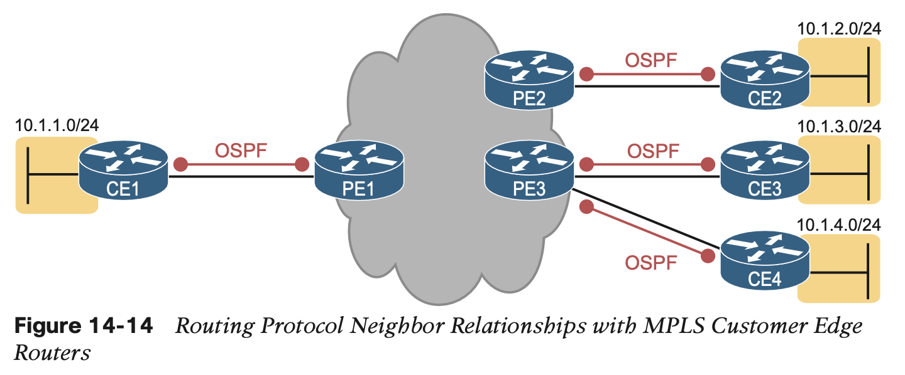

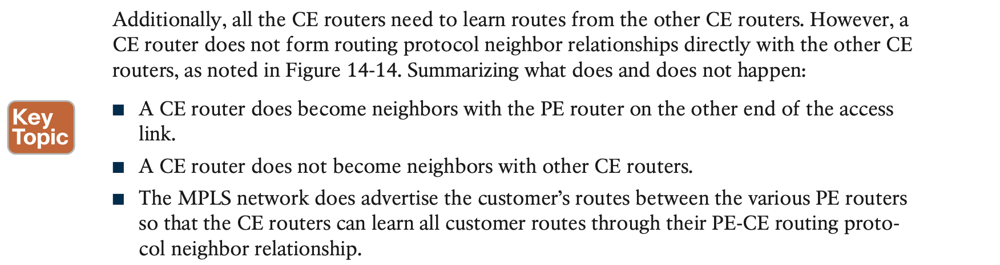

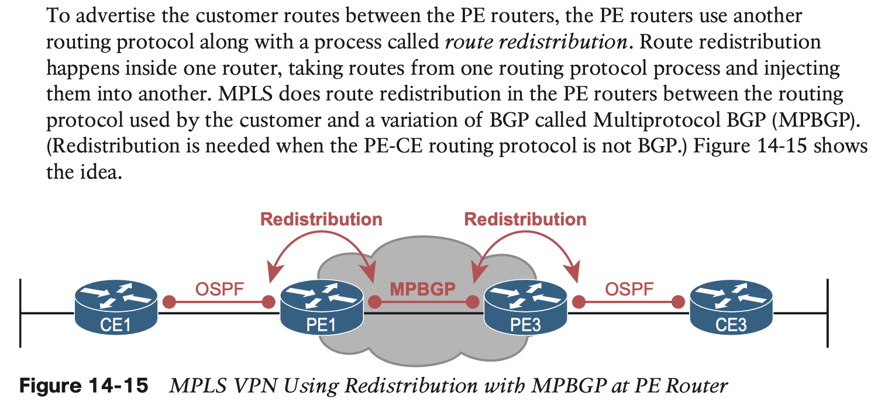

## 3. **Internet VPNs**

### 3.1 **Internet Access**

### 3.2 **Internet VPN Fundamentals**

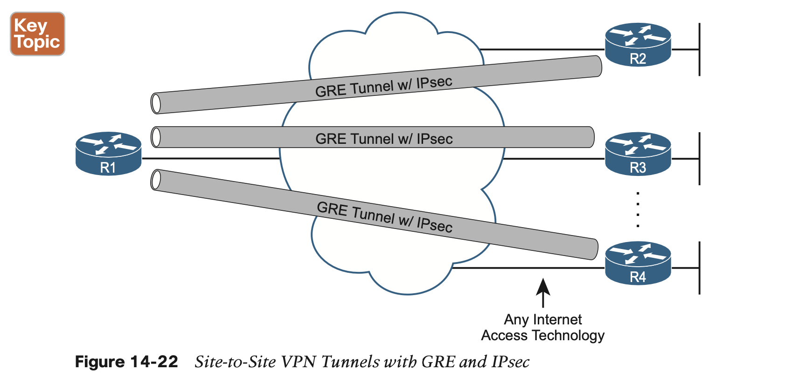

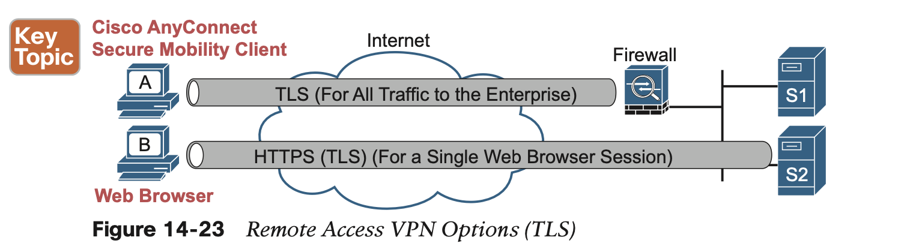

### 3.3 **VPN Comparisons**

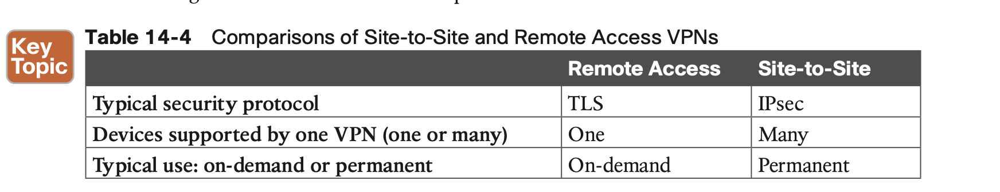

