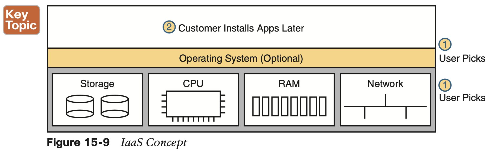

# Cloud Architecture

## 1. **Server Virtualization**

#### 1.1 **Cisco Server Hardware**

#### 1.2 **Server Virtualization Basics**

#### 1.3 **Networking with Virtual Switches on a Virtualized Host**

#### 1.4 **The Physical Data Center Network**

## 2. **Cloud Computing Services**

The list is derived from the definition of cloud computing as put forth by the US National Institute of Standards and Technology (NIST):

#### 2.1 **Private Cloud (On-Premise)**

#### 2.2 **Public Cloud**

#### 2.3 **Cloud and the “As a Service” Model**

**Infrastructure as a Service**

**Software as a Service**

**(Development) Platform as a Service**

**The key difference between PaaS and IaaS is** that PaaS includes many more software tools beyond the basic OS. Those tools are useful to a software developer during the software development process. Once the development process is complete, and the application has been rolled out in production, those tools are not needed on the servers running the appli- cation. So the development tools are particular to the work done when developing.

## 3. **WAN Traffic Paths to Reach Cloud Services**

### 3.1 **Enterprise WAN Connections to Public Cloud**

**Accessing Public Cloud Services Using the Internet**

**Pros and Cons with Connecting to Public Cloud with Internet**

the following list summarizes some **good reasons** to use the Internet as the WAN connection to a public cloud service:

Those **negatives** for using the Internet for public cloud access are

**Private WAN and Internet VPN Access to Public Cloud**

**Pros and Cons of Connecting to Cloud with Private WANs**

**Intercloud Exchanges**

Generically, the term intercloud exchange has come to be known as a company that creates a private network as a service. First, an intercloud exchange connects to multiple cloud pro- viders on one side. On the other side, the intercloud connects to cloud consumers. Figure 15-15 shows the idea.

**Summarizing the Pros and Cons of Public Cloud WAN Options**

### 3.2 **A Scenario: Branch Offices and the Public Cloud**

