# Introduction to Controller-Based Networking

## 1. **SDN and Controller-Based Networks**

### 1.1 **The Data, Control, and Management Planes**

**The Data Plane**

The term data plane refers to the tasks that a networking device does to forward a message. In other words, anything to do with receiving data, processing it, and forwarding that same data—whether you call the data a frame, a packet, or, more generically, a message—is part of the data plane.

For perspective, the following list details some of the more common actions that a networking device does that fit into the data plane:

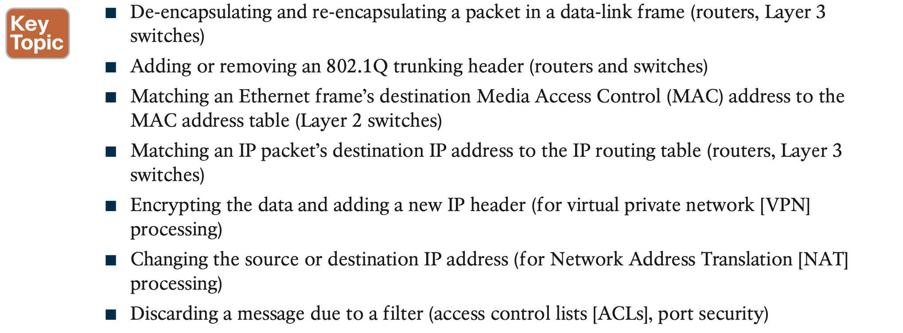

**The Control Plane**

The following list includes many of the more common control plane protocols:

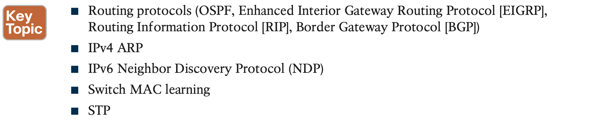

**The Management Plane**

the management plane includes protocols that allow network engineers to manage the devices.

Telnet and Secure Shell (SSH) are two of the most obvious management plane protocols. 

### 1.2 **Cisco Switch Data Plane Internals**

Hardware switches have always had specialized hardware to perform data plane processing.

1. First, the switching logic occurs not in the CPU with software, but in an application-specif- ic integrated circuit (ASIC). An ASIC is a chip built for specific purposes, such as for mes- sage processing in a networking device.
2. Second, the ASIC needs to perform table lookup in the MAC address table, so for fast table lookup, the switch uses a specialized type of memory to store the equivalent of the MAC address table: ternary content-addressable memory (TCAM). TCAM memory does not require the ASIC to execute loops through an algorithm to search the table. Instead, the ASIC can feed the fields to be matched, like a MAC address value, into the TCAM, and the TCAM returns the matching table entry, without a need to run a search algorithm.

Note that a switch still has a general-purpose CPU and RAM as well, as shown in Figure 16-4. IOS runs in the CPU and uses RAM. Most of the control and management plane func- tions run in IOS. The data plane function (and the control plane function of MAC learning) happens in the ASIC.

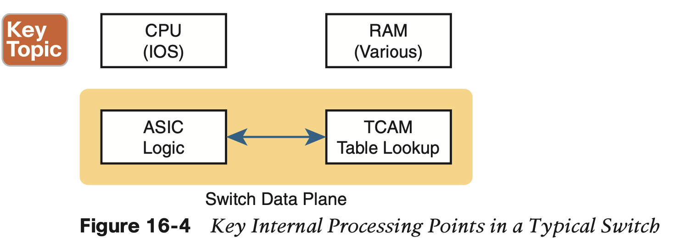

### 1.3 **Controllers and Software-Defined Architecture**

**Controllers and Centralized Control**

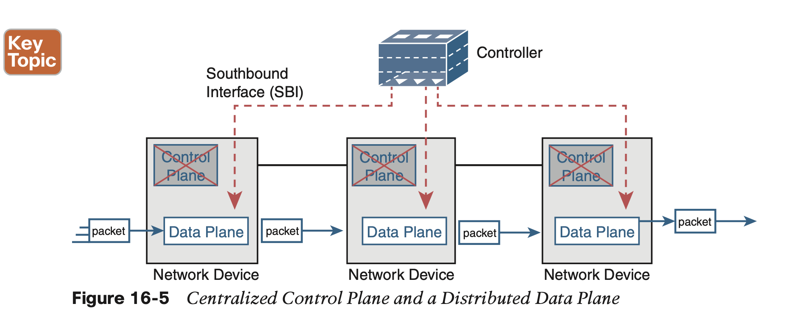

**The Southbound Interface (SBI)**

In a controller-based network architecture, the controller needs to communicate to the networking devices. In most network drawings and architecture drawings, those network devic- es typically sit below the controller, as shown in Figure 16-5. There is an interface between the controller and those devices, and given its location at the bottom part of drawings, the interface came to be known as the southbound interface, or SBI, as labeled in Figure 16-5.

**The Northbound Interface**

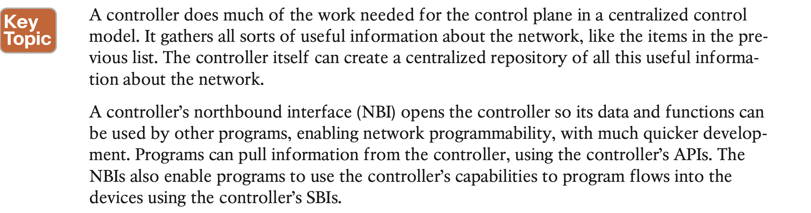

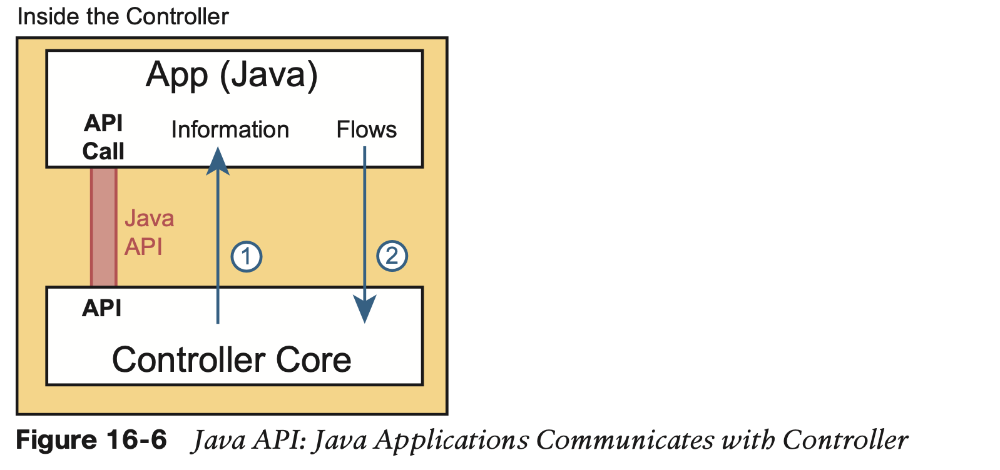

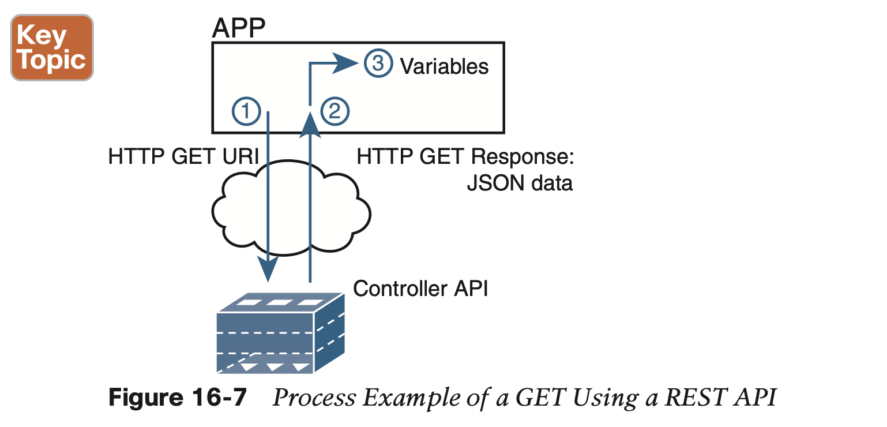

## 2. **Examples of Network Programmability and SDN**

This second of three major sections of the chapter introduces three different SDN and net- work programmability solutions available from Cisco.

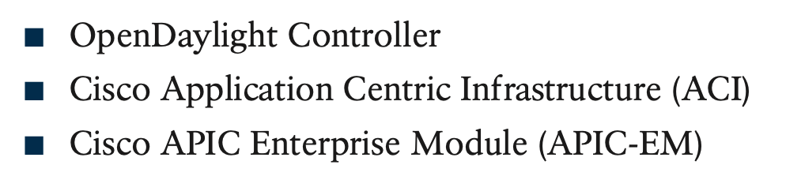

### 2.1 **OpenDaylight and OpenFlow**

**The OpenDaylight Controller**

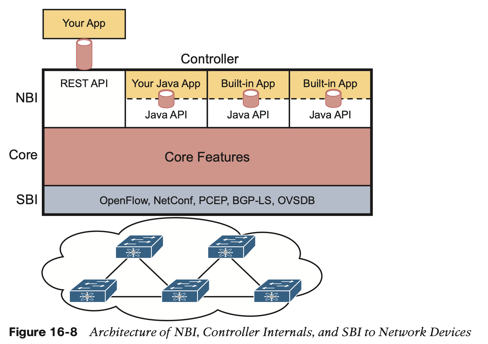

**The Cisco Open SDN Controller (OSC)**

### 2.2 **Cisco Application Centric Infrastructure (ACI)**

**ACI Physical Design: Spine and Leaf**

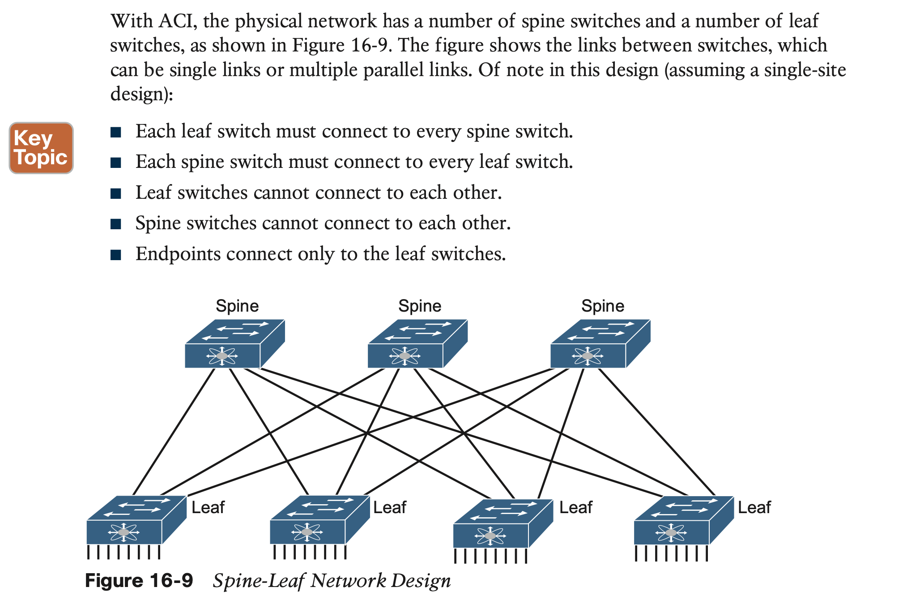

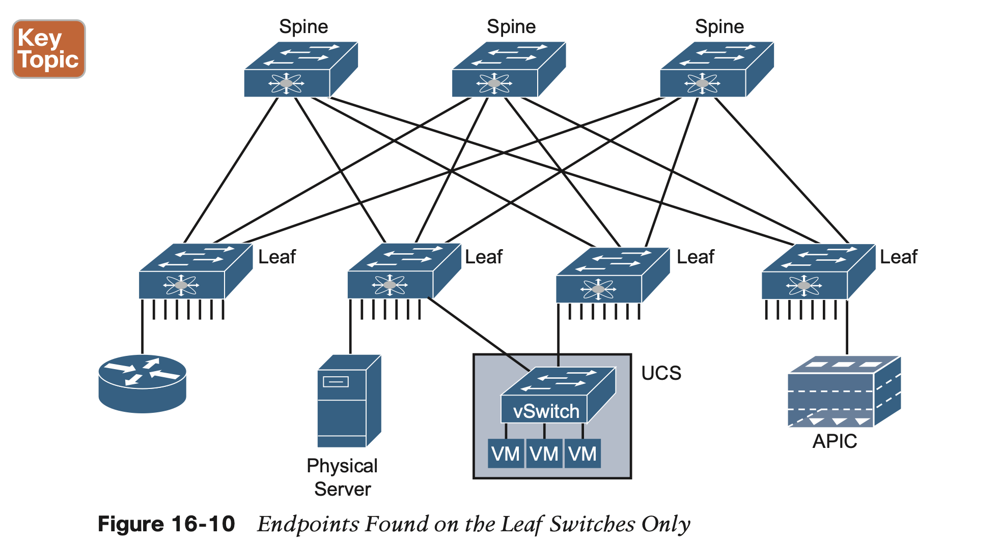

**ACI Operating Model with Intent-Based Networking**

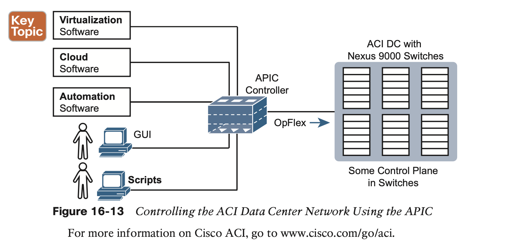

**Summary of the SDN Examples**

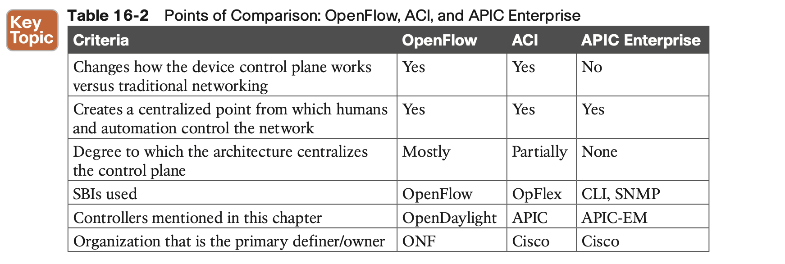

## 3. **Comparing Traditional Versus Controller-Based Networks**

The following list summarizes a few of the comparison points for this particular exam topic:

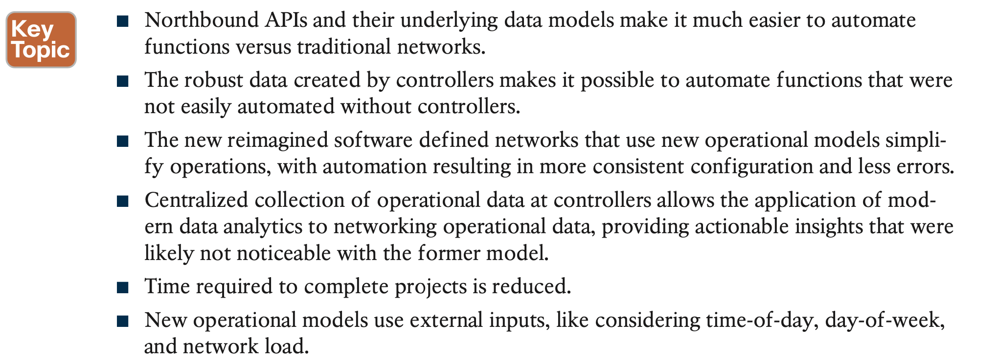

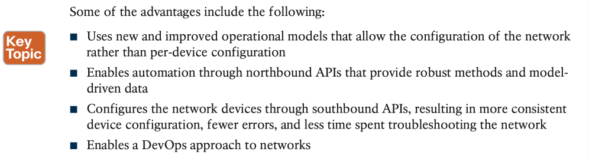
