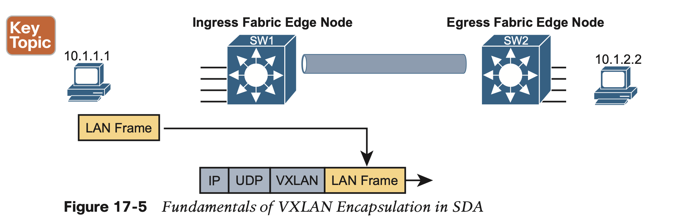
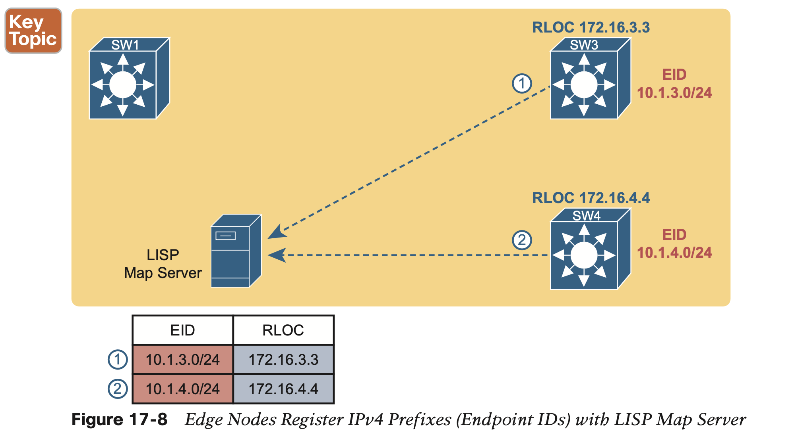
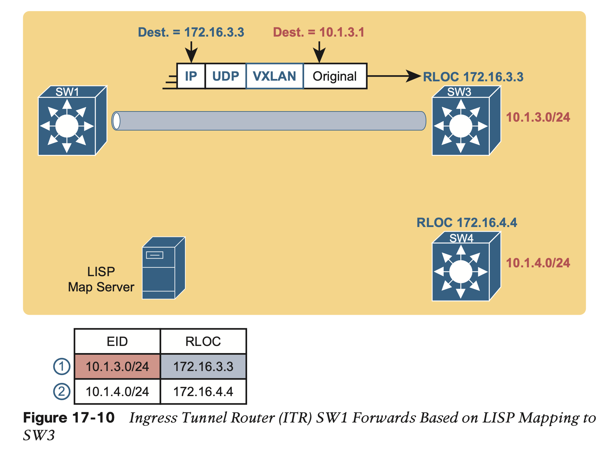

# Cisco Software-Defined Access (SDA)

## 1. **SDA Fabric, Underlay, and Overlay**

**Digital Network Architecture (DNA)**

Architecturally, the southbound side of the controller contains the fabric, underlay, and overlay. 

### 1.1 **The SDA Underlay**

**With SDA, the underlay exists to provide connectivity between the nodes in the SDA environment for the purpose of supporting VXLAN tunnels in the overlay network.** 

To do that, the underlay includes the switches, routers, cables, and wireless links used to create the physical network. It also includes the configuration and operation of the underlay so it can support the work of the overlay network.

**Using Existing Gear for the SDA Underlay**

The SDA underlay configuration requires you to think about and choose the different SDA roles filled by each device before you can decide which devices to use and which minimum software levels each requires. you will see different lists of supported hardware and software depending on the roles. These roles include:

**Using New Gear for the SDA Underlay**

That best configuration happens to use a design called a routed access layer design, which has these features:

### 1.2 **The SDA Overlay**

When you first think of the SDA overlay, think of this kind of sequence. 

1. First, an endpoint sends a frame that will be delivered across the SDA network. 
2. The first SDA node to receive the frame encapsulates the frame in a new message—using a tunneling specification called VXLAN—and forwards the frame into the fabric. 
3. Once the ingress node has encapsulated the original frame in VXLAN, the other SDA nodes forward the frame based on the VXLAN tunnel details. 
4. The last SDA node removes the VXLAN details, leaving the original frame, and forwards the original frame on toward the destination endpoint.

#### 1.2.1 VXLAN Tunnels in the Overlay (Data Plane)

SDA has many additional needs beyond the simple message delivery—needs that let it provide improved functions. To that end, **SDA does not only route IP packets or switch Ethernet frames. Instead, it encapsulates incoming data link frames in a tunneling technology for delivery across the SDA network, with these goals in mind:**

To achieve those goals, when creating SDA, Cisco chose **the Virtual Extensible LAN (VXLAN) protocol** to create the tunnels used by SDA.

1. When an SDA endpoint (for exam- ple, an end-user computer) sends a data link frame into an SDA edge node, the ingress edge node encapsulates the frame and sends it across a VXLAN tunnel to the egress edge node, as shown in Figure 17-5.

#### 1.2.2 LISP for Overlay Discovery and Location (Control Plane)

When new incoming frames arrive, the ingress tunnel router (ITR)—the SDA node that receives the new frame from outside the SDA fabric—needs some help from the control plane. 

To complete the story, now that ingress node SW1 knows that it can forward packets sent to endpoint 10.1.3.1 to the edge node with RLOC 172.16.3.3 (that is, SW3), SW1 encap- sulates the original Ethernet frame as shown in Figure 17-9, with the original destination IP address of 10.1.3.1. It adds the IP, UDP, and VXLAN headers shown so it can deliver the message over the SDA network, with that outer IP header listing a destination IP address of the RLOC IP address, so that the message will arrive through the SDA fabric at SW3, as shown in Figure 17-10.

## 2. **DNA Center and SDA Operation**

### 2.1 **Cisco DNA Center**

Cisco DNA Center exists as a software application that Cisco delivers pre-installed on a Cisco DNA Center appliance. The software follows the same general controller architecture concepts as described in Chapter 16. Figure 17-11 shows the general ideas.

Cisco DNA Center includes a robust northbound REST API along with a series of south- bound APIs. For most of us, the northbound API matters most, because as the user of SDA networks, you interact with SDA using Cisco DNA Center’s northbound REST API or the GUI interface. 

### 2.2 **Cisco DNA Center and Scalable Groups**

**Issues with Traditional IP-Based Security**

**SDA Security Based on User Groups**

## 3. **DNA Center as a Network Management Platform**

 Cisco Prime Infrastructure has been Cisco’s primary network management product for the enter- prise. It includes the following features:

### 3.2 **DNA Center Differences with Traditional Management**

In a broad sense, there are several fundamental differences between Cisco DNA Center and traditional network management platforms like Cisco PI. The largest difference: Cisco DNA Center supports SDA, whereas other management apps do not. 

Some of the features unique to Cisco DNA Center include

