# Understanding REST and JSON

The CCNA blueprint mentions one type of API—**REpresentational State Transfer (REST)**—because of its popularity as a type of API in networking automation applications.

## 1. **REST-Based APIs**

### 1.1 **REST-Based (RESTful) APIs**

Those six attributes are

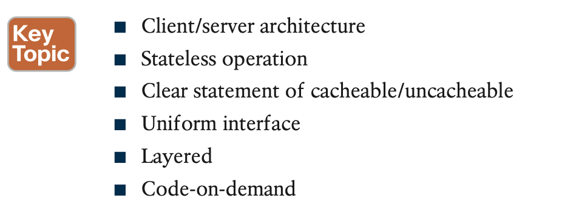

The first three of these attributes get at the heart of how a REST API works. You can more easily see those first three features at work with networking REST APIs, so the next few paragraphs give a little more explanation about those first three points.

1. **Client/Server Architecture**

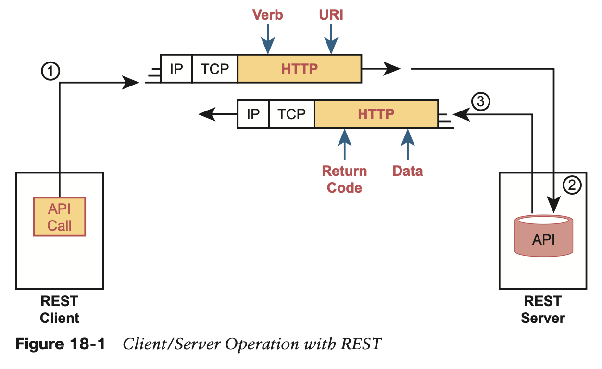

2. **Stateless Operation**

each API request and reply does not use any other past history considered when processing the request.

3. **Cacheable (or Not)**

REST APIs require that any resource requested via an API call have a clear method by which to mark the resource as cacheable or not. The goals remain the same: improve performance by retrieving resources less often (cacheable). Note that cacheable resources are marked with a timeframe so that the client knows when to ask for a new copy of the resource again.

### 1.2 **Background: Data and Variables**

### 1.3 **REST APIs and HTTP**

Many APIs need to be available to pro- grams that run on other computers, so the API must define the type of networking proto- cols supported by the API—and many REST-based APIs use the HTTP protocol.

**Software CRUD Actions and HTTP Verbs**

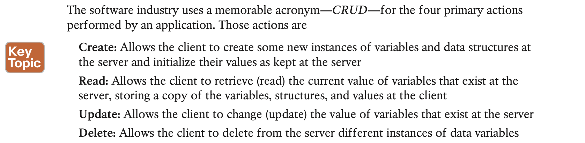

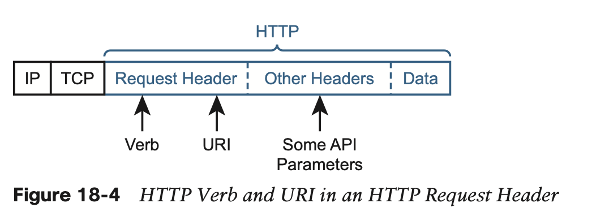

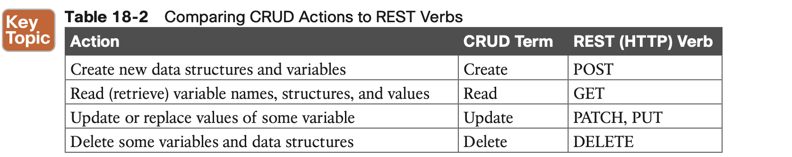

**Using URIs with HTTP to Specify the Resource**

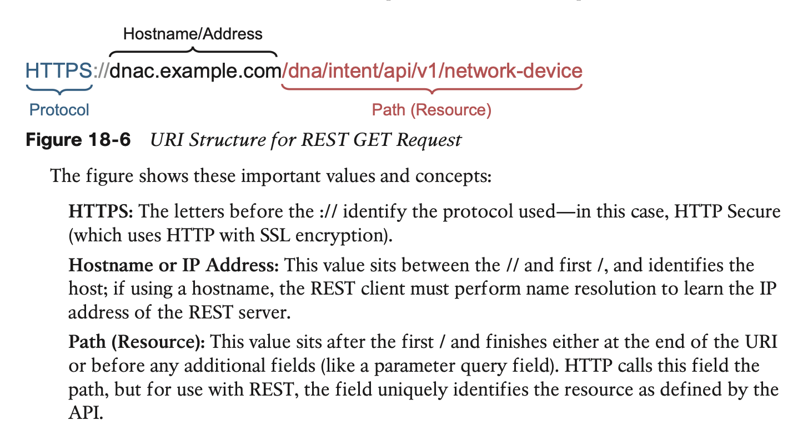

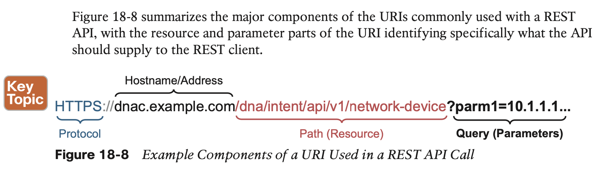

## 2. **Data Serialization and JSON**

### 2.1 **The Need for a Data Model with APIs**

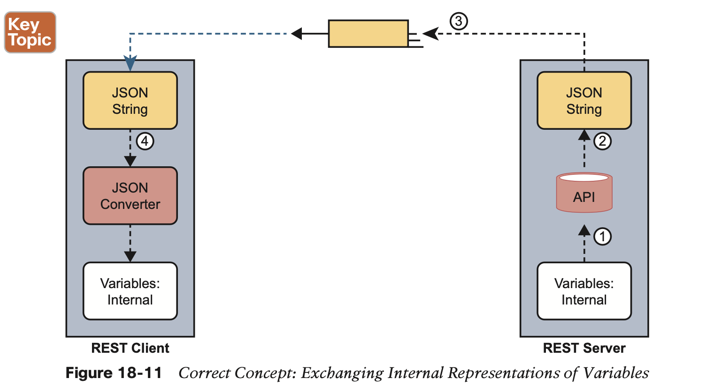

### 2.2 **Data Serialization Languages**

**JSON**

**XML**

**YAML**

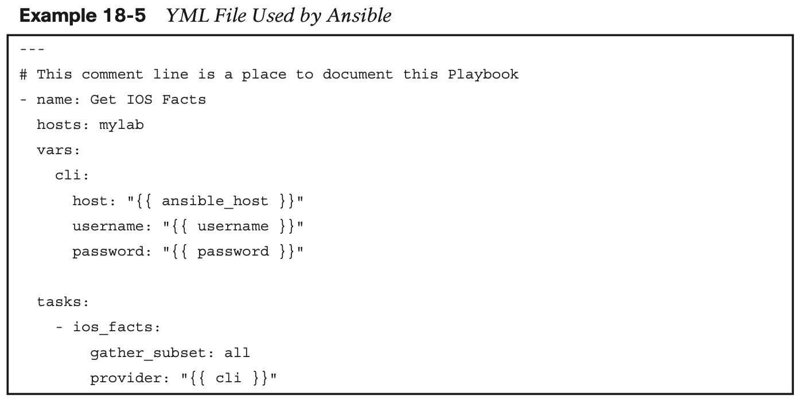

**Summary of Data Serialization**

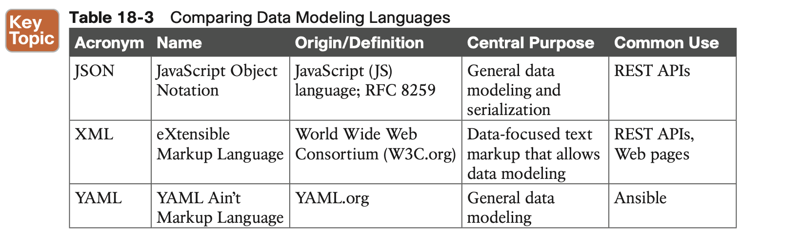

### 2.3 **Interpreting JSON**

#### 2.3.1 Interpreting JSON Key:Value Pairs

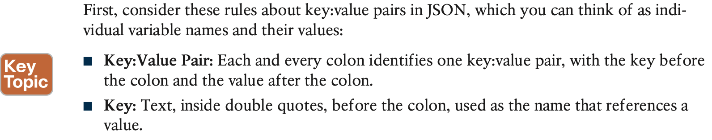

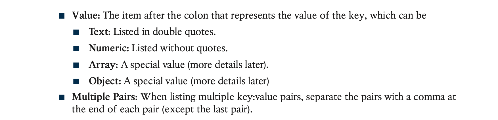

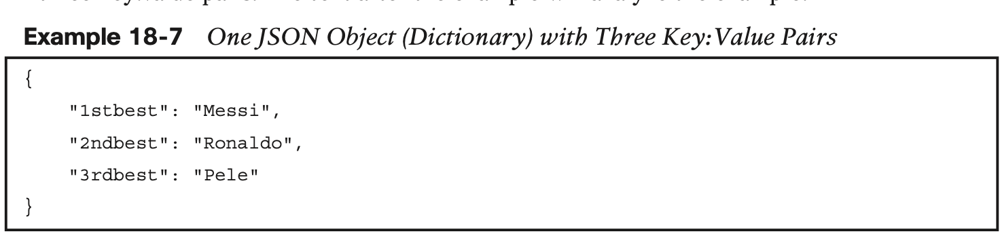

#### 2.3.2 Interpreting JSON Objects and Arrays

**NOTE** Python, the most common language to use for network automation, **converts JSON objects to Python dictionaries, and JSON arrays to Python lists.** For general conversation, many people refer to the JSON structures as dictionaries and lists rather than as objects and arrays.

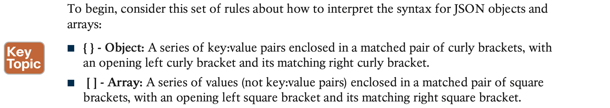

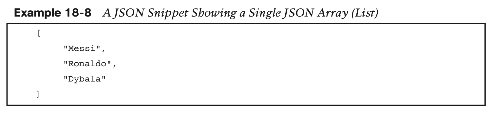

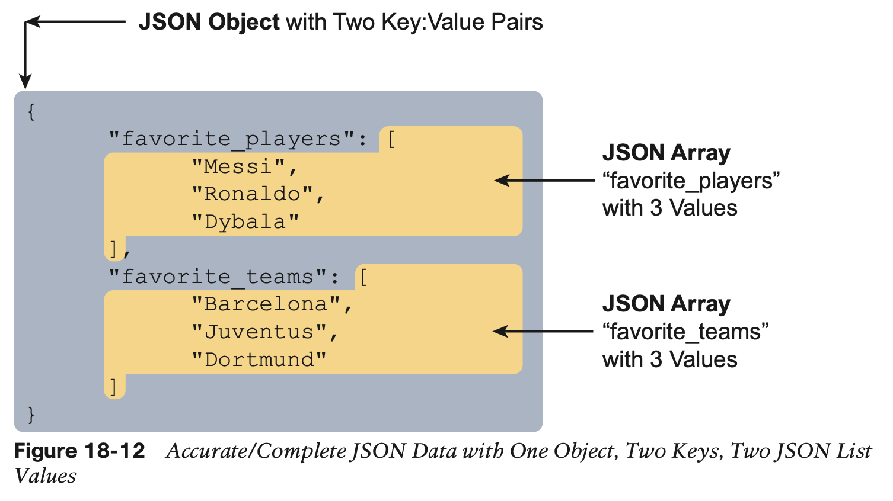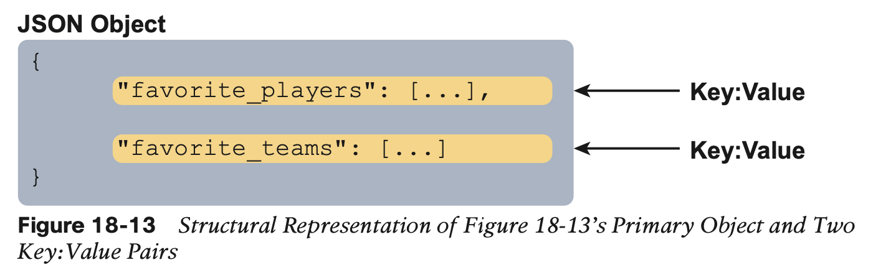

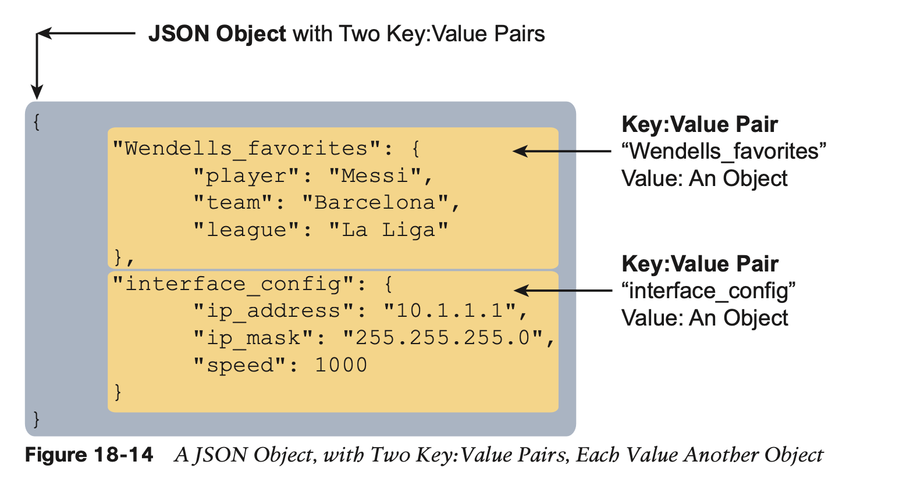

#### 2.3.3 Minified and Beautified JSON

