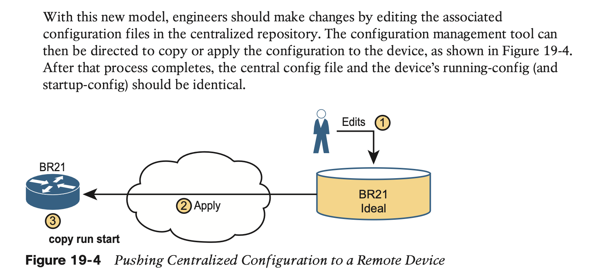

#  Understanding Ansible, Puppet, and Chef

## 1. **Device Configuration Challenges and Solutions**

### 1.1 **Configuration Drift**

### 1.2 **Centralized Configuration Files and Version Control**

### 1.3 **Configuration Monitoring and Enforcement**

Using the model shown in Figure 19-4 still has dangers. Former correct con- figuration changes might be overwritten, and made incorrect, by future changes. In other words, eventually, some configuration drift can occur.

### 1.4 **Configuration Provisioning**

Configuration provisioning refers to how to provision or deploy changes to the configura- tion once made by changing files in the configuration management system. As one of the primary functions of a configuration management tool, you would likely see features like these:

**Configuration Templates and Variables**

**Files That Control Configuration Automation**

## 2. **Ansible, Puppet, and Chef Basics**

Ansible, Puppet, and Chef are software packages. You can purchase each tool, with varia- tions on which package. However, they all also have different free options that allow you to download and learn about the tools, although you might need to run a Linux guest because some of the tools do not run in a Windows OS.

### 2.1 **Ansible**

As far as how Ansible works for managing network devices, it uses an agentless archi- tecture. That means Ansible does not rely on any code (agent) running on the network device. Instead, Ansible relies on features typical in network devices, namely SSH and/or NETCONF, to make changes and extract information. When using SSH, the Ansible control node actually makes changes to the device like any other SSH user would do, but doing the work with Ansible code, rather than with a human.

### 2.2 **Puppet**

### 2.3 **Chef**

### 2.4 **Summary of Configuration Management Tools**

